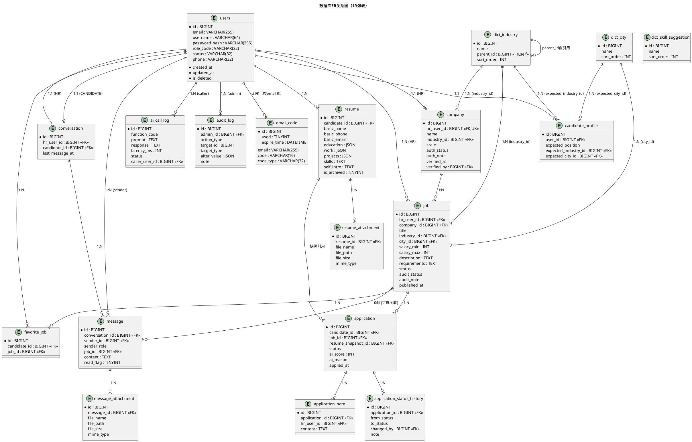

# 数据库设计

> 项目：AI 集成的智能招聘系统
> 课程：计算机项目综合开发创新实践
> 文档版本：v0.1
> 编制日期：2026-09-28
> 编制依据：`docs/需求分析/功能性需求分析.md v1.1` / `docs/需求分析/非功能性需求分析.md v1.1` / `docs/系统设计/用例图.md v1.0` / `docs/系统设计/WBS/WBS.md v0.1` / `docs/技术约束.md v0.3` / `docs/系统设计/功能模块设计.md`（master + §1-§8）

---

## 修订记录

| 版本 | 日期 | 变更说明 |
|---|---|---|
| v0.1 | 2026-09-28 | 初稿：19 张表设计 + ER 图 + DDL |

---

## 0. 阅读说明

> 本文件展示数据库的设计决策与字段说明。
>
> **本文件不创建表、不注入数据**。可执行 DDL 见 `docs/DataBase/schema.sql`；建表与种子数据注入由用户自行操作。

---

## 1. 设计原则与命名约定

### 1.1 总体约定

| 项 | 约定 | 出处 |
|---|---|---|
| 表数 | 19 张 | 功能性 v1.1 §8.2 |
| 主键 | `BIGINT AUTO_INCREMENT` | 技术约束 §4.2 |
| 时间 | `created_at DATETIME DEFAULT CURRENT_TIMESTAMP` + `updated_at DATETIME ON UPDATE CURRENT_TIMESTAMP` | 同上 |
| 软删 | 每张业务表加 `is_deleted TINYINT DEFAULT 0`（详见 §6） | 同上 |
| 字符集 | `utf8mb4` / 排序 `utf8mb4_0900_ai_ci` | 同上 |
| 引擎 | InnoDB（支持外键） | 同上 |
| 索引命名 | `uk_` 唯一键、`idx_` 普通索引、`fk_` 外键 | 同上 |
| 字段注释 | 所有字段写 `COMMENT` | 同上 |

### 1.2 字段类型约定

- **状态字段**：用 `VARCHAR(32)` + 应用层枚举校验（不用 MySQL ENUM，方便扩展）
- **布尔字段**：用 `TINYINT(1)` 0/1（如 `is_archived`、`read_flag`、`used`、`is_deleted`）
- **大文本**：`TEXT`（如 JD 描述 / 自我介绍 / 备注）
- **JSON 数据**：`JSON` 类型（如 `education` / `work` / `projects` / `before_value`）

### 1.3 字段命名修正

`docs/需求分析/功能性需求分析.md v1.1 §8.2` 实体清单中 `users` 表写有 `real_name` 字段，但与本文件 §3.1.5（个人资料 = 用户名 + 电话 + 头像）和 §4.1.1（注册仅邮箱 + 密码 + 角色）冲突。**修正如下**：

| 旧字段 | 新字段 | 理由 |
|---|---|---|
| `users.real_name` | **删除** | 网站注册不要求真名；真名仅在 `resume.basic_name` |
| — | **新增 `users.username`** | 候选人/HR 个人资料中的"用户名"（昵称 / 显示名）；可选 |

---

## 2. ER 关系图（PlantUML）



---

## 3. 19 张表设计

### 3.1 账号与认证

#### `users`（用户账号）

| 字段 | 类型 | 约束 | 说明 |
|---|---|---|---|
| `id` | BIGINT | PK AUTO_INCREMENT | 主键 |
| `email` | VARCHAR(255) | NOT NULL, UNIQUE | 登录账号 |
| `password_hash` | VARCHAR(255) | NOT NULL | BCrypt 哈希 |
| `role_code` | VARCHAR(32) | NOT NULL | `CANDIDATE` / `HR` / `ADMIN` |
| `status` | VARCHAR(32) | NOT NULL DEFAULT 'ENABLED' | `ENABLED` / `DISABLED` |
| `username` | VARCHAR(64) | NULL | 昵称 / 显示名（个人资料）；可选，默认 = email `@` 前缀 |
| `phone` | VARCHAR(32) | NULL | 手机号（候选人/HR 资料） |
| `created_at` | DATETIME | NOT NULL DEFAULT CURRENT_TIMESTAMP | 创建时间 |
| `updated_at` | DATETIME | NOT NULL DEFAULT CURRENT_TIMESTAMP ON UPDATE CURRENT_TIMESTAMP | 更新时间 |
| `is_deleted` | TINYINT(1) | NOT NULL DEFAULT 0 | 软删标记 |

索引：`uk_email(email)` / `idx_role(role_code)` / `idx_status(status)`

**关键说明**：
- **不存 `real_name`**：网站注册不强制真名，真名仅在 `resume.basic_name`
- **`username` 可选**：未设置时前端 fallback 显示 `email 前缀`
- 头像首字符来源优先级（详见 §7）：`username` > `email 前缀` > `user_id`

---

#### `email_code`（邮箱验证码）

| 字段 | 类型 | 约束 | 说明 |
|---|---|---|---|
| `id` | BIGINT | PK AUTO_INCREMENT | 主键 |
| `email` | VARCHAR(255) | NOT NULL | 接收方邮箱 |
| `code` | VARCHAR(16) | NOT NULL | 6 位数字 |
| `code_type` | VARCHAR(32) | NOT NULL | `register` / `login` / `reset` |
| `used` | TINYINT(1) | NOT NULL DEFAULT 0 | 是否已使用 |
| `expire_time` | DATETIME | NOT NULL | 过期时间（5 分钟） |
| `created_at` | DATETIME | NOT NULL DEFAULT CURRENT_TIMESTAMP | — |
| `updated_at` | DATETIME | NOT NULL DEFAULT CURRENT_TIMESTAMP ON UPDATE CURRENT_TIMESTAMP | — |
| `is_deleted` | TINYINT(1) | NOT NULL DEFAULT 0 | — |

索引：`idx_email_type(email, code_type)` / `idx_expire(expire_time)`

**关键说明**：单次有效（`used=1` 后不能复用）；发送频率限流（60 秒内同邮箱限 1 次）在应用层。

---

### 3.2 简历相关

#### `candidate_profile`（求职者扩展资料 + 求职偏好）

| 字段 | 类型 | 约束 | 说明 |
|---|---|---|---|
| `id` | BIGINT | PK AUTO_INCREMENT | 主键 |
| `user_id` | BIGINT | NOT NULL, UNIQUE | 关联 `users.id`（CANDIDATE） |
| `expected_position` | VARCHAR(128) | NULL | 期望职位（自由输入） |
| `expected_industry_id` | BIGINT | NULL FK | 期望行业 |
| `expected_city_id` | BIGINT | NULL FK | 期望城市 |
| `created_at` | DATETIME | NOT NULL DEFAULT CURRENT_TIMESTAMP | — |
| `updated_at` | DATETIME | NOT NULL DEFAULT CURRENT_TIMESTAMP ON UPDATE CURRENT_TIMESTAMP | — |
| `is_deleted` | TINYINT(1) | NOT NULL DEFAULT 0 | — |

外键：`fk_profile_user(user_id) → users(id)` / `fk_profile_industry(expected_industry_id) → dict_industry(id)` / `fk_profile_city(expected_city_id) → dict_city(id)`

**关键说明**：求职偏好是候选人个人资料的自然延伸，与 `users` 1:1。

---

#### `resume`（简历主体）

| 字段 | 类型 | 约束 | 说明 |
|---|---|---|---|
| `id` | BIGINT | PK AUTO_INCREMENT | 主键 |
| `candidate_id` | BIGINT | NOT NULL FK | 关联 `users.id`（CANDIDATE） |
| `basic_name` | VARCHAR(64) | NULL | **真实姓名**（简历基本信息必填） |
| `basic_phone` | VARCHAR(32) | NULL | 电话（必填） |
| `basic_email` | VARCHAR(255) | NULL | 邮箱（必填） |
| `education` | JSON | NULL | 教育经历数组 `[{school, major, degree, start, end}]` |
| `work` | JSON | NULL | 工作经历数组 |
| `projects` | JSON | NULL | 项目经历数组 |
| `skills` | TEXT | NULL | 技能（逗号分隔或 JSON） |
| `self_intro` | TEXT | NULL | 自我介绍 |
| `is_archived` | TINYINT(1) | NOT NULL DEFAULT 0 | `false`=ACTIVE / `true`=ARCHIVED |
| `created_at` | DATETIME | NOT NULL DEFAULT CURRENT_TIMESTAMP | — |
| `updated_at` | DATETIME | NOT NULL DEFAULT CURRENT_TIMESTAMP ON UPDATE CURRENT_TIMESTAMP | — |
| `is_deleted` | TINYINT(1) | NOT NULL DEFAULT 0 | — |

外键：`fk_resume_candidate(candidate_id) → users(id)`
索引：`idx_candidate_archived(candidate_id, is_archived)`

**关键说明**：
- **单一 ACTIVE 原则**：每位候选人仅一份 `is_archived=false` 简历
- **MySQL 不支持函数唯一索引**，该约束由 Service 层 INSERT 前校验保证
- 教育/工作/项目经历**不建子表**，统一以 JSON 数组存储
- 技能**不建子表 / 不建字典**，自由输入

---

#### `resume_attachment`（简历附件元数据）

| 字段 | 类型 | 约束 | 说明 |
|---|---|---|---|
| `id` | BIGINT | PK AUTO_INCREMENT | 主键 |
| `resume_id` | BIGINT | NOT NULL FK | 关联 `resume.id` |
| `file_name` | VARCHAR(255) | NOT NULL | 原始文件名 |
| `file_path` | VARCHAR(512) | NOT NULL | 存储路径（相对 `UPLOAD_DIR`） |
| `file_size` | BIGINT | NOT NULL | 字节 |
| `mime_type` | VARCHAR(128) | NULL | MIME 类型 |
| `uploaded_at` | DATETIME | NOT NULL DEFAULT CURRENT_TIMESTAMP | — |
| `created_at` | DATETIME | NOT NULL DEFAULT CURRENT_TIMESTAMP | — |
| `updated_at` | DATETIME | NOT NULL DEFAULT CURRENT_TIMESTAMP ON UPDATE CURRENT_TIMESTAMP | — |
| `is_deleted` | TINYINT(1) | NOT NULL DEFAULT 0 | — |

外键：`fk_attach_resume(resume_id) → resume(id)`
索引：`idx_resume(resume_id)`

---

### 3.3 职位与公司

#### `company`（HR 所属公司）

| 字段 | 类型 | 约束 | 说明 |
|---|---|---|---|
| `id` | BIGINT | PK AUTO_INCREMENT | 主键 |
| `hr_user_id` | BIGINT | NOT NULL, UNIQUE | 关联 `users.id`（HR），一个 HR 一个公司 |
| `name` | VARCHAR(255) | NOT NULL | 公司名 |
| `industry_id` | BIGINT | NULL FK | 行业 |
| `scale` | VARCHAR(64) | NULL | 规模（"1-50" / "50-200" 等） |
| `description` | TEXT | NULL | 公司简介 |
| `auth_status` | VARCHAR(32) | NOT NULL DEFAULT 'PENDING' | `PENDING` / `VERIFIED` / `REJECTED` |
| `auth_note` | VARCHAR(512) | NULL | 拒绝理由 |
| `verified_at` | DATETIME | NULL | 审核通过时间 |
| `verified_by` | BIGINT | NULL FK | 审核管理员 `users.id` |
| `created_at` | DATETIME | NOT NULL DEFAULT CURRENT_TIMESTAMP | — |
| `updated_at` | DATETIME | NOT NULL DEFAULT CURRENT_TIMESTAMP ON UPDATE CURRENT_TIMESTAMP | — |
| `is_deleted` | TINYINT(1) | NOT NULL DEFAULT 0 | — |

外键：`fk_company_hr(hr_user_id) → users(id)` / `fk_company_industry(industry_id) → dict_industry(id)` / `fk_company_verified_by(verified_by) → users(id)`
索引：`idx_auth_status(auth_status)`

**关键说明**：HR 注册时自动创建 `auth_status=PENDING`；HR 即用全部功能，管理员事后巡查。

---

#### `job`（职位 / JD）

| 字段 | 类型 | 约束 | 说明 |
|---|---|---|---|
| `id` | BIGINT | PK AUTO_INCREMENT | 主键 |
| `hr_user_id` | BIGINT | NOT NULL FK | 关联 `users.id`（HR），冗余便于 HR 视角 |
| `company_id` | BIGINT | NOT NULL FK | 关联 `company.id` |
| `title` | VARCHAR(255) | NOT NULL | 职位标题 |
| `industry_id` | BIGINT | NULL FK | 行业 |
| `city_id` | BIGINT | NULL FK | 城市 |
| `salary_min` | INT | NULL | 薪资下限（元/月） |
| `salary_max` | INT | NULL | 薪资上限（元/月） |
| `description` | TEXT | NOT NULL | JD 岗位职责 |
| `requirements` | TEXT | NOT NULL | JD 任职要求 |
| `status` | VARCHAR(32) | NOT NULL DEFAULT 'DRAFT' | `DRAFT` / `ONLINE` / `OFFLINE` / `DELETED` |
| `audit_status` | VARCHAR(32) | NOT NULL DEFAULT 'PENDING' | `PENDING` / `APPROVED` / `REJECTED` |
| `audit_note` | VARCHAR(512) | NULL | 审核驳回理由 |
| `published_at` | DATETIME | NULL | 发布时间 |
| `created_at` | DATETIME | NOT NULL DEFAULT CURRENT_TIMESTAMP | — |
| `updated_at` | DATETIME | NOT NULL DEFAULT CURRENT_TIMESTAMP ON UPDATE CURRENT_TIMESTAMP | — |
| `is_deleted` | TINYINT(1) | NOT NULL DEFAULT 0 | — |

外键：`fk_job_hr(hr_user_id) → users(id)` / `fk_job_company(company_id) → company(id)` / `fk_job_industry(industry_id) → dict_industry(id)` / `fk_job_city(city_id) → dict_city(id)`
索引：`idx_status_audit_published(status, audit_status, is_deleted, published_at)` / `idx_hr(hr_user_id)` / `idx_company(company_id)`

**关键说明**：
- **`status` 与 `audit_status` 分开**：`status` 决定是否对候选人可见，`audit_status` 决定管理员审核结果
- 候选人浏览列表默认条件：`status=ONLINE AND audit_status=APPROVED AND is_deleted=0`
- 状态机：`DRAFT → ONLINE → OFFLINE → DELETED`（仅 `DELETED` 不可恢复）

---

### 3.4 投递相关

#### `application`（投递记录）

| 字段 | 类型 | 约束 | 说明 |
|---|---|---|---|
| `id` | BIGINT | PK AUTO_INCREMENT | 主键 |
| `candidate_id` | BIGINT | NOT NULL FK | 关联 `users.id`（CANDIDATE） |
| `job_id` | BIGINT | NOT NULL FK | 关联 `job.id` |
| `resume_snapshot_id` | BIGINT | NOT NULL FK | **投递时的 ACTIVE 简历快照**（防止候选人后续修改影响历史） |
| `status` | VARCHAR(32) | NOT NULL DEFAULT 'PENDING_REVIEW' | 8 状态枚举 |
| `ai_score` | INT | NULL | 0-100；NULL = 待评分 |
| `ai_reason` | VARCHAR(512) | NULL | AI 评分理由 |
| `applied_at` | DATETIME | NOT NULL DEFAULT CURRENT_TIMESTAMP | 投递时间 |
| `created_at` | DATETIME | NOT NULL DEFAULT CURRENT_TIMESTAMP | — |
| `updated_at` | DATETIME | NOT NULL DEFAULT CURRENT_TIMESTAMP ON UPDATE CURRENT_TIMESTAMP | — |
| `is_deleted` | TINYINT(1) | NOT NULL DEFAULT 0 | — |

外键：`fk_app_candidate(candidate_id) → users(id)` / `fk_app_job(job_id) → job(id)` / `fk_app_resume(resume_snapshot_id) → resume(id)`
索引：`idx_candidate_job(candidate_id, job_id)` / `idx_job_status(job_id, status, is_deleted)` / `idx_candidate_status(candidate_id, status, is_deleted)`

**8 状态枚举**（`status` 字段取值）：
```
PENDING_REVIEW  →  VIEWED_BY_HR
PENDING_REVIEW  →  REJECTED
VIEWED_BY_HR    →  RESUME_PASSED
VIEWED_BY_HR    →  REJECTED
RESUME_PASSED   →  INTERVIEWING
RESUME_PASSED   →  REJECTED
INTERVIEWING    →  OFFERED
INTERVIEWING    →  REJECTED
OFFERED         →  HIRED
OFFERED         →  REJECTED
任意非终态       →  WITHDRAWN  （仅求职者触发）
```
终态：`HIRED` / `REJECTED` / `WITHDRAWN`

**关键说明**：
- **重复投递校验**：Service 层查 `idx_candidate_job` 索引；MySQL 软删无法用 UNIQUE 约束
- **ai_score NULL 语义**：表示"待评分"（不新增 `score_status` 字段，推断式）
- **简历快照**：投递瞬间拷贝当前 ACTIVE 简历 id，候选人后续编辑不影响历史

---

#### `application_status_history`（状态时间线）

| 字段 | 类型 | 约束 | 说明 |
|---|---|---|---|
| `id` | BIGINT | PK AUTO_INCREMENT | 主键 |
| `application_id` | BIGINT | NOT NULL FK | 关联 `application.id` |
| `from_status` | VARCHAR(32) | NULL | 原状态（NULL = 初次创建） |
| `to_status` | VARCHAR(32) | NOT NULL | 目标状态 |
| `changed_by` | BIGINT | NOT NULL FK | 变更人 `users.id`（HR / CANDIDATE / SYSTEM） |
| `note` | VARCHAR(512) | NULL | 备注（如驳回理由） |
| `created_at` | DATETIME | NOT NULL DEFAULT CURRENT_TIMESTAMP | — |
| `updated_at` | DATETIME | NOT NULL DEFAULT CURRENT_TIMESTAMP ON UPDATE CURRENT_TIMESTAMP | — |
| `is_deleted` | TINYINT(1) | NOT NULL DEFAULT 0 | — |

外键：`fk_hist_app(application_id) → application(id)` / `fk_hist_user(changed_by) → users(id)`
索引：`idx_app_changed(application_id, created_at)`

---

#### `application_note`（HR 内部备注）

| 字段 | 类型 | 约束 | 说明 |
|---|---|---|---|
| `id` | BIGINT | PK AUTO_INCREMENT | 主键 |
| `application_id` | BIGINT | NOT NULL FK | 关联 `application.id` |
| `hr_user_id` | BIGINT | NOT NULL FK | HR `users.id` |
| `content` | TEXT | NOT NULL | 备注内容 |
| `created_at` | DATETIME | NOT NULL DEFAULT CURRENT_TIMESTAMP | — |
| `updated_at` | DATETIME | NOT NULL DEFAULT CURRENT_TIMESTAMP ON UPDATE CURRENT_TIMESTAMP | — |
| `is_deleted` | TINYINT(1) | NOT NULL DEFAULT 0 | — |

外键：`fk_note_app(application_id) → application(id)` / `fk_note_hr(hr_user_id) → users(id)`
索引：`idx_app(application_id)`

**关键说明**：仅 HR 自己可见，不影响候选人侧。

---

### 3.5 收藏

#### `favorite_job`（求职者收藏职位）

| 字段 | 类型 | 约束 | 说明 |
|---|---|---|---|
| `id` | BIGINT | PK AUTO_INCREMENT | 主键 |
| `candidate_id` | BIGINT | NOT NULL FK | 关联 `users.id`（CANDIDATE） |
| `job_id` | BIGINT | NOT NULL FK | 关联 `job.id` |
| `created_at` | DATETIME | NOT NULL DEFAULT CURRENT_TIMESTAMP | — |
| `updated_at` | DATETIME | NOT NULL DEFAULT CURRENT_TIMESTAMP ON UPDATE CURRENT_TIMESTAMP | — |
| `is_deleted` | TINYINT(1) | NOT NULL DEFAULT 0 | — |

外键：`fk_fav_candidate(candidate_id) → users(id)` / `fk_fav_job(job_id) → job(id)`
索引：`uk_candidate_job(candidate_id, job_id)` UNIQUE / `idx_candidate(candidate_id)`

**关键说明**：联合唯一键防重复收藏。

---

### 3.6 消息相关

#### `conversation`（消息会话）

| 字段 | 类型 | 约束 | 说明 |
|---|---|---|---|
| `id` | BIGINT | PK AUTO_INCREMENT | 主键 |
| `hr_user_id` | BIGINT | NOT NULL FK | 关联 `users.id`（HR） |
| `candidate_id` | BIGINT | NOT NULL FK | 关联 `users.id`（CANDIDATE） |
| `last_message_at` | DATETIME | NULL | 用于会话列表排序 |
| `created_at` | DATETIME | NOT NULL DEFAULT CURRENT_TIMESTAMP | — |
| `updated_at` | DATETIME | NOT NULL DEFAULT CURRENT_TIMESTAMP ON UPDATE CURRENT_TIMESTAMP | — |
| `is_deleted` | TINYINT(1) | NOT NULL DEFAULT 0 | — |

外键：`fk_conv_hr(hr_user_id) → users(id)` / `fk_conv_candidate(candidate_id) → users(id)`
索引：`uk_hr_candidate(hr_user_id, candidate_id, is_deleted)` UNIQUE / `idx_hr_updated(hr_user_id, last_message_at)` / `idx_candidate_updated(candidate_id, last_message_at)`

**关键说明**：
- **二元组唯一**：`(hr_user_id, candidate_id)` 唯一；跨职位共享
- **包含 `is_deleted` 字段**：MySQL 5.7 软删兼容做法；不含时软删后再插同对会冲突
- 实际使用：通常不做软删会话；如需删除，先删相关消息再删会话

---

#### `message`（消息）

| 字段 | 类型 | 约束 | 说明 |
|---|---|---|---|
| `id` | BIGINT | PK AUTO_INCREMENT | 主键 |
| `conversation_id` | BIGINT | NOT NULL FK | 关联 `conversation.id` |
| `sender_id` | BIGINT | NOT NULL FK | 发送人 `users.id`；SYSTEM 消息用特殊 ID |
| `sender_role` | VARCHAR(32) | NOT NULL | `CANDIDATE` / `HR` / `SYSTEM` |
| `job_id` | BIGINT | NULL FK | 关联职位（可空） |
| `content` | TEXT | NOT NULL | 消息内容 |
| `read_flag` | TINYINT(1) | NOT NULL DEFAULT 0 | 已读标记 |
| `created_at` | DATETIME | NOT NULL DEFAULT CURRENT_TIMESTAMP | — |
| `updated_at` | DATETIME | NOT NULL DEFAULT CURRENT_TIMESTAMP ON UPDATE CURRENT_TIMESTAMP | — |
| `is_deleted` | TINYINT(1) | NOT NULL DEFAULT 0 | — |

外键：`fk_msg_conv(conversation_id) → conversation(id)` / `fk_msg_sender(sender_id) → users(id)` / `fk_msg_job(job_id) → job(id)`
索引：`idx_conv_created(conversation_id, created_at)` / `idx_sender(sender_id)`

**关键说明**：
- **SYSTEM 角色**：用于撤回通知等系统自动消息；`sender_id` 可设为 0 或专门的 system users
- **`job_id` 可空**：跨职位会话中单条消息可关联具体职位
- **已读标记**：进入会话时自动将对方消息 `read_flag` 置 1

---

#### `message_attachment`（消息附件）

| 字段 | 类型 | 约束 | 说明 |
|---|---|---|---|
| `id` | BIGINT | PK AUTO_INCREMENT | 主键 |
| `message_id` | BIGINT | NOT NULL FK | 关联 `message.id` |
| `file_name` | VARCHAR(255) | NOT NULL | — |
| `file_path` | VARCHAR(512) | NOT NULL | — |
| `file_size` | BIGINT | NOT NULL | 字节 |
| `mime_type` | VARCHAR(128) | NULL | — |
| `created_at` | DATETIME | NOT NULL DEFAULT CURRENT_TIMESTAMP | — |
| `updated_at` | DATETIME | NOT NULL DEFAULT CURRENT_TIMESTAMP ON UPDATE CURRENT_TIMESTAMP | — |
| `is_deleted` | TINYINT(1) | NOT NULL DEFAULT 0 | — |

外键：`fk_msgatt_msg(message_id) → message(id)`
索引：`idx_message(message_id)`

---

### 3.7 字典

#### `dict_industry`（行业字典，一级 + 二级）

| 字段 | 类型 | 约束 | 说明 |
|---|---|---|---|
| `id` | BIGINT | PK AUTO_INCREMENT | 主键 |
| `name` | VARCHAR(128) | NOT NULL | 行业名 |
| `parent_id` | BIGINT | NULL FK self | 父级行业（NULL = 一级） |
| `sort_order` | INT | NOT NULL DEFAULT 0 | 排序 |
| `created_at` | DATETIME | NOT NULL DEFAULT CURRENT_TIMESTAMP | — |
| `updated_at` | DATETIME | NOT NULL DEFAULT CURRENT_TIMESTAMP ON UPDATE CURRENT_TIMESTAMP | — |
| `is_deleted` | TINYINT(1) | NOT NULL DEFAULT 0 | — |

外键：`fk_ind_parent(parent_id) → dict_industry(id)`（自引用）
索引：`idx_parent(parent_id)` / `idx_name(name)`

**关键说明**：支持一级 + 二级树形；强制下拉（候选人/HR 必选）。

---

#### `dict_city`（城市字典）

| 字段 | 类型 | 约束 | 说明 |
|---|---|---|---|
| `id` | BIGINT | PK AUTO_INCREMENT | 主键 |
| `name` | VARCHAR(128) | NOT NULL | 城市名 |
| `sort_order` | INT | NOT NULL DEFAULT 0 | 排序 |
| `created_at` | DATETIME | NOT NULL DEFAULT CURRENT_TIMESTAMP | — |
| `updated_at` | DATETIME | NOT NULL DEFAULT CURRENT_TIMESTAMP ON UPDATE CURRENT_TIMESTAMP | — |
| `is_deleted` | TINYINT(1) | NOT NULL DEFAULT 0 | — |

索引：`uk_name(name)` UNIQUE / `idx_name(name)`

**关键说明**：强制下拉。

---

#### `dict_skill_suggestion`（技能建议池）

| 字段 | | | | |
|---|---|---|---|---|
| `id` | BIGINT | PK AUTO_INCREMENT | 主键 |
| `name` | VARCHAR(128) | NOT NULL | 技能名 |
| `sort_order` | INT | NOT NULL DEFAULT 0 | 排序 |
| `created_at` | DATETIME | NOT NULL DEFAULT CURRENT_TIMESTAMP | — |
| `updated_at` | DATETIME | NOT NULL DEFAULT CURRENT_TIMESTAMP ON UPDATE CURRENT_TIMESTAMP | — |
| `is_deleted` | TINYINT(1) | NOT NULL DEFAULT 0 | — |

索引：`uk_name(name)` UNIQUE / `idx_name(name)`

**关键说明**：自动补全用，不强制下拉；技能值不入此表，自由输入。

---

### 3.8 AI 与审计

#### `ai_call_log`（AI 调用日志）

| 字段 | | | | |
|---|---|---|---|---|
| `id` | BIGINT | PK AUTO_INCREMENT | 主键 |
| `function_code` | VARCHAR(32) | NOT NULL | `AI-1` / `AI-2` / `AI-3` / `AI-4` / `AI-5` / `AI-6` |
| `prompt` | TEXT | NOT NULL | 输入提示词 |
| `response` | TEXT | NULL | 输出响应 |
| `latency_ms` | INT | NOT NULL | 耗时（毫秒） |
| `prompt_tokens` | INT | NULL | 输入 token 数 |
| `completion_tokens` | INT | NULL | 输出 token 数 |
| `status` | VARCHAR(32) | NOT NULL | `SUCCESS` / `FAIL` / `TIMEOUT` |
| `error_message` | VARCHAR(512) | NULL | 错误信息 |
| `caller_user_id` | BIGINT | NULL FK | 调用方 `users.id` |
| `created_at` | DATETIME | NOT NULL DEFAULT CURRENT_TIMESTAMP | — |
| `updated_at` | DATETIME | NOT NULL DEFAULT CURRENT_TIMESTAMP ON UPDATE CURRENT_TIMESTAMP | — |
| `is_deleted` | TINYINT(1) | NOT NULL DEFAULT 0 | — |

外键：`fk_ailog_caller(caller_user_id) → users(id)`
索引：`idx_func_created(function_code, created_at)` / `idx_caller(caller_user_id)` / `idx_status(status)`

**关键说明**：每次 LLM 调用必写；便于答辩展示与问题追溯。

---

#### `audit_log`（管理员操作日志）

| 字段 | | | | |
|---|---|---|---|---|
| `id` | BIGINT | PK AUTO_INCREMENT | 主键 |
| `admin_id` | BIGINT | NOT NULL FK | 管理员 `users.id`（ADMIN 角色） |
| `action_type` | VARCHAR(64) | NOT NULL | `USER_ENABLE` / `USER_DISABLE` / `USER_RESET_PASSWORD` / `JOB_APPROVE` / `JOB_REJECT` / `COMPANY_VERIFY` / `COMPANY_REJECT` / `RESUME_DISABLE` / `DICT_INDUSTRY_*` / `DICT_CITY_*` / `DICT_SKILL_*` |
| `target_id` | BIGINT | NULL | 操作目标 id |
| `target_type` | VARCHAR(64) | NULL | `USERS` / `JOB` / `COMPANY` / `RESUME` / `DICT_INDUSTRY` / `DICT_CITY` / `DICT_SKILL` |
| `before_value` | JSON | NULL | 操作前值 |
| `after_value` | JSON | NULL | 操作后值 |
| `note` | VARCHAR(512) | NULL | 备注 |
| `created_at` | DATETIME | NOT NULL DEFAULT CURRENT_TIMESTAMP | — |
| `updated_at` | DATETIME | NOT NULL DEFAULT CURRENT_TIMESTAMP ON UPDATE CURRENT_TIMESTAMP | — |
| `is_deleted` | TINYINT(1) | NOT NULL DEFAULT 0 | — |

外键：`fk_audit_admin(admin_id) → users(id)`
索引：`idx_admin_created(admin_id, created_at)` / `idx_target(target_type, target_id)`

**关键说明**：所有管理员写操作（启用 / 禁用 / 通过 / 驳回 / 字典 CRUD）必写。

---

## 4. 外键 / 索引 矩阵

| 表 | 主外键 | 关键索引 |
|---|---|---|
| `users` | — | `uk_email`, `idx_role`, `idx_status` |
| `email_code` | — | `idx_email_type`, `idx_expire` |
| `candidate_profile` | `users.id`, `dict_industry.id`, `dict_city.id` | `uk_user_id` |
| `resume` | `users.id` | `idx_candidate_archived` |
| `resume_attachment` | `resume.id` | `idx_resume` |
| `company` | `users.id` (×2), `dict_industry.id` | `uk_hr_user_id`, `idx_auth_status` |
| `job` | `users.id`, `company.id`, `dict_industry.id`, `dict_city.id` | `idx_status_audit_published`, `idx_hr`, `idx_company` |
| `application` | `users.id`, `job.id`, `resume.id` | `idx_candidate_job`, `idx_job_status`, `idx_candidate_status` |
| `application_status_history` | `application.id`, `users.id` | `idx_app_changed` |
| `application_note` | `application.id`, `users.id` | `idx_app` |
| `favorite_job` | `users.id`, `job.id` | `uk_candidate_job`, `idx_candidate` |
| `conversation` | `users.id` (×2) | `uk_hr_candidate_deleted`, `idx_hr_updated`, `idx_candidate_updated` |
| `message` | `conversation.id`, `users.id`, `job.id` | `idx_conv_created`, `idx_sender` |
| `message_attachment` | `message.id` | `idx_message` |
| `dict_industry` | self (`parent_id`) | `idx_parent`, `idx_name` |
| `dict_city` | — | `uk_name`, `idx_name` |
| `dict_skill_suggestion` | — | `uk_name`, `idx_name` |
| `ai_call_log` | `users.id` | `idx_func_created`, `idx_caller`, `idx_status` |
| `audit_log` | `users.id` | `idx_admin_created`, `idx_target` |

---

## 5. 建表顺序

按外键依赖关系：

```
 1.  users                         （基础表，无 FK）
 2.  dict_industry               （自引用，先建空表，再 UPDATE parent_id）
 3.  dict_city                   （无 FK）
 4.  dict_skill_suggestion       （无 FK）
 5.  email_code                  （无 FK）
 6.  candidate_profile           （FK users, dict_industry, dict_city）
 7.  company                     （FK users × 2, dict_industry）
 8.  job                         （FK users, company, dict_industry, dict_city）
 9.  resume                      （FK users）
10.  resume_attachment           （FK resume）
11.  application                 （FK users, job, resume）
12.  application_status_history  （FK application, users）
13.  application_note            （FK application, users）
14.  favorite_job                （FK users, job）
15.  conversation                （FK users × 2）
16.  message                     （FK conversation, users, job）
17.  message_attachment          （FK message）
18.  ai_call_log                 （FK users）
19.  audit_log                   （FK users）
```

可执行 DDL 见 `docs/DataBase/schema.sql`，严格按此顺序执行。

---

## 6. 软删策略与数据生命周期

### 6.1 软删约定

- 所有业务表加 `is_deleted TINYINT(1) DEFAULT 0` 字段
- `0` = 未删除（默认），`1` = 已删除
- **所有查询默认过滤 `is_deleted=0`**（列表 / 浏览 / 搜索）
- 应用层做删除操作：`UPDATE xxx SET is_deleted=1 WHERE id=?`

### 6.2 唯一索引与软删的冲突

| 字段约束 | 软删兼容做法 |
|---|---|
| `(candidate_id, job_id)` 唯一（投递 / 收藏） | MySQL 不支持软删+UNIQUE；由 Service 层查 `is_deleted=0` 后再 INSERT |
| `(hr_user_id, candidate_id, is_deleted)` 唯一（会话二元组） | 把 `is_deleted` 纳入 UNIQUE 键；MySQL 中 `is_deleted=0` 与 `is_deleted=1` 视为不同 |
| ACTIVE 简历唯一（`is_archived=false` 单份） | 应用层 INSERT 前校验 |

### 6.3 数据保留期

- 归档简历（`is_archived`）+ 终态投递（`HIRED` / `REJECTED` / `WITHDRAWN`）：保留期 **≥ 6 个月**
- 字典软删：已关联数据保留原值，不影响历史展示
- 演示阶段不实做硬删；由管理员在后台定期硬删

### 6.4 视图层"显示已结束"开关

- 列表默认过滤 `is_deleted=0`
- 提供 toggle "显示已结束 / 已删除" → 取消过滤
- 实现：前端 store 维护 flag，请求时附带；后端按需忽略过滤

---

## 7. 用户展示名与头像策略

### 7.1 用户展示名优先级（消息 / 投递列表 / 评论 等场景）

| 优先级 | 来源 | 场景 |
|---|---|---|
| 1 | `resume.basic_name`（投递快照） | 投递列表、HR 视角 |
| 2 | `users.username` | 个人资料、消息发送者 |
| 3 | `users.email` `@` 前缀 | 未设置用户名时 fallback |

### 7.2 头像首字符来源优先级

| 优先级 | 来源 |
|---|---|
| 1 | `users.username`（若非空） |
| 2 | `users.email` `@` 前首字符 |
| 3 | `user_id` 哈希取色（不变） |

颜色哈希基于 `user_id` 稳定不变；字符大小在用户设置 `username` 后随之稳定。

---

## 8. 种子数据策略

> **本文件不包含种子数据**。用户自行注入。

### 8.1 推荐种子（最小可演示）

| 表 | 内容 |
|---|---|
| `users` | 1 个 admin 账号（`admin@local` / `admin123`） |
| `dict_industry` | 5 个一级行业 + 10 个二级 |
| `dict_city` | 30 个常用城市 |
| `dict_skill_suggestion` | 50 个常用技能 |

### 8.2 演示种子（答辩用，可选）

`users` + 2 候选人 + 2 HR（密码统一 `123456`）/ `company` × 2 / `job` × 5 / `resume` × 2 / `application` × 10 / `conversation` × 2 / `message` × 10（含 1 条 SYSTEM 通知）

可由 Python 脚本（`tools/seed_demo_data.py`）独立管理，**不在本数据库设计范围内**。

---

## 9. 交叉引用

- `docs/需求分析/功能性需求分析.md v1.1`：§3 角色 / §4 功能需求 / §5 投递状态机 / §6 消息中心 / §7 AI 功能 / §8 数据实体概要
- `docs/需求分析/非功能性需求分析.md v1.1`：§3 非功能性需求 / §4 关键技术决策 / §3.4 数据生命周期管理
- `docs/系统设计/用例图.md v1.0`：40 用例（UC-01 ~ UC-40 + AI2）
- `docs/系统设计/WBS/WBS.md v0.1`：10 一级模块
- `docs/技术约束.md v0.3`：§4.2 DDL 约定（命名 / 字符集 / 索引 / 注释）
- `docs/系统设计/功能模块设计.md` + §1-§8：每张表对应的 Service/Mapper 详细说明
- `AGENTS.md`：AI 协作规范

---

## 附 A：表清单（速览）

| 编号 | 表名 | 业务域 | WBS |
|---|---|---|---|
| 1 | `users` | 账号 | §1 |
| 2 | `email_code` | 账号 | §1 |
| 3 | `candidate_profile` | 简历 | §1 / §2 |
| 4 | `resume` | 简历 | §2 |
| 5 | `resume_attachment` | 简历 | §2 / §8 |
| 6 | `company` | 职位 | §3 |
| 7 | `job` | 职位 | §3 |
| 8 | `application` | 投递 | §4 |
| 9 | `application_status_history` | 投递 | §4 |
| 10 | `application_note` | 投递 | §4 |
| 11 | `favorite_job` | 收藏 | §3 |
| 12 | `conversation` | 消息 | §5 |
| 13 | `message` | 消息 | §5 |
| 14 | `message_attachment` | 消息 | §5 / §8 |
| 15 | `dict_industry` | 字典 | §7 |
| 16 | `dict_city` | 字典 | §7 |
| 17 | `dict_skill_suggestion` | 字典 | §7 |
| 18 | `ai_call_log` | AI | §6 |
| 19 | `audit_log` | 审计 | §7 |

---

> 最后编辑：Opencode @ 2026-09-28T14:28:13+08:00