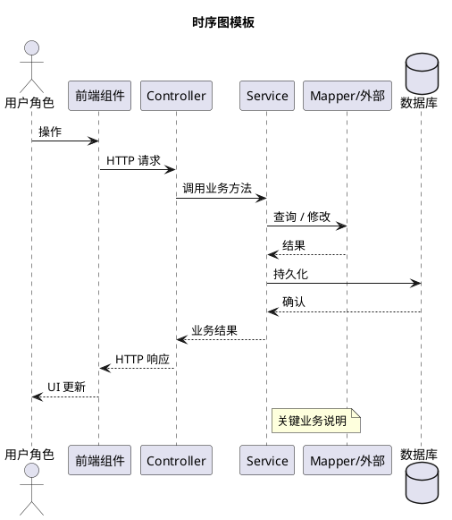

# 功能模块详细设计

> 项目：AI 集成的智能招聘系统
> 课程：计算机项目综合开发创新实践
> 文档版本：v0.1
> 编制日期：2026-09-27
> 编制依据：`docs/需求分析/功能性需求分析.md v1.1` / `docs/需求分析/非功能性需求分析.md v1.1` / `docs/系统设计/用例图.md v1.0` / `docs/系统设计/WBS/WBS.md v0.1` / `docs/技术约束.md v0.3`

---

## 修订记录

| 版本 | 日期 | 变更说明 |
|---|---|---|
| v0.1 | 2026-09-27 | 初稿（批 1）：master §0 全局约定 + §9 测试 + §10 文档 + 附 A/B/C/D；分文件 §8 基础设施 |
| （后续） | — | 批 2-4 逐步补齐 §1-7 分文件 |

---

## 阅读说明（重要）

> **本文档所有 API 路径、DTO 字段、注解命名、错误码均为设计示意**。实际实现可基于业务复杂度、代码风格、第三方库选型自由调整。
>
> 数据库 schema 以 `docs/DataBase/数据库设计.md` 与 `docs/DataBase/schema.sql` 为准；前后端代码以最终实现为准。
>
> 时序图展示关键路径与协作关系，**实际实现可选用等价方案**（如异步可用 `@Async` / `ApplicationEvent` / `CompletableFuture` / 独立线程池，由实现阶段决定）。
>
> 文档中所有"推荐 / 建议 / 可选用 / 参考做法"措辞均为方向性建议，非强制约束。已签批决策（如 JWT、UTF-8、`Result<T>` 包装）可写得明确。

---

## 预期读者

- **开发人员**：编码、评审、测试
- **答辩老师**：评审设计合理性

---

## 前置依赖

- `docs/需求分析/功能性需求分析.md v1.1`
- `docs/需求分析/非功能性需求分析.md v1.1`
- `docs/系统设计/用例图.md v1.0`
- `docs/系统设计/WBS/WBS.md v0.1`
- `docs/技术约束.md v0.3`

---

## 文档结构

| 文件 | 内容 | WBS |
|---|---|---|
| `docs/系统设计/功能模块设计.md`（本文件） | §0 全局约定 + §9 测试 + §10 文档 + 附 A 错误码 + 附 B API 清单 + 附 C 时序图索引 + 附 D 交叉引用 | — |
| `docs/系统设计/详细设计/用户与认证.md` | §1 用户与认证模块 | §1 |
| `docs/系统设计/详细设计/简历.md` | §2 简历模块 | §2 |
| `docs/系统设计/详细设计/职位与公司.md` | §3 职位与公司模块 | §3 |
| `docs/系统设计/详细设计/投递.md` | §4 投递模块 | §4 |
| `docs/系统设计/详细设计/消息中心.md` | §5 消息中心模块 | §5 |
| `docs/系统设计/详细设计/AI集成.md` | §6 AI 集成模块 | §6 |
| `docs/系统设计/详细设计/管理员.md` | §7 管理员模块 | §7 |
| `docs/系统设计/详细设计/基础设施.md` | §8 基础设施模块 | §8 |

---

## §0 全局约定

### 0.1 模块依赖关系

```
        ┌──────────────────────────────────────────┐
        │              Controller 层                │
        │  (按业务模块分包：auth / resume / job /…) │
        └──────────────┬───────────────────────────┘
                       ↓
        ┌──────────────────────────────────────────┐
        │              Service 层                   │
        │  (业务逻辑、状态机、AI 调用协调、异步任务) │
        └────┬───────────────────────┬─────────────┘
             ↓                       ↓
   ┌─────────────────┐    ┌──────────────────────┐
   │   Mapper 层     │    │   LLM / Mail / OSS   │
   │ (MyBatis-Plus)  │    │   (外部服务适配)      │
   └────────┬────────┘    └──────────────────────┘
            ↓
   ┌─────────────────┐
   │     MySQL       │
   └─────────────────┘
```

横向依赖：
- 所有模块依赖 §8 基础设施（JWT / BCrypt / 全局异常 / CORS）
- §4 投递模块依赖 §2 简历（取 ACTIVE 简历）+ §3 职位（取 JD）+ §6 AI（评分）
- §5 消息中心依赖 §8 SSE / 异步支持
- §6 AI 集成被 §2 / §3 / §4 / §5 调用
- §7 管理员依赖 §1 / §3 / §8（用户 / 审核 / 字典）

### 0.2 后端包结构（建议）

包前缀：`com.example.recruitmentsystem`

```
com.example.recruitmentsystem
├── RecruitmentSystemApplication.java
├── common/
│   ├── annotation/      # @LoginRequired / @RoleCandidate / @RoleHR / @RoleAdmin
│   ├── context/         # CurrentUserContext（ThreadLocal）
│   ├── exception/       # BusinessException
│   ├── handler/         # GlobalExceptionHandler（@RestControllerAdvice）
│   ├── util/            # 工具类
│   ├── Result.java      # 统一响应包装
│   └── PageResponse.java # 分页响应
├── config/
│   ├── WebConfig        # CORS / 静态资源 / 拦截器注册
│   ├── AuthInterceptor  # 注解拦截（@LoginRequired / 角色注解）
│   ├── JwtFilter        # JWT 解析
│   ├── PasswordConfig   # BCryptPasswordEncoder Bean
│   ├── LlmConfig        # @ConfigurationProperties("llm")
│   ├── MailProperties   # @ConfigurationProperties("app.mail")
│   ├── AsyncConfig      # @Async 线程池
│   └── JacksonConfig    # 时间格式 / Long 序列化
├── controller/          # 按业务模块分包
├── dto/                 # 按业务模块分包
├── entity/              # 数据库实体（与表一一对应）
├── mapper/              # MyBatis-Plus Mapper 接口
├── service/
│   └── impl/            # 业务实现
└── llm/                 # AI 集成层（Prompt 模板 / LlmClient 封装 / 6 个 AI Service）
```

### 0.3 前端目录结构（建议）

```
frontend/src/
├── api/                 # Axios 封装（http.js + 按业务模块拆分）
├── assets/
├── components/
│   ├── layout/          # 布局组件（TopBar / Sidebar / Footer）
│   ├── common/          # 通用组件（Avatar / Tag / Empty / ConfirmDialog）
│   └── business/        # 业务组件（按模块拆分）
├── views/
│   ├── auth/            # 登录 / 注册
│   ├── candidate/       # 求职者端页面
│   ├── hr/              # HR 端页面
│   ├── admin/           # 管理员端页面
│   └── common/          # 通用页面（404 / 403 / 个人中心）
├── router/              # 路由 + 角色守卫
├── stores/              # Pinia stores（详见 §0.9）
├── utils/               # 工具类
└── main.ts / App.vue
```

### 0.4 统一响应格式

后端所有接口返回 `Result<T>`：

```json
{
  "code": 200,
  "message": "success",
  "data": <T>
}
```

| code | 含义 | 触发场景 |
|---|---|---|
| 200 | 成功 | 业务正常完成 |
| 400 | 业务校验失败 | BusinessException / 参数校验失败 |
| 401 | 未登录 | JWT 缺失 / 过期 / 无效 |
| 403 | 无权限 | 角色检查不通过 |
| 404 | 资源不存在 | 实体不存在 / 已删除 |
| 500 | 系统异常 | 兜底异常 |

分页接口额外返回 `PageResponse<T>`：

```json
{
  "code": 200,
  "message": "success",
  "data": {
    "total": 100,
    "pageNum": 1,
    "pageSize": 20,
    "list": [...]
  }
}
```

### 0.5 API 路径约定

- 全部走 `/api` 前缀（前端 vite proxy 已对齐 `/api` → `http://localhost:8080`）
- 资源用名词复数：`/api/jobs` / `/api/applications` / `/api/messages`
- 操作性子资源用动词：`/api/applications/{id}/withdraw` / `/api/applications/{id}/status`
- 查询参数放 query 或 body（POST + body 适合复杂筛选条件）

### 0.6 鉴权与角色注解

**JWT 流程**：

1. 用户登录 → 服务端签发 JWT（含 userId / role / 过期时间）
2. 前端存 localStorage，axios 拦截器自动注入 `Authorization: Bearer <token>`
3. 后端 `JwtFilter` 解析 token → 写入 `CurrentUserContext`（ThreadLocal）
4. `AuthInterceptor` 检查方法上的注解 → 通过则放行，不通过抛 BusinessException

**角色注解**（推荐组织方式，实现可调整）：

| 注解 | 检查内容 | 适用角色 |
|---|---|---|
| `@LoginRequired` | 必须登录（任意角色） | 任意已登录用户 |
| `@RoleCandidate` | 必须登录 + role=CANDIDATE | 求职者 |
| `@RoleHR` | 必须登录 + role=HR | HR |
| `@RoleAdmin` | 必须登录 + role=ADMIN | 管理员 |

注解可叠加：`@LoginRequired` 是基类，其他三个角色注解隐含登录检查。

### 0.7 异步任务

Spring `@Async` + 自定义 `TaskExecutor` Bean（推荐配置，可调整）：

- 核心线程数：4
- 最大线程数：8
- 队列容量：200
- 线程名前缀：`rs-async-`
- 适用场景：投递瞬间触发 AI-2 评分（异步，不阻塞 HTTP 返回）、AI 客服首响（流式）

### 0.8 LLM 调用约定

- HTTP 客户端：`RestClient` + `JdkClientHttpRequestFactory`
- 超时：30 秒（与 `llm.timeout-seconds` 一致）
- 失败处理：抛 `BusinessException("大模型调用失败：xxx")`，由调用方决定降级策略
- 结构化输出：业务调用设置 `response_format={"type":"json_object"}`，prompt 内给出 JSON Schema
- 缓存（可选）：本地 Caffeine 1 小时（暂不引入 Redis）

### 0.9 Pinia Stores

推荐 7 个 store（按业务域划分，可按需合并 / 拆分）：

| Store | 主要 state | 关键 action |
|---|---|---|
| `useAuthStore` | token / userInfo / role | login / logout / refreshUser |
| `useUserStore` | profile / preferences | fetchProfile / updateProfile |
| `useResumeStore` | currentResume / uploadProgress | uploadResume / saveResume |
| `useJobStore` | jobList / currentJob / filters | fetchJobs / toggleFavorite |
| `useApplicationStore` | myApplications / currentApplication | fetchApplications / withdraw / pushStatus |
| `useMessageStore` | conversations / currentMessages / sseConn | connectSse / sendMessage / markRead |
| `useAiChatStore` | chatHistory / isStreaming | sendMessage / clearHistory |

### 0.10 时序图图例



约定：
- 同步调用用实线箭头 `->`
- 异步调用用虚线箭头 `->>`（带 note 说明）
- 关键业务约束用 `note over/right of ...` 说明
- 数据持久化用 `database` 元素

---

## §9 测试与质量保证（WBS §9）

### 9.1 单元测试

- **目标**：覆盖关键业务逻辑（状态机、AI 降级判断、密码校验、JWT 生成解析）
- **框架**：JUnit 5 + Mockito
- **关键用例**：
  - 投递状态机合法流转校验（非合法转换抛 BusinessException）
  - WITHDRAWN 仅求职者可触发（HR 触发抛 BusinessException）
  - 简历 ACTIVE 唯一性校验（已有 ACTIVE 时再上传抛错）
  - JWT 过期 / 无效解析返回 401
  - BCrypt 密码哈希校验一致性

### 9.2 集成测试

- **目标**：API 端到端 + DB 集成
- **框架**：`@SpringBootTest` + MockMvc + 本机 MySQL
- **关键场景**：
  - 注册 → 登录 → 调受保护接口（拿到 userId）
  - 候选人投递 → 异步 AI 评分 → 状态时间线写入
  - HR 推进状态 → 状态机校验 → 候选人端 UI 反映
  - 撤回投递 → WITHDRAWN → HR 收到站内信

### 9.3 端到端演示路径

- 3 角色主路径脚本（与 `docs/演示脚本.md` 联动）
- 演示数据准备（Python seed 脚本，可选）

---

## §10 文档与答辩（WBS §10）

### 10.1 阶段性文档

- 排版：仿宋_GB2312 + 小四 + 1.5 倍行距
- 渲染：PDF + 页面 PNG
- 截止：9.30 22:00

### 10.2 终期报告

- ≤40 页 PDF
- 必备截图：开发环境 + 用户界面 + 数据库实现
- 截止：10.11 22:00

### 10.3 答辩演示

- 8 分钟主路径
- 演示环境：Windows 本机 + MySQL80 + 后端 :8080 + 前端 :5173

---

## 附 A 错误码表（分段约定）

> 具体码值由实现阶段分配，本附录仅约定分段范围。

| 段 | 范围 | 含义 |
|---|---|---|
| 1xxx | 1001-1099 | 认证 / 用户 |
| 2xxx | 2001-2099 | 简历 / 附件 |
| 3xxx | 3001-3099 | 职位 / 公司 |
| 4xxx | 4001-4099 | 投递 / 状态 |
| 5xxx | 5001-5099 | 消息 / 会话 |
| 6xxx | 6001-6099 | 字典 / 公共 |
| 9xxx | 9001-9099 | 系统 / AI |

---

## 附 B API 完整清单（汇总占位）

> 各模块 endpoint 数量汇总，详细接口在分文件 §N.2 中定义。

| 模块 | endpoint 数 | 详见 |
|---|---|---|
| 用户与认证 | ~8 | `docs/系统设计/详细设计/用户与认证.md` §1.2 |
| 简历 | ~6 | `docs/系统设计/详细设计/简历.md` §2.2 |
| 职位与公司 | ~10 | `docs/系统设计/详细设计/职位与公司.md` §3.2 |
| 投递 | ~8 | `docs/系统设计/详细设计/投递.md` §4.2 |
| 消息中心 | ~8 | `docs/系统设计/详细设计/消息中心.md` §5.2 |
| AI 集成 | ~7 | `docs/系统设计/详细设计/AI集成.md` §6.2 |
| 管理员 | ~12 | `docs/系统设计/详细设计/管理员.md` §7.2 |
| **合计** | **~59** | — |

---

## 附 C 时序图索引

| 时序图 | 覆盖用例 | 文件 |
|---|---|---|
| 鉴权拦截流程 | UC-03 / UC-04 | `设计/基础设施.md` §8.1 |
| 文件上传 / 下载 | UC-05 / UC-18 / UC-27 | `设计/基础设施.md` §8.4 |
| 注册流程 | UC-01 / UC-02 | `设计/用户与认证.md` §1.4 |
| 密码登录 | UC-03 | 同上 |
| 验证码登录 | UC-04 | 同上 |
| 账号设置 | UC-15 | 同上 |
| 上传 + AI-1 解析 | UC-05 / UC-06 | `设计/简历.md` §2.4 |
| 编辑简历 | UC-07 | 同上 |
| 重新上传简历 | UC-08 | 同上 |
| 候选人浏览 / 搜索 | UC-09 / UC-10 | `设计/职位与公司.md` §3.4 |
| 收藏职位 | UC-11 | 同上 |
| 公司信息维护 | UC-20 | 同上 |
| 发布职位 | UC-21 | 同上 |
| 编辑职位 + AI-3 润色 | UC-22 | 同上 |
| 下架 / 删除职位 | UC-23 | 同上 |
| 候选人搜索 | UC-28 | 同上 |
| 投递触发 AI-2 评分 | UC-12 | `设计/投递.md` §4.4 |
| HR 查看投递列表 | UC-24 | 同上 |
| 推进投递状态 | UC-25 | 同上 |
| HR 备注 | UC-26 | 同上 |
| 查看候选人简历 | UC-27 | 同上 |
| 撤回投递 + 自动通知 | UC-14 / UC-33 | 同上 |
| 消息收发 | UC-16 / UC-17 / UC-31 / UC-32 | `设计/消息中心.md` §5.4 |
| 消息附件 | UC-18 | 同上 |
| AI 智能客服 | UC-19 | `设计/AI集成.md` §6.4 |
| AI-5 批量回复 | UC-29 | 同上 |
| AI-6 投递信生成 | UC-30 | 同上 |
| 用户管理 | UC-34 | `设计/管理员.md` §7.4 |
| 职位审核 | UC-35 | 同上 |
| 公司审核 | UC-36 | 同上 |
| 简历审核 | UC-37 | 同上 |
| 字典 CRUD | UC-38 / UC-39 / UC-40 | 同上 |

---

## 附 D 交叉引用

- `docs/需求分析/功能性需求分析.md v1.1`：每个用例对应 §4.x 章节
- `docs/需求分析/非功能性需求分析.md v1.1`：对应 §3 NFR / §4 关键技术决策
- `docs/系统设计/用例图.md v1.0`：40 用例（UC-01 ~ UC-40 + AI2）
- `docs/系统设计/WBS/WBS.md v0.1`：10 一级模块
- `docs/技术约束.md v0.3`：技术栈 / DDL 约定 / 配置 / AI 集成 / 目录结构
- `AGENTS.md`：AI 协作规范
- `docs/数据库设计.md`（后续批）：DB schema 详细定义
