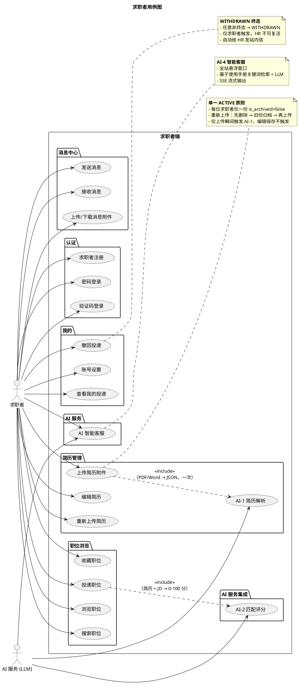
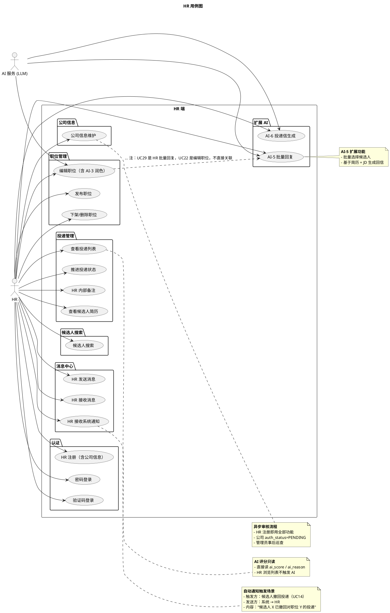
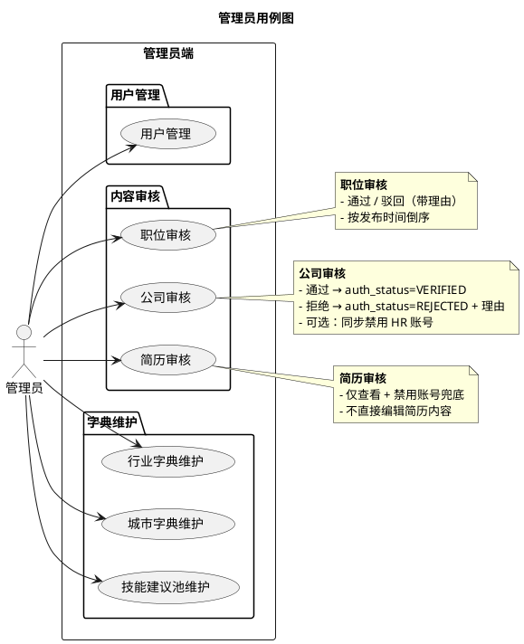
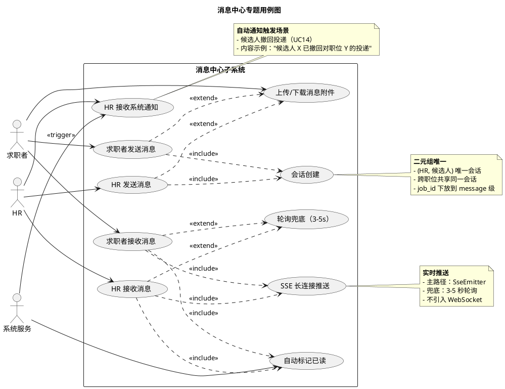
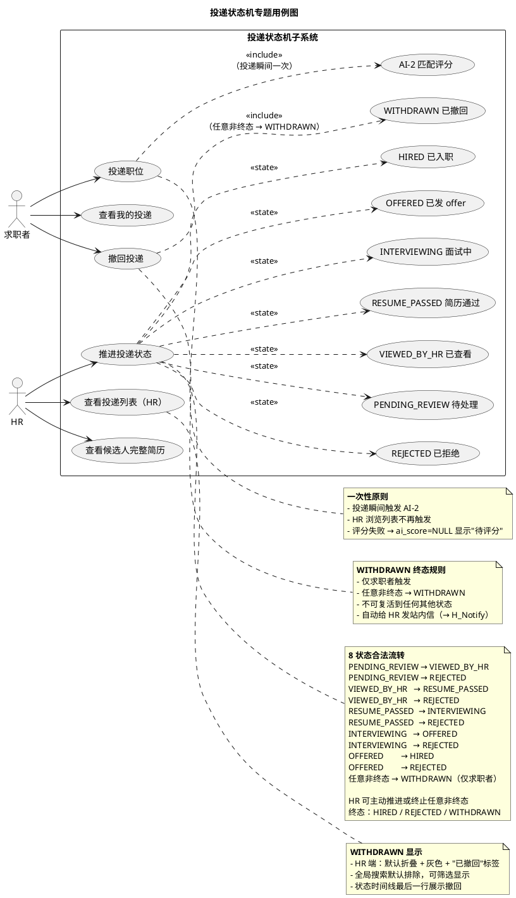
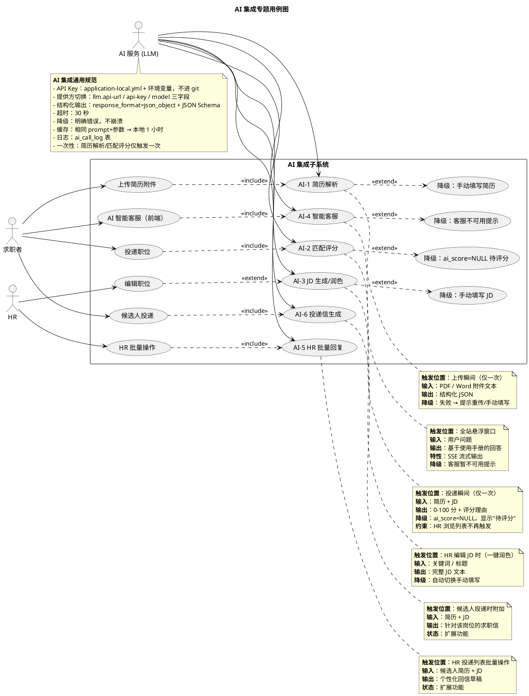

# 用例图

> 项目：AI 集成的智能招聘系统
> 课程：计算机项目综合开发创新实践
> 文档版本：v1.0
> 编制日期：2026-09-26
> 编制依据：`docs/需求分析/功能性需求分析.md v1.1`、`docs/系统设计/WBS/WBS.md v0.1`
> 图表工具：PlantUML（VSCode PlantUML 插件 / IDEA PlantUML Integration）

---

## 修订记录

| 版本 | 日期 | 变更说明 |
|---|---|---|
| v0.1 | 2026-09-26 | Codex 初稿：21 个用例，总览图 1 张；缺 include/extend，路径错放在 `docs/系统设计/详细设计/` |
| v1.0 | 2026-09-26 | Opencode 重做：拆分 21→40 个用例；7 张图（总览 1 + 角色 3 + 专题 3）；补 include/extend；补 AI-2、AI-5、AI-6；路径规范到 `docs/系统设计/用例图.md` |

---

## 说明

- 本文档采用 **PlantUML** 描述用例图，每张图为独立 ` ```plantuml ` 代码块，可在 VSCode 中用 PlantUML 插件直接预览。
- **图层结构**：3 层共 7 张图
  - **总览级**（1 张）：跨 3 角色 + AI 服务的全部用例
  - **角色级**（3 张）：候选人 / HR / 管理员各自的详细用例图
  - **专题级**（3 张）：消息中心 / 投递状态机 / AI 集成
- **用例粒度**：40 个用例（覆盖功能性需求分析 v1.1 全部 4.x 章节 + 扩展 AI 功能）
- **关键关系**：
  - `A ..> B : <<include>>` —— A 必须触发 B
  - `A ..> B : <<extend>>` —— B 在 A 的特定条件下触发
  - `Actor --> Usecase` —— actor 与用例的直接关联

---

## 1. 总览级用例图

> 4 个 actor × 40 个用例，按子系统分组展示。

```plantuml
@startuml
left to right direction
title AI 集成的智能招聘系统 - 需求用例图（总览）

actor "求职者" as C
actor "HR" as H
actor "管理员" as A
actor "AI 服务 (LLM)" as AI

rectangle "AI 集成的智能招聘系统" {

    package "认证" {
        usecase "求职者注册" as UC01
        usecase "HR 注册" as UC02
        usecase "密码登录" as UC03
        usecase "验证码登录" as UC04
    }

    package "简历模块（求职者）" {
        usecase "上传简历附件" as UC05
        usecase "AI-1 简历解析" as UC06
        usecase "编辑简历" as UC07
        usecase "重新上传简历" as UC08
    }

    package "职位模块（求职者）" {
        usecase "浏览职位" as UC09
        usecase "搜索职位" as UC10
        usecase "收藏职位" as UC11
        usecase "投递职位" as UC12
    }

    package "我的（求职者）" {
        usecase "查看我的投递" as UC13
        usecase "撤回投递" as UC14
        usecase "账号设置" as UC15
    }

    package "消息中心（求职者）" {
        usecase "发送消息" as UC16
        usecase "接收消息" as UC17
        usecase "上传/下载消息附件" as UC18
    }

    package "AI - 求职者" {
        usecase "AI 智能客服" as UC19
    }

    package "公司/职位（HR）" {
        usecase "公司信息维护" as UC20
        usecase "发布职位" as UC21
        usecase "编辑职位（含 AI-3 润色）" as UC22
        usecase "下架/删除职位" as UC23
    }

    package "投递管理（HR）" {
        usecase "查看投递列表" as UC24
        usecase "推进投递状态" as UC25
        usecase "HR 内部备注" as UC26
        usecase "查看候选人简历" as UC27
    }

    package "候选人搜索（HR）" {
        usecase "候选人搜索" as UC28
    }

    package "扩展 AI（HR）" {
        usecase "AI-5 批量回复" as UC29
        usecase "AI-6 投递信生成" as UC30
    }

    package "消息中心（HR）" {
        usecase "HR 发送消息" as UC31
        usecase "HR 接收消息" as UC32
        usecase "HR 接收系统通知" as UC33
    }

    package "管理员模块" {
        usecase "用户管理" as UC34
        usecase "职位审核" as UC35
        usecase "公司审核" as UC36
        usecase "简历审核" as UC37
        usecase "行业字典维护" as UC38
        usecase "城市字典维护" as UC39
        usecase "技能建议池维护" as UC40
    }

    package "AI 服务集成" {
        usecase "AI-2 匹配评分" as AI2
    }
}

' ====== 求职者关联 ======
C --> UC01
C --> UC03
C --> UC04
C --> UC05
C --> UC07
C --> UC08
C --> UC09
C --> UC10
C --> UC11
C --> UC12
C --> UC13
C --> UC14
C --> UC15
C --> UC16
C --> UC17
C --> UC18
C --> UC19

' ====== HR 关联 ======
H --> UC02
H --> UC03
H --> UC04
H --> UC20
H --> UC21
H --> UC22
H --> UC23
H --> UC24
H --> UC25
H --> UC26
H --> UC27
H --> UC28
H --> UC29
H --> UC30
H --> UC31
H --> UC32
H --> UC33

' ====== 管理员关联 ======
A --> UC34
A --> UC35
A --> UC36
A --> UC37
A --> UC38
A --> UC39
A --> UC40

' ====== AI 服务关联（次要 actor） ======
AI --> UC06 : <<AI-1>>
AI --> UC19 : <<AI-4>>
AI --> UC22 : <<AI-3>>
AI --> UC29 : <<AI-5>>
AI --> UC30 : <<AI-6>>
AI --> AI2  : <<AI-2>>

' ====== 关键 include（必须触发） ======
UC05 ..> UC06 : <<include>>\n（上传瞬间一次）
UC12 ..> AI2  : <<include>>\n（投递瞬间一次）

' ====== 关键 extend（条件触发） ======
UC14 ..> UC33 : <<extend>>\n（撤回自动通知 HR）

@enduml
```



---

## 2. 求职者用例图（详细）



---

## 3. HR 用例图（详细）



---

## 4. 管理员用例图（详细）



---

## 5. 消息中心专题用例图



---

## 6. 投递状态机专题用例图



---

## 7. AI 集成专题用例图



---

## 附录：用例清单（40 个）

| ID | 用例名 | 主 actor | 子系统 | 触发 / 备注 |
|---|---|---|---|---|
| UC-01 | 求职者注册 | 求职者 | 认证 | 邮箱 + 密码（BCrypt 哈希） |
| UC-02 | HR 注册 | HR | 认证 | 邮箱 + 密码 + 公司信息 |
| UC-03 | 密码登录 | 求职者 / HR | 认证 | 邮箱 + 密码 |
| UC-04 | 验证码登录 | 求职者 / HR | 认证 | 邮箱 + 验证码；`app.mail.enabled` 开关 |
| UC-05 | 上传简历附件 | 求职者 | 简历 | PDF / Word，≤20MB |
| UC-06 | AI-1 简历解析 | AI | 简历 | UC05 <<include>>；上传瞬间一次 |
| UC-07 | 编辑简历 | 求职者 | 简历 | 单一 ACTIVE；编辑不触发 AI |
| UC-08 | 重新上传简历 | 求职者 | 简历 | 删除 → 归档 → 再上传 |
| UC-09 | 浏览职位 | 求职者 | 职位 | 分页 20 条 / 行业 / 城市 / 薪资筛选 |
| UC-10 | 搜索职位 | 求职者 | 职位 | 关键词（职位名 / 公司名 / JD）+ 技能 |
| UC-11 | 收藏职位 | 求职者 | 职位 | 收藏 / 取消收藏 |
| UC-12 | 投递职位 | 求职者 | 职位 | 自动取 ACTIVE 简历副本；触发 AI-2 |
| UC-13 | 查看我的投递 | 求职者 | 我的 | 含状态时间线 |
| UC-14 | 撤回投递 | 求职者 | 我的 | → WITHDRAWN 终态；自动通知 HR |
| UC-15 | 账号设置 | 求职者 | 我的 | 账号安全 + 个人资料 + 求职偏好 |
| UC-16 | 发送消息 | 求职者 | 消息 | 二元组唯一会话 |
| UC-17 | 接收消息 | 求职者 | 消息 | SSE + 自动已读 |
| UC-18 | 上传/下载消息附件 | 求职者 / HR | 消息 | 图片 / 文件 |
| UC-19 | AI 智能客服 | 求职者 | AI | SSE 流式输出 |
| UC-20 | 公司信息维护 | HR | HR-公司 | 编辑公司名 / 行业 / 规模 / 简介；查看审核状态 |
| UC-21 | 发布职位 | HR | HR-职位 | 基本信息 + JD |
| UC-22 | 编辑职位（含 AI-3 润色） | HR / AI | HR-职位 | 一键润色按钮（extend） |
| UC-23 | 下架/删除职位 | HR | HR-职位 | 隐藏而非删除，可重新发布 |
| UC-24 | 查看投递列表 | HR | HR-投递 | 按职位分组；只读 ai_score |
| UC-25 | 推进投递状态 | HR | HR-投递 | 8 状态合法流转 |
| UC-26 | HR 内部备注 | HR | HR-投递 | application_note 表 |
| UC-27 | 查看候选人简历 | HR | HR-投递 | 取自投递时所附 ACTIVE 副本 |
| UC-28 | 候选人搜索 | HR | HR-候选人 | 基于简历池关键词（扩展项，待定） |
| UC-29 | AI-5 批量回复 | HR / AI | HR-扩展 AI | 批量选择候选人 |
| UC-30 | AI-6 投递信生成 | 求职者 / AI | HR-扩展 AI | 投递时附加 |
| UC-31 | HR 发送消息 | HR | 消息 | 二元组唯一会话 |
| UC-32 | HR 接收消息 | HR | 消息 | SSE + 自动已读 |
| UC-33 | HR 接收系统通知 | HR | 消息 | UC14 <<extend>>；撤回自动通知 |
| UC-34 | 用户管理 | 管理员 | 管理员 | 启用 / 禁用 / 重置密码 / HR 角色标记 |
| UC-35 | 职位审核 | 管理员 | 管理员 | 通过 / 驳回（带理由） |
| UC-36 | 公司审核 | 管理员 | 管理员 | 通过 / 拒绝（带理由 + 可选禁用 HR） |
| UC-37 | 简历审核 | 管理员 | 管理员 | 查看 + 禁用账号兜底 |
| UC-38 | 行业字典维护 | 管理员 | 管理员 | 一级 + 二级 |
| UC-39 | 城市字典维护 | 管理员 | 管理员 | 强制下拉 |
| UC-40 | 技能建议池维护 | 管理员 | 管理员 | 自动补全建议池 |
| AI2  | AI-2 匹配评分 | AI | AI 服务 | UC12 <<include>>；投递瞬间一次 |

---

## 附录：交叉引用

- `docs/需求分析/功能性需求分析.md v1.1`：每个用例对应 4.x 章节
- `docs/系统设计/WBS/WBS.md v0.1`：每个用例对应 WBS 节点
- `docs/技术约束.md`：AI 集成通用规范（§6）、DDL 约定（§4）、配置（§5）
