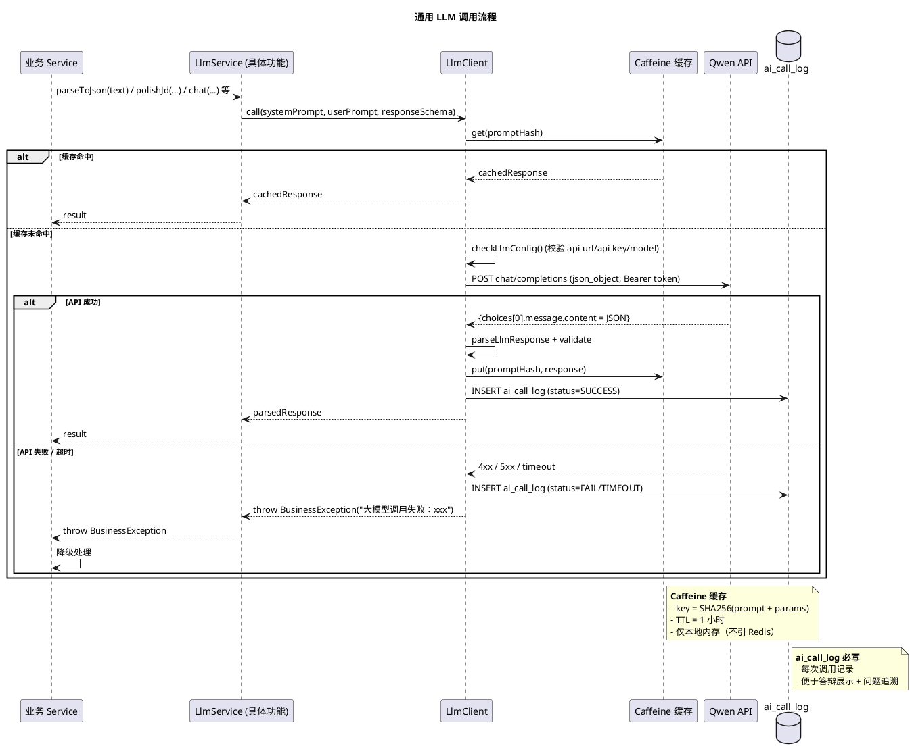
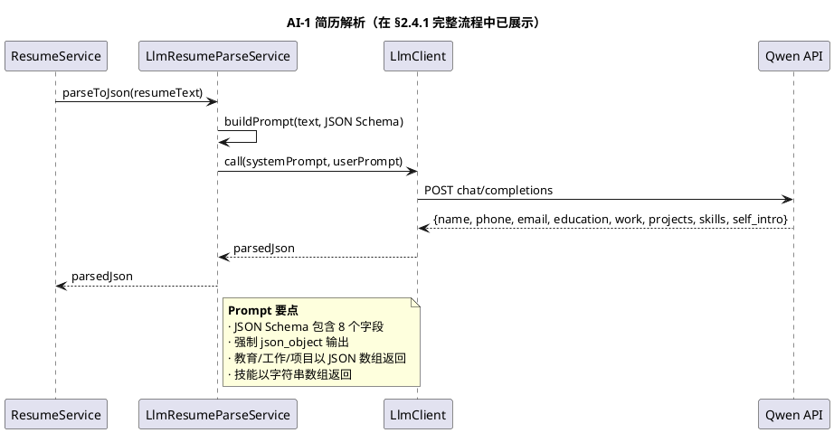
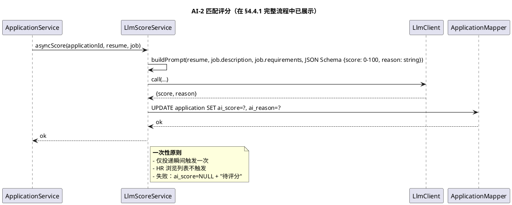
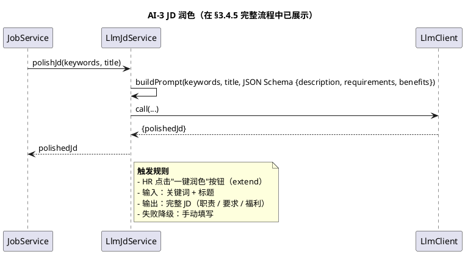
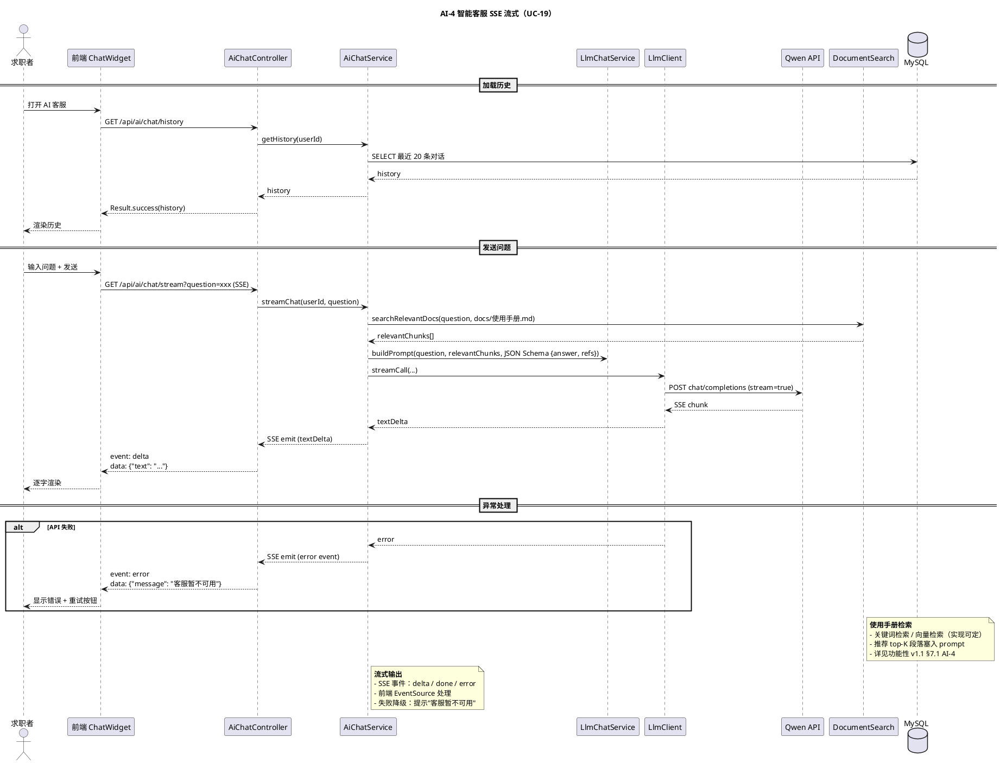
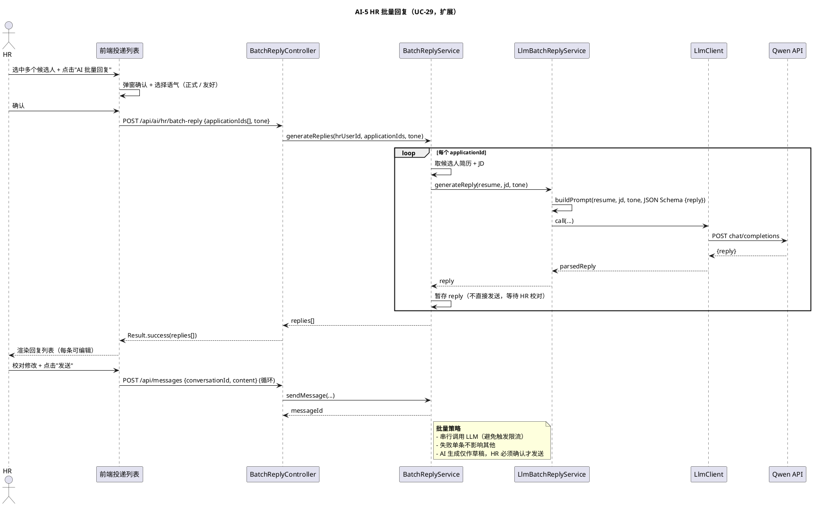
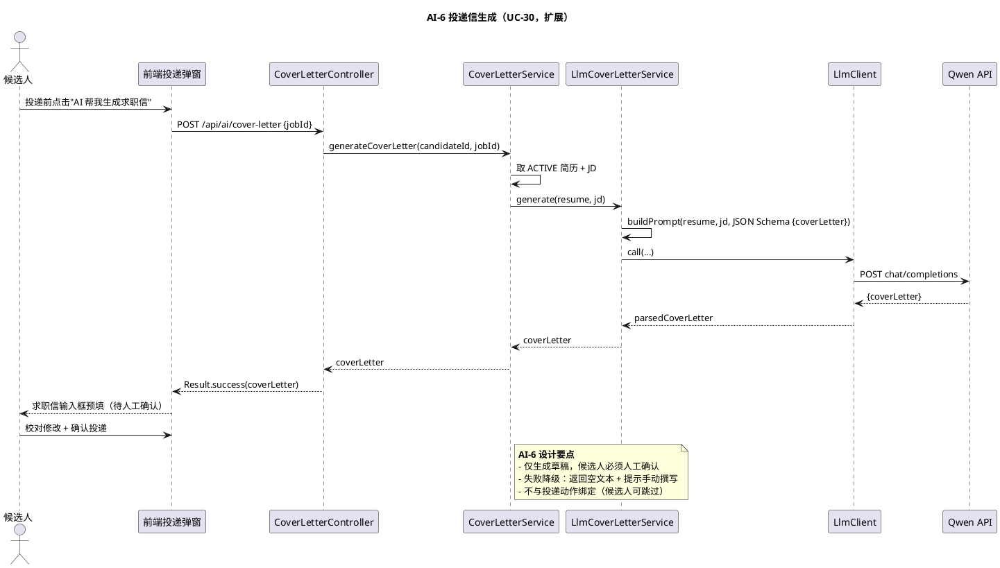

# §6 AI 集成模块

> WBS 节点：§6 AI 集成
> 编制依据：`docs/系统设计/WBS/WBS.md v0.1` §6 / `docs/需求分析/功能性需求分析.md v1.1` §7
> 编制日期：2026-09-27
> 文档版本：v0.1

> 本文件展示 AI 集成模块的设计。所有 API 路径、DTO 字段、注解命名均为示意，实现可调整。

---

## 修订记录

| 版本 | 日期 | 变更说明 |
|---|---|---|
| v0.1 | 2026-09-27 | 初稿：通用 LLM 客户端 + AI-1/2/3/4/5/6 详细设计 |

---

## 6.0 模块概述

提供 4 个必做 + 2 个扩展 AI 能力的统一集成层：

| 编号 | 功能 | 触发位置 | 状态 |
|---|---|---|---|
| AI-1 | 简历解析 | 求职者上传瞬间 | 必做 |
| AI-2 | 简历 ↔ JD 匹配评分 | 候选人投递瞬间 | 必做 |
| AI-3 | JD 生成 / 润色 | HR 编辑 JD 时 | 必做 |
| AI-4 | 智能客服 | 全站悬浮窗口 | 必做 |
| AI-5 | HR 批量回复 | HR 投递列表批量操作 | 扩展 |
| AI-6 | 投递信生成 | 候选人投递时 | 扩展 |

**通用规范**（来自功能性 v1.1 §7.4）：
1. API Key 通过 `application-local.yml` + 环境变量注入，不进 git
2. 提供方切换：修改 `llm.api-url / api-key / model` 三字段
3. 结构化输出：`response_format={"type":"json_object"}` + JSON Schema
4. 超时控制：30 秒
5. 降级策略：未配置 API Key 或调用失败时返回明确错误而非崩溃
6. 缓存：相同 prompt+参数 → 本地缓存 1 小时（暂不引入 Redis）
7. 日志：每次调用记录输入、输出、耗时、token 数，存入 `ai_call_log`
8. 一次性原则：简历解析 / 匹配评分仅触发一次

依赖：
- §2 简历（AI-1 输入）
- §3 职位（AI-2 / AI-3 输入）
- §4 投递（AI-2 触发点）
- §5 消息中心（无 AI 集成）

被调用方：§2 / §3 / §4 / §5。

---

## 6.1 数据模型

涉及的核心表（详见 `docs/数据库设计.md`，后续批输出）：

| 表 | 关键字段 |
|---|---|
| `ai_call_log` | id, function_code（AI-1/2/3/4/5/6）, prompt, response, latency_ms, prompt_tokens, completion_tokens, status（SUCCESS/FAIL/TIMEOUT）, error_message, caller_user_id, created_at, updated_at, is_deleted |

要点：
- 每次 LLM 调用必写 ai_call_log，便于答辩展示与问题追溯
- 不缓存 prompt+response 到 DB（仅在内存 Caffeine 缓存 1 小时）

---

## 6.2 接口设计（示意）

### 6.2.1 AI-4 智能客服（唯一直接面向前端的 AI endpoint）

| endpoint | 方法 | 鉴权 | 说明 |
|---|---|---|---|
| `/api/ai/chat/stream` | GET | @LoginRequired | AI-4 智能客服 SSE 流式响应 |
| `/api/ai/chat/history` | GET | @LoginRequired | 当前用户历史对话 |

### 6.2.2 AI-5 / AI-6（扩展）

| endpoint | 方法 | 鉴权 | 说明 |
|---|---|---|---|
| `/api/ai/hr/batch-reply` | POST | @RoleHR | AI-5 HR 批量回复（候选人数组 + 简历 + JD） |
| `/api/ai/cover-letter` | POST | @RoleCandidate | AI-6 投递信生成（投递前调用） |

### 6.2.3 内部接口（不对外暴露）

- AI-1：§2.2 ResumeService.uploadAndParse() 内部调用
- AI-2：§4.4 ApplicationService.apply() 内部 @Async 调用
- AI-3：§3.2 JobService.polishJd() 内部调用

字段集非穷举。

---

## 6.3 业务逻辑

### 6.3.1 LLM 客户端封装（LlmClient）

- HTTP 客户端：`RestClient` + `JdkClientHttpRequestFactory`
- 超时设置：readTimeout = 30s（与 `llm.timeout-seconds` 一致）
- 请求构造：`Authorization: Bearer <api-key>` + `Content-Type: application/json`
- 请求体：`{model, messages: [{role: system, content: prompt}, ...], response_format: {type: json_object}}`
- 响应解析：提取 `choices[0].message.content` → JSON parse

### 6.3.2 LLM 配置读取（LlmConfig）

`@ConfigurationProperties("llm")`：

```java
private String apiUrl;    // 默认通义千问
private String apiKey;    // 演示态可空
private String model;     // 默认 qwen-plus
```

校验：调用前 `checkLlmConfig()`，三者任一为空抛 BusinessException("大模型配置不完整")。

### 6.3.3 Prompt 模板

每个 AI 功能独立 prompt 模板（Java text block 写在 Service 内）：

- 系统提示词：定义 AI 角色 + 任务 + JSON Schema
- 用户提示词：动态填充业务数据（如简历内容、JD 文本）

### 6.3.4 响应解析

- 期望响应：JSON 对象（强制 `response_format`）
- 解析失败 → 抛 BusinessException("大模型返回内容解析失败")
- 字段缺失 → 抛 BusinessException("大模型返回字段缺失：xxx")
- 值非法（如 AI-2 分数不在 0-100）→ 抛 BusinessException

### 6.3.5 降级策略

| AI 功能 | 失败降级 UX |
|---|---|
| AI-1 简历解析 | 创建空简历 + 前端 toast "AI 解析失败，请手动填写" |
| AI-2 匹配评分 | ai_score=NULL + HR 端显示"待评分" |
| AI-3 JD 润色 | 弹窗提示"AI 润色失败，请手动填写" |
| AI-4 智能客服 | 返回错误提示"客服暂不可用" |
| AI-5 批量回复 | 单条失败不影响其他，失败项标记重试 |
| AI-6 投递信生成 | 返回空文本 + 提示"AI 生成失败，请手动撰写" |

### 6.3.6 缓存

- 内存 Caffeine 缓存（key = prompt hash + params hash，value = response）
- TTL：1 小时
- 命中条件：相同 prompt + 相同参数

### 6.3.7 ai_call_log 日志

每次调用必写：

```
[function_code] [prompt 摘要] [response 摘要] [latency_ms] [token 数] [status] [error_message?]
```

---

## 6.4 时序图

### 6.4.1 通用 LLM 调用流程（覆盖所有 AI 功能的底层）



### 6.4.2 AI-1 简历解析（已在 §2.4.1 覆盖，此处简化）



### 6.4.3 AI-2 匹配评分（投递瞬间异步）



### 6.4.4 AI-3 JD 生成 / 润色（HR 编辑时 extend）



### 6.4.5 AI-4 智能客服（SSE 流式，UC-19）



### 6.4.6 AI-5 HR 批量回复（UC-29，扩展）



### 6.4.7 AI-6 投递信生成（UC-30，扩展）



---

## 6.5 前端组件

### 6.5.1 AI-4 智能客服

- **ChatWidget.vue**（全站悬浮聊天窗口）
  - 悬浮按钮（右下角）
  - 点击展开聊天面板
  - 流式输出（逐字渲染）
  - 历史消息加载

### 6.5.2 AI-3 JD 润色

- **JobEdit.vue** 中"一键润色"按钮
  - 弹窗加载
  - 字段填充后 HR 校对

### 6.5.3 AI-5 批量回复

- **HrApplicationList.vue** 中"AI 批量回复"按钮
  - 选中候选人 + 选择语气
  - 回复列表展示 + 编辑 + 逐条发送

### 6.5.4 AI-6 投递信生成

- **ApplyDialog.vue**（投递确认弹窗）中"AI 帮我写"按钮
  - 调用后填充求职信文本框

### 6.5.5 Pinia Stores

- `useAiChatStore`：chatHistory / isStreaming / sendMessage / clearHistory

---

## 6.6 错误处理

| 场景 | code | message |
|---|---|---|
| 大模型配置缺失 | 400 / 9xxx | 大模型配置不完整 |
| API Key 无效 | 500 / 9xxx | 大模型调用失败：401 |
| API 超时（30s） | 500 / 9xxx | 大模型调用超时 |
| 返回非 JSON | 500 / 9xxx | 大模型返回内容解析失败 |
| 字段缺失 / 不合法 | 500 / 9xxx | 大模型返回字段缺失：xxx |
| AI-4 流式中断 | — | SSE error 事件：客服暂不可用 |

---

## 6.7 测试要点

### 6.7.1 单元测试

- LlmClient 的请求构造 / 响应解析（mock HTTP）
- 每个 AI Service 的 Prompt 拼接 / JSON Schema 校验
- 缓存命中逻辑
- 降级策略触发条件

### 6.7.2 集成测试

- AI-1：mock LLM 返回合法 JSON → resume 字段填充
- AI-1：mock LLM 返回非法 JSON → 空字段 + 提示
- AI-2：投递 → 异步评分 → ai_score 写入
- AI-3：HR 编辑 → 润色 → JD 字段填充
- AI-4：流式输出 → 前端逐字接收
- AI-5：批量生成 + HR 校对 + 发送
- AI-6：生成草稿 + 候选人校对

### 6.7.3 端到端冒烟

- 候选人：上传简历 → 看到 AI 解析结果 → 校对保存
- 候选人：投递 → toast"评分中" → 等待评分 → 列表显示分数
- HR：编辑 JD → 输入关键词 → AI 润色 → 校对保存
- 候选人：打开 AI 客服 → 问"如何投递" → 流式收到回答
- AI 失败：mock 关闭 → 各 AI 功能降级 UX 触发
