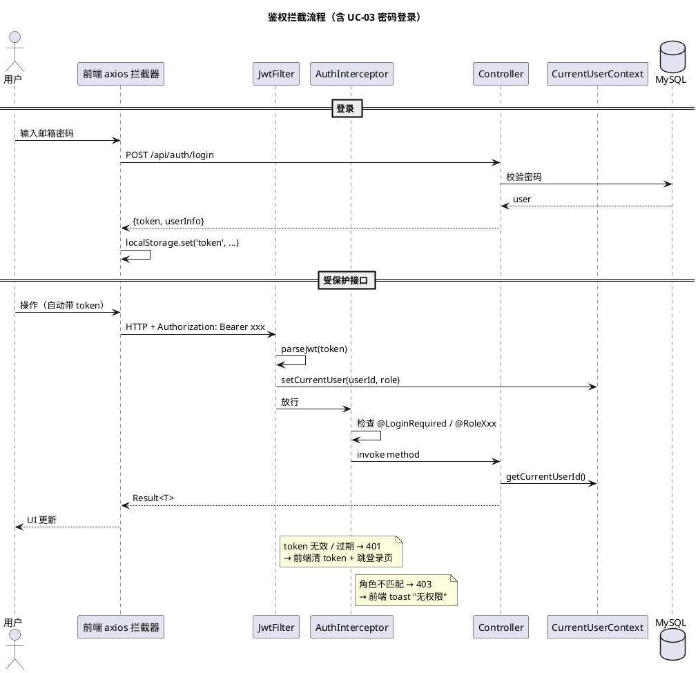
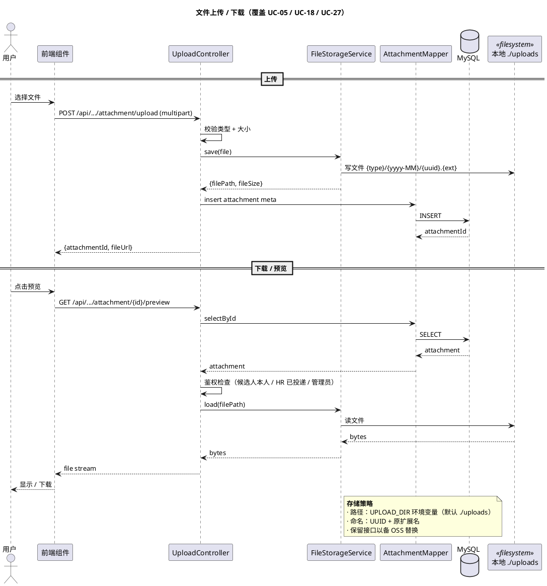

# §8 基础设施与横切关注点

> WBS 节点：§8 基础设施模块
> 编制依据：`docs/系统设计/WBS/WBS.md v0.1` §8 / `docs/技术约束.md v0.3`
> 编制日期：2026-09-27
> 文档版本：v0.1

> 本文件展示基础设施层的设计约定。各业务模块均依赖本层提供的横切能力。
>
> 所有 API 路径、字段、注解命名均为示意，实现可调整。

---

## 修订记录

| 版本 | 日期 | 变更说明 |
|---|---|---|
| v0.1 | 2026-09-27 | 初稿：JWT / BCrypt / 全局异常 / 文件 / 数据库 / 配置 / 安全 |

---

## 8.1 JWT 认证

### 8.1.1 模块概述

提供基于 JWT 的无状态认证。前端登录后拿到 token，存 localStorage，每次请求自动注入 `Authorization: Bearer <token>`。后端 `JwtFilter` 解析 token 写入 ThreadLocal，由 `AuthInterceptor` 检查角色注解。

### 8.1.2 数据模型

- 不建独立表
- JWT Claims：`sub` = userId, `role` = 角色代码, `exp` = 过期时间
- 密钥：`${JWT_SECRET:dev-secret-please-change}` 占位符注入

### 8.1.3 接口设计（示意）

| endpoint | 方法 | 鉴权 | 说明 |
|---|---|---|---|
| `/api/auth/login` | POST | 无 | 密码登录，返回 JWT |
| `/api/auth/code-login` | POST | 无 | 验证码登录，返回 JWT |
| `/api/auth/logout` | POST | @LoginRequired | 前端清 token；后端可选黑名单（演示阶段不做） |

字段集非穷举，实现可增删。

### 8.1.4 业务逻辑

- 登录成功 → 签发 JWT → 返回 `{token, userInfo}`
- JWT 过期 / 无效 → 401
- 角色不匹配 → 403

### 8.1.5 时序图

### 8.1.6 前端组件

- 登录页（密码 / 验证码切换）
- axios 拦截器：401 自动清 token + 跳登录
- Pinia `useAuthStore`：token / userInfo / login / logout

### 8.1.7 错误处理

- 401 → 前端清 token + 跳登录页
- 403 → toast 提示"无权限"
- 500 → toast + 全局异常页

### 8.1.8 测试要点

- 单元：JWT 生成 / 解析 / 过期判断
- 集成：登录 → 调受保护接口 → 拿到 userId
- 集成：过期 token → 401

---

## 8.2 BCrypt 密码哈希

### 8.2.1 模块概述

提供密码哈希与校验能力。

### 8.2.2 数据模型

不涉及（`user` 表已有 `password_hash` 字段）。

### 8.2.3 接口设计（内部）

- `PasswordEncoder.encode(raw)` — 哈希
- `PasswordEncoder.matches(raw, hash)` — 校验

### 8.2.4 业务逻辑

- 注册 / 重置密码：`encode()` 哈希后入库
- 登录：`matches()` 校验

### 8.2.5 时序图

无需独立时序图（嵌入 §1.4 注册 / 登录流程）。

### 8.2.6 测试要点

- 单元：`encode` → `matches` 一致；不同 raw 不同 hash
- 集成：注册 → 登录用相同密码成功

---

## 8.3 全局异常处理

### 8.3.1 模块概述

统一异常响应格式。`@RestControllerAdvice` + `BusinessException` → 400 兜底。

### 8.3.2 业务逻辑

- `BusinessException` → 400
- `MethodArgumentNotValidException` → 400 + 字段错误信息
- `IllegalArgumentException` → 400
- `Exception` 兜底 → 500
- JWT 解析异常 → 401

### 8.3.3 时序图

无需独立时序图（嵌入各业务模块异常分支）。

---

## 8.4 文件上传 / 下载

### 8.4.1 模块概述

提供简历附件 / 消息附件的统一上传下载能力。存储路径通过占位符配置，预留 OSS 接口。

### 8.4.2 数据模型

- 简历附件：`resume_attachment` 表（详见 `docs/数据库设计.md`）
- 消息附件：`message_attachment` 表（详见 `docs/数据库设计.md`）
- 存储路径：`${UPLOAD_DIR:./uploads}/{type}/{yyyy-MM}/{uuid}.{ext}`

### 8.4.3 接口设计（示意）

| endpoint | 方法 | 鉴权 | 说明 |
|---|---|---|---|
| `/api/resumes/attachment/upload` | POST | @RoleCandidate | 上传简历附件（multipart） |
| `/api/resumes/attachment/{id}/preview` | GET | @LoginRequired | 预览（PDF 内嵌 / 图片直显） |
| `/api/resumes/attachment/{id}/download` | GET | @LoginRequired | 下载 |
| `/api/messages/attachment/upload` | POST | @LoginRequired | 上传消息附件 |
| `/api/messages/attachment/{id}/download` | GET | @LoginRequired | 下载消息附件 |

字段集非穷举。

### 8.4.4 业务逻辑

- **上传**：multipart → 类型校验（白名单 PDF / .docx / 图片）→ 大小校验（≤20MB）→ 写文件 + 写元数据表
- **下载 / 预览**：按 ID 读元数据 → 鉴权（候选人本人 / HR 已投递 / 管理员）→ 返回文件流

### 8.4.5 时序图

### 8.4.6 前端组件

- `Upload.vue`：Element Plus el-upload 封装，支持拖拽 + 进度
- `AttachmentList.vue`：附件列表（下载 / 删除）

### 8.4.7 错误处理

- 文件类型不符 → 400 + 提示
- 文件超 20MB → 400 + 提示
- 鉴权失败 → 403

### 8.4.8 测试要点

- 单元：FileStorageService 的路径生成 / 类型校验
- 集成：上传 → 下载完整链路
- 集成：HR 试图访问未投递候选人附件 → 403

---

## 8.5 数据库 schema

### 8.5.1 模块概述

数据库 DDL 与种子数据。

### 8.5.2 业务逻辑

- 共 19 张表（详见 `docs/数据库设计.md`，后续批输出）
- 建表顺序考虑外键约束
- 软删：`is_deleted` 字段（所有业务表）
- 审计：`created_at` / `updated_at`（所有业务表）
- 索引命名：uk_ 唯一 / idx_ 普通 / fk_ 外键

### 8.5.3 测试要点

- 集成：`schema.sql` 在空库上可重入执行
- 集成：种子数据脚本可重复运行（idempotent）

---

## 8.6 应用配置

### 8.6.1 模块概述

`application.yml` 单 profile 配置；`application-local.yml` 不入 git。所有外部化配置通过 `${ENV_VAR:默认值}` 占位符。

### 8.6.2 占位符约定（推荐）

| 占位符 | 默认值 | 说明 |
|---|---|---|
| `${DB_HOST}` | localhost | MySQL 主机 |
| `${DB_PORT}` | 3306 | MySQL 端口 |
| `${DB_USER}` | root | MySQL 用户名 |
| `${DB_PASSWORD}` | （空） | MySQL 密码 |
| `${JWT_SECRET}` | dev-secret-please-change | JWT 密钥 |
| `${JWT_EXPIRE_HOURS}` | 24 | JWT 过期小时 |
| `${LLM_API_URL}` | 通义千问默认 | LLM 端点 |
| `${LLM_API_KEY}` | （空） | LLM Key |
| `${LLM_MODEL}` | qwen-plus | LLM 模型 |
| `${LLM_TIMEOUT_SECONDS}` | 30 | LLM 超时 |
| `${UPLOAD_DIR}` | ./uploads | 文件上传目录 |
| `${APP_MAIL_ENABLED}` | false | 邮件开关（演示默认 false） |
| `${APP_MAIL_FROM_ADDRESS}` | demo@local | 发件邮箱 |
| `${APP_MAIL_FROM_NAME}` | 招聘系统 | 发件人名 |

### 8.6.3 业务逻辑

- 启动时读取所有占位符
- 缺值时给默认值（开发友好）
- 生产部署通过环境变量覆盖

---

## 8.7 安全相关

### 8.7.1 CORS

允许 `http://localhost:5173` 跨域访问全部路径（开发环境）。

### 8.7.2 SQL 注入防护

- MyBatis-Plus 参数化查询（默认行为）
- 不允许 SQL 拼接

### 8.7.3 XSS 防护

- 前端：v-text 替代 v-html
- 后端：可选输入过滤（演示阶段不做）

### 8.7.4 速率限制（可选）

- 验证码发送：60 秒内同邮箱限 1 次；5 分钟内 ≤3 次
- 登录：5 次失败 → 锁定 15 分钟（演示可选）

### 8.7.5 时序图

无需独立时序图（嵌入各模块异常分支）。

---

## 8.8 时序图索引（本文件相关）

| 时序图 | 覆盖用例 | 位置 |
|---|---|---|
| 鉴权拦截流程 | UC-03 / UC-04 | §8.1.5 |
| 文件上传 / 下载 | UC-05 / UC-18 / UC-27 | §8.4.5 |
