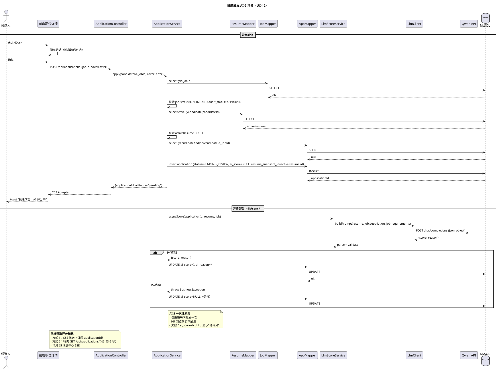
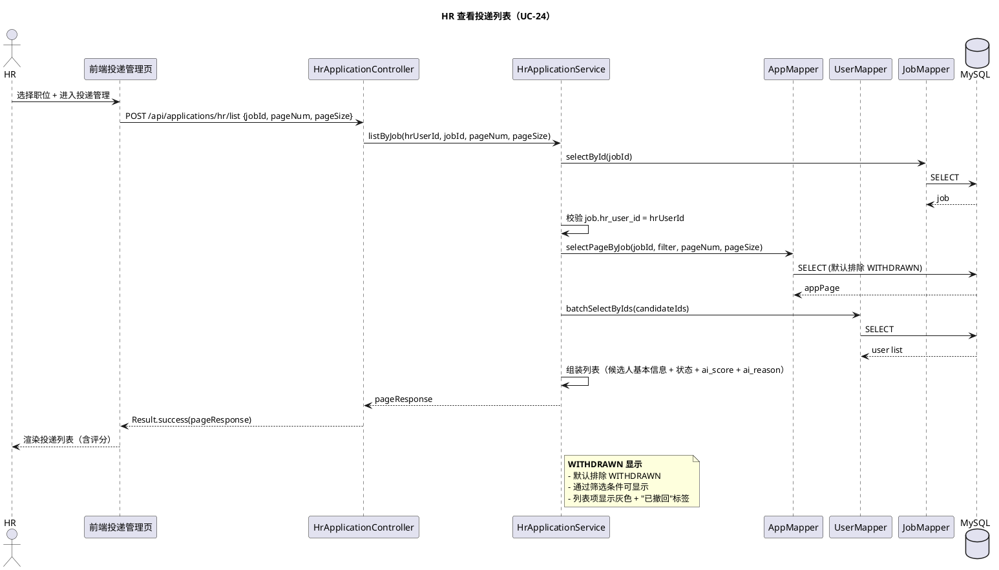
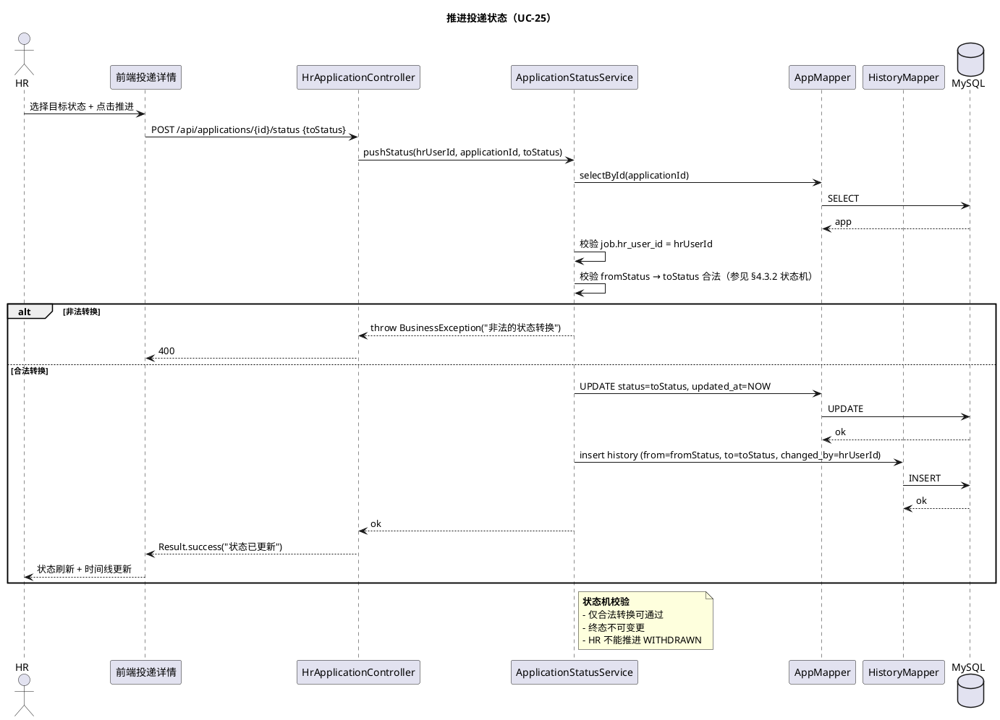
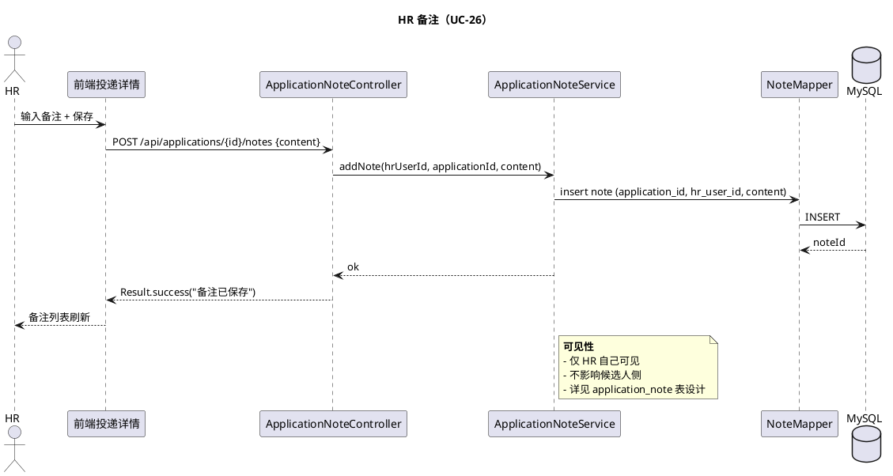
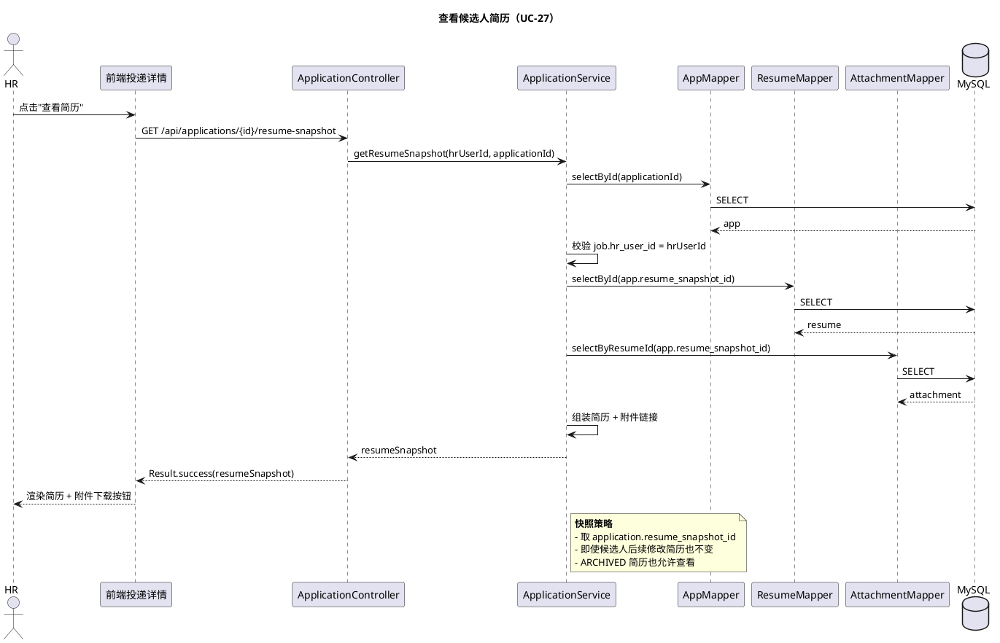
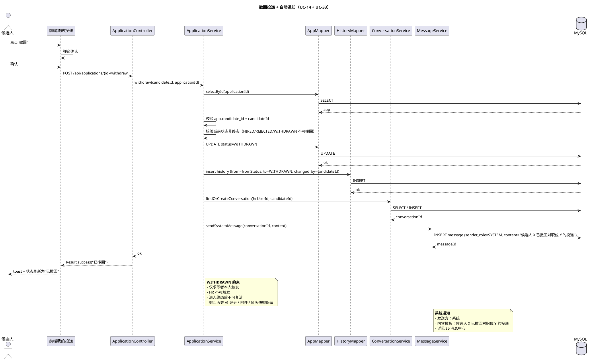

# §4 投递模块

> WBS 节点：§4 投递模块
> 编制依据：`docs/系统设计/WBS/WBS.md v0.1` §4 / `docs/需求分析/功能性需求分析.md v1.1` §4.1.4 / §4.1.5 / §4.2.3 / §4.2.5 / §5
> 编制日期：2026-09-27
> 文档版本：v0.1

> 本文件展示投递模块的设计。所有 API 路径、DTO 字段、注解命名均为示意，实现可调整。

---

## 修订记录

| 版本 | 日期 | 变更说明 |
|---|---|---|
| v0.1 | 2026-09-27 | 初稿：投递 + AI-2 异步评分 / 状态机 / 撤回 / HR 投递管理 / 时间线 |

---

## 4.0 模块概述

投递是求职者与 HR 的核心交互：候选人浏览职位 → 投递 → AI 自动评分 → HR 查看评分推进状态 → 候选人撤回。

8 个状态：`PENDING_REVIEW / VIEWED_BY_HR / RESUME_PASSED / INTERVIEWING / OFFERED / HIRED / REJECTED / WITHDRAWN`

关键规则：
- AI-2 评分**仅在投递瞬间触发一次**，HR 浏览列表不再触发
- WITHDRAWN 仅求职者触发，HR 不可复活
- 撤回投递自动给 HR 发站内信
- 单一 status 字段 + 显示层过滤（候选人侧隐藏 VIEWED_BY_HR）

依赖：
- §2 简历（取 ACTIVE 简历快照）
- §3 职位（取 JD + 公司信息）
- §5 消息中心（撤回触发系统通知）
- §6 AI 集成（AI-2 匹配评分）

---

## 4.1 数据模型

涉及的核心表（详见 `docs/数据库设计.md`，后续批输出）：

| 表 | 关键字段 |
|---|---|
| `application` | id, candidate_id, job_id, resume_snapshot_id（投递时 ACTIVE 简历快照）, status, ai_score（NULL=待评分）, ai_reason, applied_at, updated_at, is_deleted |
| `application_status_history` | id, application_id, from_status, to_status, changed_by, changed_at, note |
| `application_note` | id, application_id, hr_user_id, content, created_at, updated_at |

要点：
- 投递时**拷贝当前 ACTIVE 简历快照**到 application.resume_snapshot_id（防止候选人后续修改简历影响历史投递）
- `ai_score` 为 NULL 时显示"待评分"（不新增 score_status 字段，推断式）
- `application_status_history` 记录每次状态变更，驱动"状态时间线"
- `application_note` 仅 HR 自己可见

---

## 4.2 接口设计（示意）

| endpoint | 方法 | 鉴权 | 说明 |
|---|---|---|---|
| `/api/applications` | POST | @RoleCandidate | 投递职位（触发 AI-2） |
| `/api/applications/mine` | GET | @RoleCandidate | 我的投递列表（含状态时间线） |
| `/api/applications/{id}` | GET | @LoginRequired | 投递详情（鉴权校验） |
| `/api/applications/{id}/withdraw` | POST | @RoleCandidate | 撤回投递 |
| `/api/applications/hr/list` | POST | @RoleHR | HR 投递列表（按职位分组） |
| `/api/applications/{id}/status` | POST | @RoleHR | 推进状态 |
| `/api/applications/{id}/notes` | GET/POST/PUT/DELETE | @RoleHR | HR 备注 CRUD |
| `/api/applications/{id}/resume-snapshot` | GET | @RoleHR | 查看候选人投递时的简历快照 |

字段集非穷举。

---

## 4.3 业务逻辑

### 4.3.1 投递动作（UC-12）

1. 校验：候选人已登录、有 ACTIVE 简历、职位状态 ONLINE 且审核通过、未重复投递
2. 拷贝 ACTIVE 简历快照（`resume_snapshot_id = currentActiveId`）
3. 创建 application：status=PENDING_REVIEW，ai_score=NULL
4. **异步触发 AI-2 评分**（详见 §6.2）：
   - 立即返回 200，前端 toast "投递成功，评分中"
   - 评分完成后 UPDATE application SET ai_score, ai_reason
5. 返回 applicationId + aiStatus="pending"

### 4.3.2 投递状态机（8 状态）

合法流转：

```
PENDING_REVIEW → VIEWED_BY_HR
PENDING_REVIEW → REJECTED
VIEWED_BY_HR   → RESUME_PASSED
VIEWED_BY_HR   → REJECTED
RESUME_PASSED  → INTERVIEWING
RESUME_PASSED  → REJECTED
INTERVIEWING   → OFFERED
INTERVIEWING   → REJECTED
OFFERED        → HIRED
OFFERED        → REJECTED

任意非终态 → WITHDRAWN（仅求职者）
```

终态：`HIRED / REJECTED / WITHDRAWN`，进入终态后不可变更。

### 4.3.3 撤回投递（UC-14）

1. 校验：仅求职者本人、当前状态非终态（不能撤回 HIRED/REJECTED/WITHDRAWN）
2. 更新 status=WITHDRAWN
3. 写 application_status_history（from=原状态, to=WITHDRAWN, changed_by=candidateId）
4. **自动触发系统通知**（详见 §5）：向 HR 发站内信"候选人 X 已撤回对职位 Y 的投递"

### 4.3.4 HR 投递管理（UC-24/25/26/27）

- **UC-24 查看投递列表**：按职位分组，WITHDRAWN 默认折叠 + 灰色 + "已撤回"标签
- **UC-25 推进状态**：仅合法转换；非法转换抛 BusinessException
- **UC-26 HR 备注**：候选人维度的备注，application_note 表
- **UC-27 查看候选人简历**：取 application.resume_snapshot_id 对应的简历快照

### 4.3.5 AI-2 评分

- **触发位置**：投递瞬间（仅一次）
- **输入**：resume_snapshot + job.description + job.requirements
- **输出**：0-100 分 + 评分理由
- **写入**：application.ai_score + application.ai_reason
- **失败降级**：ai_score=NULL + HR 端显示"待评分"
- **HR 浏览列表不触发 AI**：直接读 application.ai_score

### 4.3.6 候选人侧显示逻辑

- 隐藏 VIEWED_BY_HR（等同"处理中"）
- WITHDRAWN 显示"已撤回"，撤回按钮置灰
- 显示状态时间线（application_status_history）

### 4.3.7 HR 侧显示逻辑

- 展示完整状态流
- WITHDRAWN 默认折叠 + 灰色卡片 + "已撤回"标签
- 状态时间线最后一行展示"WITHDRAWN @ 时间 by 候选人"
- 全局搜索默认排除 WITHDRAWN

---

## 4.4 时序图

### 4.4.1 投递触发 AI-2 评分（UC-12，关键）



### 4.4.2 HR 查看投递列表（UC-24）



### 4.4.3 推进投递状态（UC-25）



### 4.4.4 HR 备注（UC-26）



### 4.4.5 查看候选人简历（UC-27）



### 4.4.6 撤回投递 + 自动通知（UC-14 + UC-33，关键）



---

## 4.5 前端组件

### 4.5.1 候选人端

- **MyApplications.vue**（我的投递）
  - 投递列表 + 状态时间线
  - 每条投递右侧：撤回按钮（终态置灰）
- **ApplicationDetail.vue**（投递详情）
  - 状态时间线（最后一行显示 WITHDRAWN）
  - 简历快照预览
  - 联系 HR 按钮

### 4.5.2 HR 端

- **HrApplicationList.vue**（投递管理列表）
  - 按职位分组 + 候选人列表
  - 显示 ai_score / ai_reason / WITHDRAWN 标签
- **HrApplicationDetail.vue**（投递详情）
  - 顶部状态时间线
  - "AI 评分"区块（分数 + 评分理由）
  - 候选人简历 + 附件预览
  - 状态推进按钮 + 备注编辑

### 4.5.3 Pinia Stores

- `useApplicationStore`：myApplications / currentApplication / withdraw / pushStatus

### 4.5.4 关键交互

- 投递成功 → toast"评分中" → 等待 SSE 推送 → 列表刷新显示评分
- 撤回：二次确认弹窗 + 不可恢复提示
- HR 状态推进：下拉框 + 推进按钮 + 时间线动画

---

## 4.6 错误处理

| 场景 | code | message |
|---|---|---|
| 重复投递 | 400 / 4xxx | 已投递过该职位 |
| 投递非 ONLINE / 非审核通过职位 | 400 / 4xxx | 该职位当前不可投递 |
| 无 ACTIVE 简历 | 400 / 4xxx | 请先上传简历 |
| 非法状态转换 | 400 / 4xxx | 非法的状态转换 |
| 撤回终态投递 | 400 / 4xxx | 已终止的投递无法撤回 |
| 非本人撤回 | 403 | 无权限 |
| HR 操作非本职位投递 | 403 | 无权限 |
| AI-2 失败 | 200 + aiScore=NULL | 显示"待评分" |

---

## 4.7 测试要点

### 4.7.1 单元测试

- 状态机合法转换校验（10 条边 + 5 条 WITHDRAWN）
- WITHDRAWN 触发者校验（仅 candidate）
- 重复投递校验
- 简历快照逻辑（拷贝引用，不随候选人后续修改变化）

### 4.7.2 集成测试

- 投递 → 异步 AI 评分 → 状态写入
- AI 评分失败 → ai_score=NULL 显示
- HR 推进状态：合法 + 非法转换
- 撤回投递 → WITHDRAWN + 自动通知 HR
- HR 查看简历快照（即使候选人后续编辑）

### 4.7.3 端到端冒烟

- 候选人：投递 → 看到"PENDING_REVIEW" → 等待评分 → 看到 ai_score
- HR：收到投递 → 推进 VIEWED_BY_HR → 推进 RESUME_PASSED → 推进 INTERVIEWING → 推进 OFFERED → 推进 HIRED
- 候选人：撤回投递 → WITHDRAWN → HR 收到系统通知
- 非法操作：HR 试图推进 WITHDRAWN → 400
