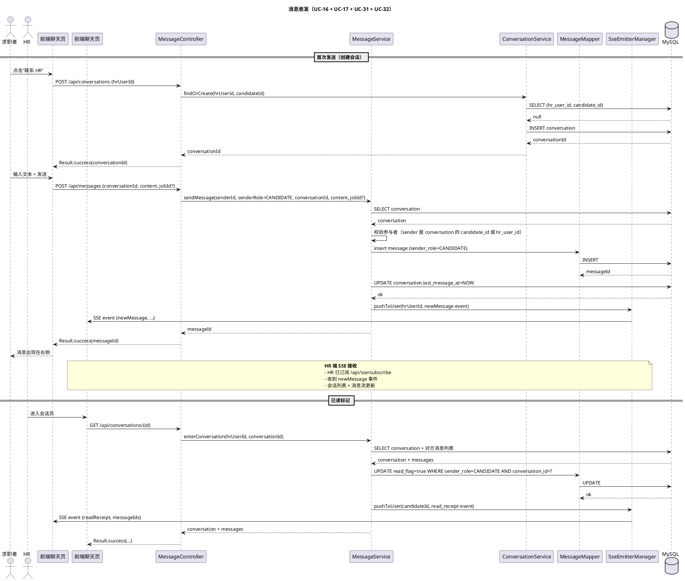
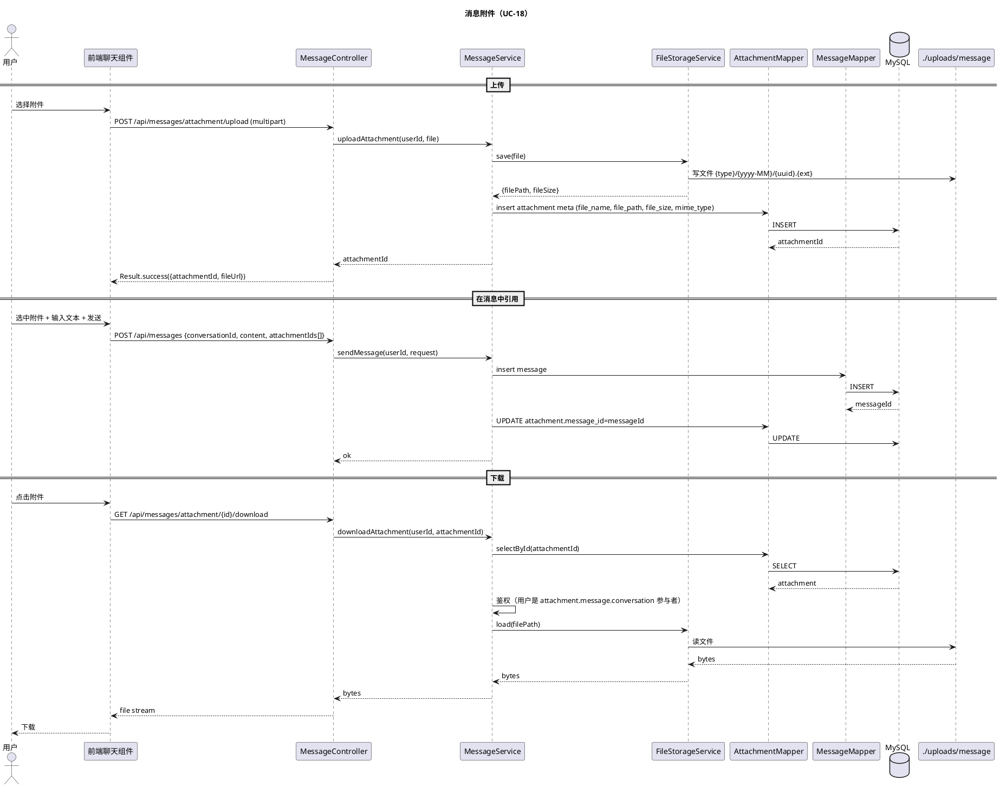
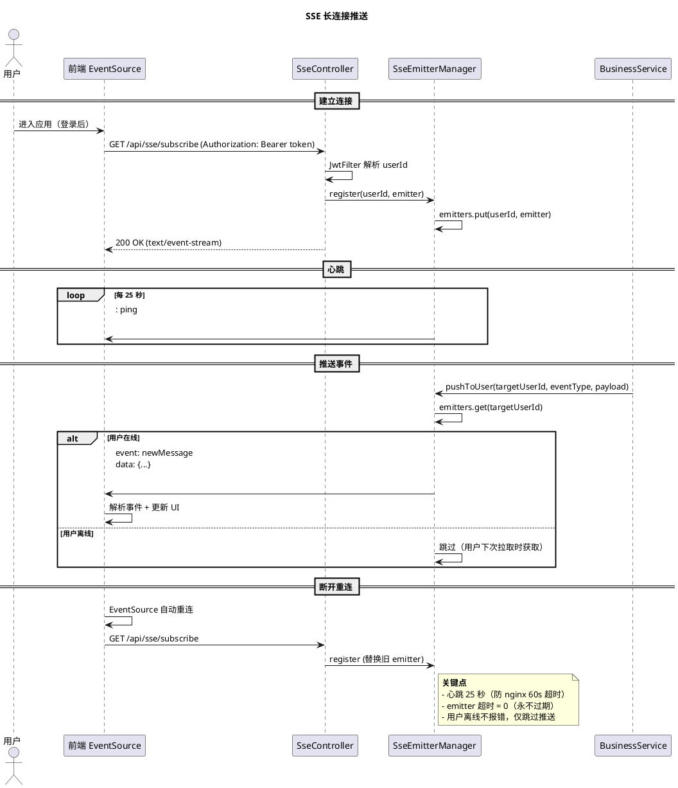

# §5 消息中心模块

> WBS 节点：§5 消息中心
> 编制依据：`docs/系统设计/WBS/WBS.md v0.1` §5 / `docs/需求分析/功能性需求分析.md v1.1` §6
> 编制日期：2026-09-27
> 文档版本：v0.1

> 本文件展示消息中心模块的设计。所有 API 路径、DTO 字段、注解命名均为示意，实现可调整。

---

## 修订记录

| 版本 | 日期 | 变更说明 |
|---|---|---|
| v0.1 | 2026-09-27 | 初稿：会话（二元组唯一）/ 消息收发 / 消息附件 / SSE 实时推送 / 系统通知 / 自动已读 |

---

## 5.0 模块概述

提供 HR 与候选人之间的站内即时通讯能力。会话以 `(HR, 候选人)` 二元组唯一，跨职位共享同一会话；后端采用 SSE 长连接推送 + 轮询兜底，不引入 WebSocket。

系统通知：候选人撤回投递等系统行为自动给 HR 发站内信。

依赖：
- §1 用户认证（HR / 候选人身份）
- §4 投递模块（撤回触发系统通知）

---

## 5.1 数据模型

涉及的核心表（详见 `docs/数据库设计.md`，后续批输出）：

| 表 | 关键字段 |
|---|---|
| `conversation` | id, hr_user_id, candidate_id, last_message_at, created_at, updated_at, is_deleted；唯一键 (hr_user_id, candidate_id, is_deleted)（详见 `docs/DataBase/数据库设计.md §6.2`） |
| `message` | id, conversation_id, sender_id, sender_role（CANDIDATE/HR/SYSTEM）, job_id（可空）, content, read_flag, created_at, updated_at, is_deleted |
| `message_attachment` | id, message_id, file_name, file_path, file_size, mime_type, created_at |

要点：
- `conversation` 二元组唯一（HR + 候选人），跨职位共享
- `message.job_id` 可空，关联到具体职位的对话可标记
- `message.sender_role = SYSTEM` 用于撤回等系统通知
- `read_flag` 单字段标记（标记对方消息已读）

---

## 5.2 接口设计（示意）

### 5.2.1 会话

| endpoint | 方法 | 鉴权 | 说明 |
|---|---|---|---|
| `/api/conversations` | POST | @LoginRequired | 创建或获取会话（按当前用户角色与对方 ID） |
| `/api/conversations/mine` | GET | @LoginRequired | 我的会话列表（按 last_message_at 倒序） |
| `/api/conversations/{id}` | GET | @LoginRequired | 会话详情（含消息流） |

### 5.2.2 消息

| endpoint | 方法 | 鉴权 | 说明 |
|---|---|---|---|
| `/api/messages` | POST | @LoginRequired | 发送消息（文本 / 附件 / 可选 job_id） |
| `/api/messages/conversation/{id}/list` | POST | @LoginRequired | 分页查询消息（按时间倒序） |
| `/api/messages/{id}/read` | POST | @LoginRequired | 标记单条已读 |
| `/api/messages/conversation/{id}/read-all` | POST | @LoginRequired | 标记会话全部已读 |

### 5.2.3 实时推送

| endpoint | 方法 | 鉴权 | 说明 |
|---|---|---|---|
| `/api/sse/subscribe` | GET | @LoginRequired | SSE 长连接订阅（接收新消息） |

### 5.2.4 附件

| endpoint | 方法 | 鉴权 | 说明 |
|---|---|---|---|
| `/api/messages/attachment/upload` | POST | @LoginRequired | 上传消息附件 |
| `/api/messages/attachment/{id}/download` | GET | @LoginRequired | 下载消息附件 |

字段集非穷举。

---

## 5.3 业务逻辑

### 5.3.1 会话创建

- 触发场景：
  - 候选人投递后，在投递详情页点击"联系 HR"
  - HR 查看投递时，在投递详情页点击"联系候选人"
- 逻辑：按 (hrUserId, candidateId) 查询；不存在则创建
- 同一对 HR 与候选人永远只有一个会话

### 5.3.2 消息发送

1. 校验：当前用户是会话参与者（HR 或候选人之一）
2. 写 `message` 表（sender_id, sender_role, content, job_id 可选）
3. 更新 `conversation.last_message_at`
4. **推送**（详见 §5.3.4）：
   - 在线对方 → 推 SSE 事件
   - 离线 → 仅入库，下次对方进入会话时通过 /conversation/{id} 拉取

### 5.3.3 消息接收

- 主动拉取：进入会话页 → POST /api/messages/conversation/{id}/list（分页）
- 被动推送：SSE 长连接推新消息
- 兜底：若 SSE 断开 → 前端轮询 /api/messages/conversation/{id}/list（3-5 秒）

### 5.3.4 SSE 实时推送

- 后端：`SseEmitter`（异步，超时 = 0 永不过期）
- 心跳：每 25 秒发一次 `: ping\n\n`（避免 nginx 60 秒默认超时切断）
- 事件类型：`new_message` / `read_receipt` / `application_status_change`（可扩展）
- 客户端：EventSource API，自动重连

### 5.3.5 自动已读

- 进入会话时（GET /api/conversations/{id}）→ 自动将对方消息标记为已读
- 写入 `message.read_flag = true`

### 5.3.6 消息附件

- 上传：multipart → 类型校验（图片 / 文件）→ 大小校验 → 写文件 + 写 message_attachment
- 下载：按 ID 读 → 鉴权（会话参与者）→ 返回文件流

### 5.3.7 系统通知

- 触发场景：候选人撤回投递（详见 §4.3.3）
- 消息内容："候选人 X 已撤回对职位 Y 的投递"
- sender_role = SYSTEM
- 复用消息发送流程 + 系统账户标识

---

## 5.4 时序图

### 5.4.1 消息收发（覆盖 UC-16 / UC-17 / UC-31 / UC-32）

### 5.4.2 消息附件（UC-18）

### 5.4.3 SSE 长连接推送

---

## 5.5 前端组件

### 5.5.1 页面

- **Chat.vue**（聊天页）
  - 左侧会话列表 + 右侧消息流
  - 消息流：文本 + 附件 + 系统通知样式区分
  - 底部输入区 + 文件上传按钮
- **ChatListItem.vue**（会话列表项）
  - 头像 + 对方姓名 + 最后消息预览 + 时间
  - 未读消息小红点

### 5.5.2 Pinia Stores

- `useMessageStore`：conversations / currentMessages / sseConn / sendMessage / markRead

### 5.5.3 关键交互

- 进入聊天页 → 自动订阅 SSE + 拉取历史消息 + 自动已读
- 收到新消息 → 滚动到底部 + 系统通知 toast
- 网络断开 → EventSource 自动重连 + UI 提示
- 发送附件 → 进度条 → 消息展示缩略图

---

## 5.6 错误处理

| 场景 | code | message |
|---|---|---|
| 非会话参与者 | 403 | 无权限访问该会话 |
| 消息内容为空 | 400 / 5xxx | 消息内容不能为空 |
| 附件类型不符 | 400 / 5xxx | 不支持的文件类型 |
| 附件超 20MB | 400 | 文件不能超过 20MB |
| SSE 连接失败 | — | 前端 fallback 轮询 |

---

## 5.7 测试要点

### 5.7.1 单元测试

- 会话二元组唯一性校验
- 消息发送参与者校验
- 已读标记逻辑
- 系统消息 sender_role 校验

### 5.7.2 集成测试

- 候选人发消息 → HR 通过 SSE 收到
- HR 发消息 → 候选人收到
- 进入会话 → 自动已读 + 对方收到 read_receipt
- 消息附件上传 + 下载 + 鉴权
- 撤回投递 → 系统消息送达 HR

### 5.7.3 端到端冒烟

- 候选人投递后 → 点"联系 HR" → 聊天页 → 发消息 → HR 收到
- HR 主动联系候选人 → 候选人收到
- 候选人撤回投递 → HR 收到系统通知"候选人 X 已撤回..."
- 多端在线：候选人网页 + HR 网页同时在线，消息即时同步
