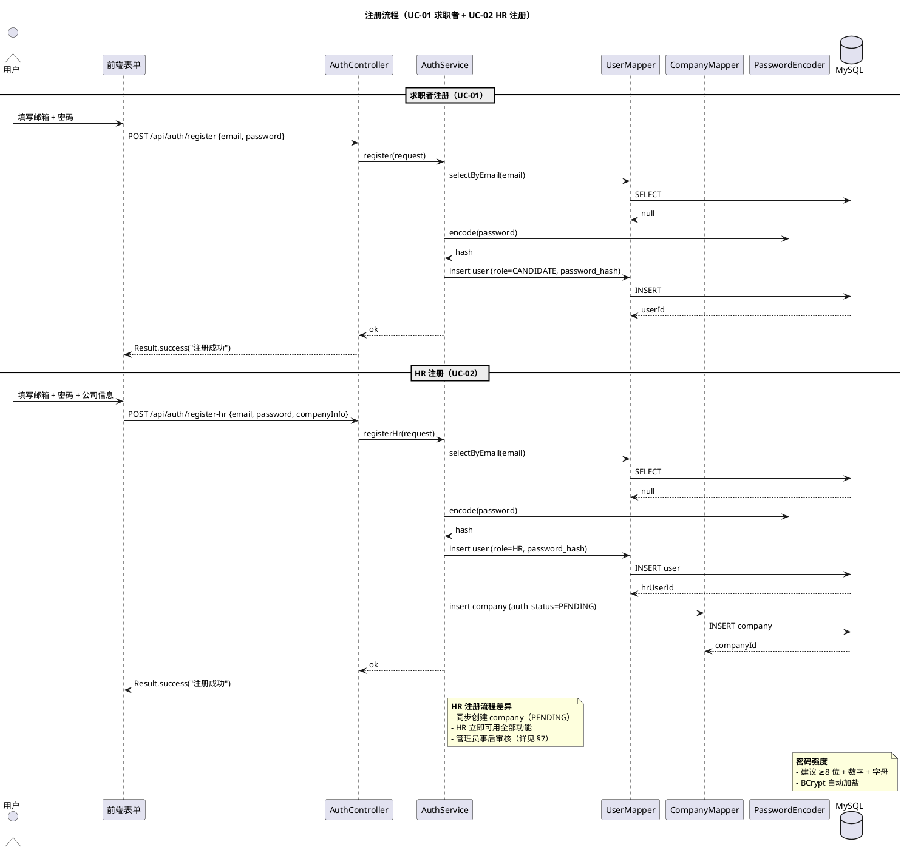
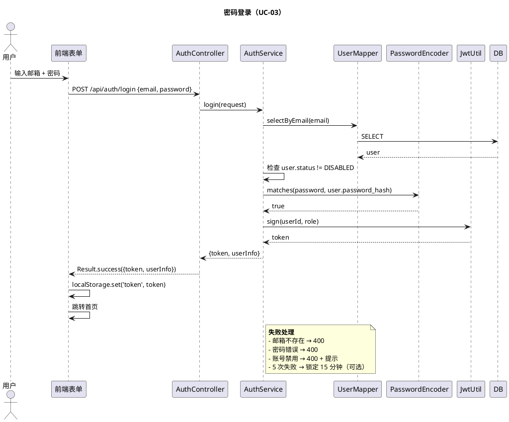
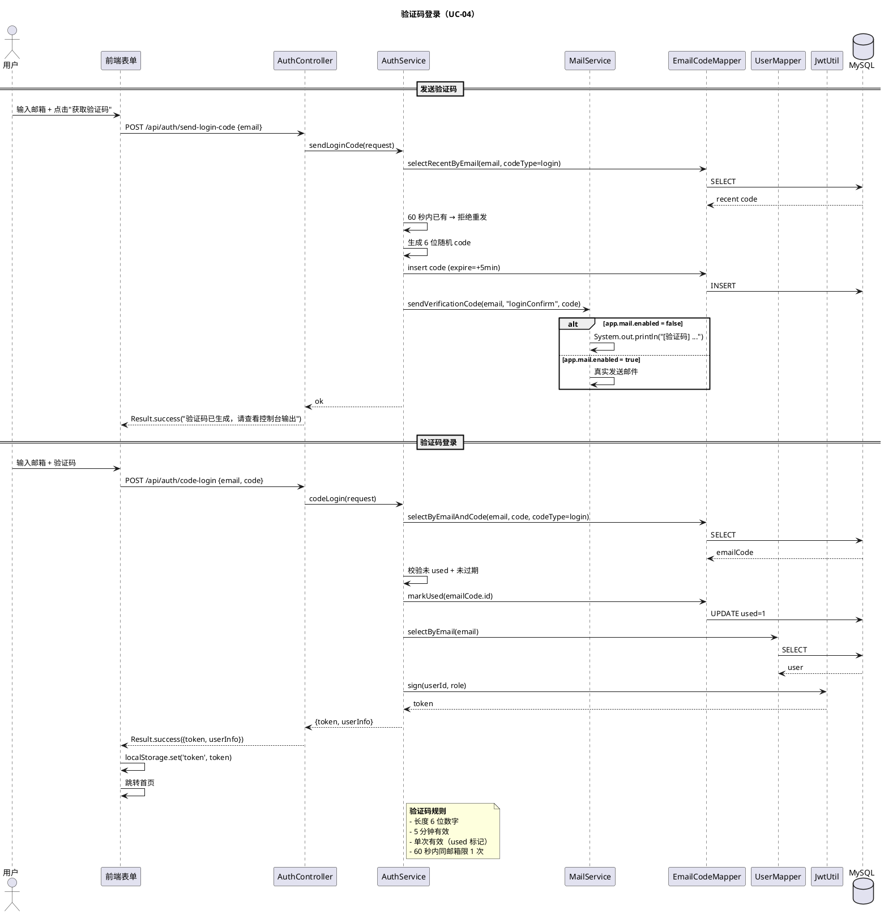
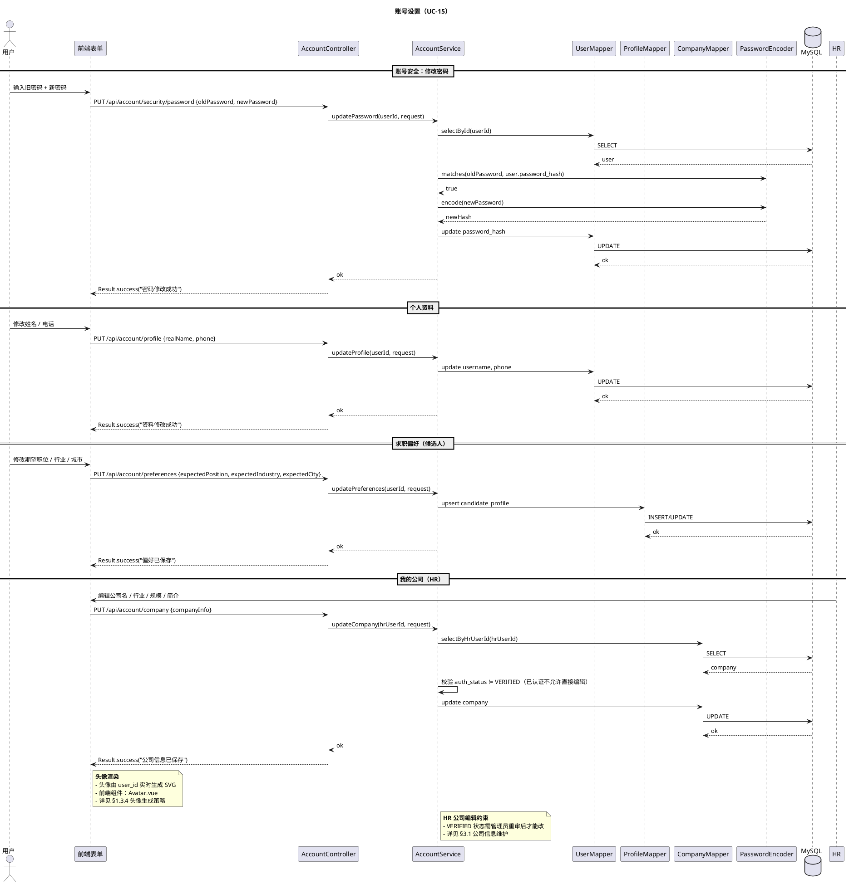

# §1 用户与认证模块

> WBS 节点：§1 用户与认证
> 编制依据：`docs/系统设计/WBS/WBS.md v0.1` §1 / `docs/需求分析/功能性需求分析.md v1.1` §4.1.1 / §4.1.5 / §4.2.1 / §4.2.5
> 编制日期：2026-09-27
> 文档版本：v0.1

> 本文件展示用户与认证模块的设计。所有 API 路径、DTO 字段、注解命名均为示意，实现可调整。

---

## 修订记录

| 版本 | 日期 | 变更说明 |
|---|---|---|
| v0.1 | 2026-09-27 | 初稿：注册 / 登录 / 账号设置 / 头像生成 |

---

## 1.0 模块概述

提供三类用户的注册、登录、账号维护能力：

- **求职者（CANDIDATE）**：邮箱 + 密码注册
- **HR**：邮箱 + 密码 + 公司信息同步注册
- **管理员（ADMIN）**：内部预置，不开放注册

登录支持两种方式：密码登录 / 验证码登录。验证码登录后端通过 `app.mail.enabled` 开关控制（默认 false 打印到控制台）。

账号设置包括账号安全、个人资料、求职偏好（候选人）/ 我的公司（HR）等子模块。

依赖：§8 基础设施（JWT / BCrypt / MailProperties）。

---

## 1.1 数据模型

涉及的核心表（详见 `docs/数据库设计.md`，后续批输出）：

| 表 | 关键字段 |
|---|---|
| `user` | id, email（唯一）, password_hash, role_code（CANDIDATE / HR / ADMIN）, status, username（昵称 / 显示名）, phone, created_at, updated_at, is_deleted |
| `email_code` | id, email, code, code_type（register/login/reset）, used, expire_time, created_at |
| `candidate_profile` | id, user_id（唯一）, expected_position, expected_industry, expected_city, created_at, updated_at |
| `company` | id, hr_user_id, name, industry, scale, description, auth_status, auth_note, verified_at, verified_by, created_at, updated_at |

要点：
- 头像由 user_id 实时生成 SVG，不写 DB（详见 §1.4）
- 求职者与 HR 共享 `user` 表，通过 `role_code` 区分
- `email_code` 设过期时间（建议 5 分钟）+ used 标记防重放

---

## 1.2 接口设计（示意）

| endpoint | 方法 | 鉴权 | 说明 |
|---|---|---|---|
| `/api/auth/register` | POST | 无 | 求职者注册（邮箱 + 密码） |
| `/api/auth/register-hr` | POST | 无 | HR 注册（邮箱 + 密码 + 公司信息） |
| `/api/auth/login` | POST | 无 | 密码登录 |
| `/api/auth/send-login-code` | POST | 无 | 发送登录验证码 |
| `/api/auth/code-login` | POST | 无 | 验证码登录 |
| `/api/auth/send-register-code` | POST | 无 | 发送注册验证码 |
| `/api/account/security` | GET | @LoginRequired | 查询账号安全（邮箱） |
| `/api/account/security/password` | PUT | @LoginRequired | 修改密码 |
| `/api/account/profile` | GET | @LoginRequired | 查询个人资料 |
| `/api/account/profile` | PUT | @LoginRequired | 修改个人资料 |
| `/api/account/preferences` | GET/PUT | @RoleCandidate | 求职偏好 |
| `/api/account/company` | GET/PUT | @RoleHR | 我的公司（HR 视角编辑） |
| `/api/account/avatar/{userId}` | GET | 无 | 获取 SVG 头像（公开） |

字段集非穷举，实现可增删。

---

## 1.3 业务逻辑

### 1.3.1 注册流程

- **校验**：邮箱格式、密码强度（建议 ≥8 位）、邮箱唯一性
- **密码哈希**：BCrypt（PasswordEncoder.encode）
- **验证码登录注册**：注册前可发送验证码校验邮箱（与登录共用 email_code 表，按 code_type 区分）
- **角色分流**：求职者只写 `user`；HR 同步写 `user` + `company`
- **HR 公司状态**：`company.auth_status = PENDING`，HR 注册即用全部功能（异步审核）

### 1.3.2 登录流程

- **密码登录**：邮箱 + 密码 → 校验 → 签发 JWT（含 userId / role）→ 返回 `{token, userInfo}`
- **验证码登录**：
  1. 调 `/api/auth/send-login-code` → 生成 6 位验证码 → 写 `email_code` → 通过 MailService 发送（开关关闭则打印 console）
  2. 调 `/api/auth/code-login` → 校验 code（未 used + 未过期 + code_type=login）→ 标记 used → 签发 JWT
- **防爆破**：连续 5 次失败 → 锁定 15 分钟（演示可选）

### 1.3.3 账号设置

- **账号安全**：邮箱不可改；密码修改需校验旧密码
- **个人资料**：username（即 `user.username` 昵称 / 显示名）、phone 可改；头像由 user_id 自动渲染（无需 DB 字段）
- **求职偏好**（候选人）：期望职位 / 行业 / 城市，存 `candidate_profile` 表
- **我的公司**（HR）：编辑公司名 / 行业 / 规模 / 简介，详见 §3

### 1.3.4 头像生成策略

- **生成规则**：按 user_id 哈希取背景色 + 取姓名首字母或邮箱首字符
- **存储**：纯前端 / 后端按 user_id 实时计算，不写 DB
- **缓存层（可选）**：首次访问生成后存到 `./uploads/avatar/{userId}.svg`，后续直接读文件
- **稳定性**：同一用户头像稳定不变（哈希函数固定）

---

## 1.4 时序图

### 1.4.1 注册流程（覆盖 UC-01 / UC-02）

### 1.4.2 密码登录（UC-03）

### 1.4.3 验证码登录（UC-04）

### 1.4.4 账号设置（UC-15）

---

## 1.5 前端组件

### 1.5.1 页面

- **Login.vue**（登录页）
  - Tab 切换：密码登录 / 验证码登录
  - 验证码输入框 + "获取验证码" 按钮（60 秒倒计时）
  - 表单校验（邮箱格式、密码非空）
- **Register.vue**（注册页）
  - 候选人 / HR 双 Tab
  - HR Tab 多一组公司信息字段
- **AccountSecurity.vue**（账号安全）
  - 显示当前邮箱（不可改）
  - 修改密码表单
- **AccountProfile.vue**（个人资料）
  - 姓名 / 电话输入
  - 头像预览（Avatar 组件）
- **AccountPreferences.vue**（求职偏好，候选人专属）
  - 期望职位 / 行业 / 城市（自由输入 + 字典下拉建议）
- **AccountCompany.vue**（我的公司，HR 专属）
  - 公司信息表单 + 审核状态展示

### 1.5.2 Pinia Stores

- `useAuthStore`：token / userInfo / login / logout / refreshUser
- `useUserStore`：profile / preferences / fetchProfile / updateProfile

### 1.5.3 关键交互

- 登录成功 → 跳首页 → 触发 `useAuthStore` 持久化 token
- 头像点击 → 跳个人中心
- 修改密码 → 旧密码校验 → 成功后 toast

---

## 1.6 错误处理

| 场景 | code | message |
|---|---|---|
| 邮箱已注册 | 400 / 1xxx | 该邮箱已注册 |
| 邮箱格式错误 | 400 | 邮箱格式不正确 |
| 密码强度不足 | 400 | 密码至少 8 位 |
| 验证码错误 / 过期 | 400 | 验证码错误或已过期 |
| 验证码发送过于频繁 | 400 | 请稍后再试 |
| 登录失败（密码错） | 400 | 邮箱或密码错误 |
| 账号禁用 | 400 / 1xxx | 当前账号已被禁用 |
| Token 过期 | 401 | （前端清 token + 跳登录） |
| 无权限访问 | 403 | 无权限 |

---

## 1.7 测试要点

### 1.7.1 单元测试

- BCrypt 密码哈希校验一致性
- 邮箱格式校验
- 验证码生成 / 校验 / 过期判断
- JWT 生成 / 解析 / 过期判断
- 头像 SVG 渲染（hash 一致性）

### 1.7.2 集成测试

- 注册 → 登录 → 拿到 JWT → 调受保护接口
- 验证码发送（开关关闭 → console 输出）
- 候选人注册流程
- HR 注册 + 公司创建（auth_status=PENDING）
- 修改密码（旧密码错 → 失败；正确 → 成功）
- 求职者修改求职偏好
- HR 修改公司信息

### 1.7.3 端到端冒烟

- 注册求职者 → 登录 → 看到空简历引导
- 注册 HR → 登录 → 看到空职位列表 + 公司待审核提示
- 验证码登录：邮箱 → 查 console → 输入 code → 登录成功
