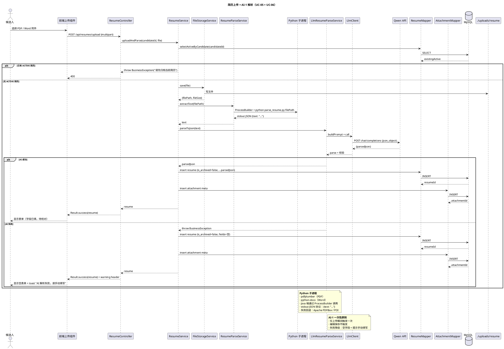
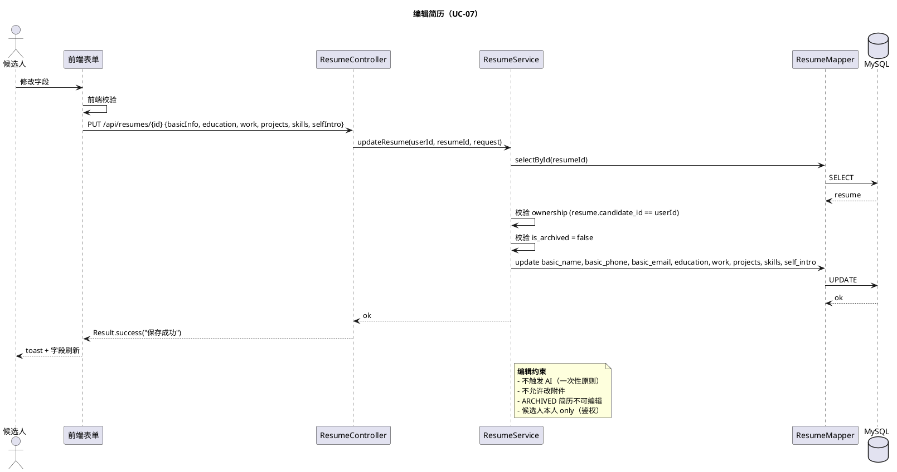
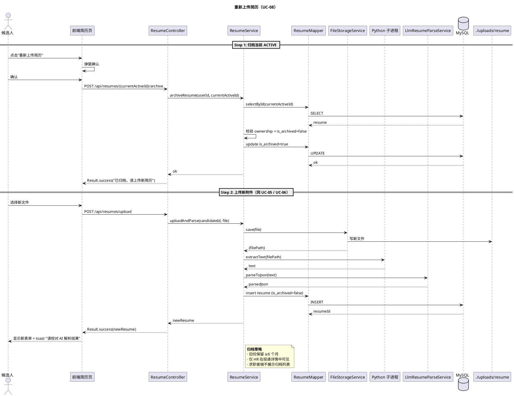

# §2 简历模块

> WBS 节点：§2 简历模块
> 编制依据：`docs/系统设计/WBS/WBS.md v0.1` §2 / `docs/需求分析/功能性需求分析.md v1.1` §4.1.2 / §9.1 / §9.2
> 编制日期：2026-09-27
> 文档版本：v0.1

> 本文件展示简历模块的设计。所有 API 路径、DTO 字段、注解命名均为示意，实现可调整。

---

## 修订记录

| 版本 | 日期 | 变更说明 |
|---|---|---|
| v0.1 | 2026-09-27 | 初稿：上传 + AI-1 解析 / 编辑 / 重新上传 / 单一 ACTIVE 归档策略 |

---

## 2.0 模块概述

每位求职者维护**一份活动简历（ACTIVE）**，AI 解析仅在上传瞬间触发一次。简历支持 PDF / Word 格式，文本抽取通过 Python 子进程（pdfplumber + python-docx），结构化字段抽取通过 §6 AI-1 简历解析服务。

简历字段包括：
- 基本信息：姓名 / 电话 / 邮箱（必填）
- 教育经历 / 工作经历 / 项目经历（JSON 字段，不建子表）
- 技能（自由输入 + 建议池）
- 自我介绍

依赖：
- §8.4 文件上传（FileStorageService）
- §6 AI 集成（AI-1 简历解析）
- §1 用户认证（候选人身份）

---

## 2.1 数据模型

涉及的核心表（详见 `docs/数据库设计.md`，后续批输出）：

| 表 | 关键字段 |
|---|---|
| `resume` | id, candidate_id, basic_name（真实姓名）, basic_phone（电话）, basic_email（邮箱）, education（JSON 数组）, work（JSON 数组）, projects（JSON 数组）, skills（text）, self_intro, is_archived（false=ACTIVE / true=ARCHIVED）, created_at, updated_at, is_deleted |
| `resume_attachment` | id, resume_id, file_name, file_path, file_size, mime_type, uploaded_at |
| `candidate_profile` | （求职偏好字段见 §1.1） |

要点：
- 每位候选人**仅一份** `is_archived = false`（ACTIVE）简历，其余为归档
- 教育 / 工作 / 项目经历统一以 JSON 数组形式存储（不建子表）
- 技能以 text 字段存储（自由输入，不建索引 / 不做精确匹配）
- 附件元数据独立存表，便于多版本追溯

---

## 2.2 接口设计（示意）

| endpoint | 方法 | 鉴权 | 说明 |
|---|---|---|---|
| `/api/resumes/current` | GET | @RoleCandidate | 获取当前 ACTIVE 简历 |
| `/api/resumes/upload` | POST | @RoleCandidate | 上传简历附件（multipart） |
| `/api/resumes/{id}` | GET | @LoginRequired | 按 ID 查询简历（鉴权校验） |
| `/api/resumes/{id}` | PUT | @RoleCandidate | 编辑简历字段 |
| `/api/resumes/{id}/archive` | POST | @RoleCandidate | 归档当前 ACTIVE 简历 |
| `/api/resumes/archived` | GET | @RoleHR | HR 查看归档简历（投递详情用） |
| `/api/resumes/attachment/{id}/preview` | GET | @LoginRequired | 预览附件 |
| `/api/resumes/attachment/{id}/download` | GET | @LoginRequired | 下载附件 |

字段集非穷举。

---

## 2.3 业务逻辑

### 2.3.1 上传 + AI-1 解析流程

1. 候选人 POST `/api/resumes/upload` 上传附件
2. 服务端调用 `FileStorageService.save()`（详见 §8.4）
3. 调用 Python 子进程 `tools/parse_resume.py` 抽取纯文本
4. 调用 §6 `LlmResumeParseService.parseToJson(text)` 获取结构化 JSON
5. 校验：已有 ACTIVE 简历则拒绝（要求先归档）；否则创建新简历 `is_archived=false`
6. 写 `resume_attachment` 元数据
7. 返回新简历实体给前端，前端展示表单供候选人校对

### 2.3.2 单一 ACTIVE 原则

- 每位候选人查询 `resume WHERE candidate_id=? AND is_archived=false` 必须唯一
- 已有 ACTIVE 时再上传 → 抛 BusinessException("请先归档当前简历")
- 候选人想替换简历：必须先调归档接口 → 旧份置 `is_archived=true` → 再上传
- ARCHIVED 简历**仅 HR 在投递详情中可见**，求职者端不展示归档列表

### 2.3.3 编辑简历

- 仅可编辑表单字段（basic_name / basic_phone / basic_email / education / work / projects / skills / self_intro）
- **不触发** AI（一次性原则）
- 不允许重新上传或替换附件
- 保存时仅校验前端已校验过的字段；后端再做一次 DTO 完整性校验

### 2.3.4 重新上传流程

```
[Step 1] 候选人调 /api/resumes/{currentActiveId}/archive
         → 旧份 is_archived = true
[Step 2] 候选人调 /api/resumes/upload 新附件
         → 新建 ACTIVE 简历 + 触发 AI-1 解析
         → 旧份保持 ARCHIVED（不删，保留 ≥6 个月）
```

### 2.3.5 Python 文本抽取子进程

- 路径：`tools/parse_resume.py`（与后端分离，独立的 Python 脚本）
- 输入：PDF / .docx 文件路径
- 输出：stdout JSON `{text: "..."}`
- 实现：pdfplumber（PDF）+ python-docx（Word）
- 失败回退：Java Apache PDFBox / POI（同样输出纯文本）
- 协议约定详见 §6.3（AI 集成模块调用 Python 的协议说明）

### 2.3.6 AI-1 解析失败降级

- AI 调用失败（超时 / 返回非 JSON / 字段缺失）→ 抛 BusinessException
- 前端提示："AI 解析失败，请手动填写简历"
- 简历记录仍创建，但字段为空，前端展示空表单

---

## 2.4 时序图

### 2.4.1 上传 + AI-1 解析（覆盖 UC-05 / UC-06）



### 2.4.2 编辑简历（UC-07）



### 2.4.3 重新上传简历（UC-08）



---

## 2.5 前端组件

### 2.5.1 页面

- **ResumeEdit.vue**（简历管理 / 编辑）
  - 三种状态：空（引导上传）/ ACTIVE（编辑表单）/ 已归档提示
  - 上传组件（Element Plus el-upload，支持拖拽）
  - AI 解析进度条（上传到返回耗时 5-30 秒）
  - 字段编辑：基本信息、教育经历（可增删条目）、工作经历、项目经历、技能标签、自我介绍

### 2.5.2 Pinia Stores

- `useResumeStore`：currentResume / uploadProgress / saveResume / uploadResume

### 2.5.3 关键交互

- 上传附件 → 显示进度条 → 解析完成 → 表单预填（AI 解析结果）
- 字段校验失败 → 高亮错误字段 + toast
- 重新上传 → 弹窗确认"将归档当前简历，确认继续？"
- 归档后 → 跳转上传页

---

## 2.6 错误处理

| 场景 | code | message |
|---|---|---|
| 文件类型不符（非 PDF/Word） | 400 / 2xxx | 仅支持 PDF / Word 格式 |
| 文件超 20MB | 400 | 文件不能超过 20MB |
| 已有 ACTIVE 简历 | 400 / 2xxx | 请先归档当前简历 |
| 编辑 ARCHIVED 简历 | 400 / 2xxx | 已归档简历不可编辑 |
| 编辑非本人简历 | 403 | 无权限 |
| AI 解析失败 | 200 + warning | AI 解析失败，请手动填写（前端 toast 提示） |
| Python 抽取失败 | 500 / 9xxx | 简历解析失败，请稍后重试 |

---

## 2.7 测试要点

### 2.7.1 单元测试

- 单一 ACTIVE 校验逻辑（已有 ACTIVE 再上传抛错）
- 归档操作（is_archived 切换正确性）
- 字段 DTO 校验（必填字段、JSON 数组结构）

### 2.7.2 集成测试

- 首次上传：附件 → Python 抽取 → mock LLM → 创建 ACTIVE 简历
- 已有 ACTIVE 时再上传 → 400
- 归档 → 再上传 → 旧份 is_archived=true，新份 false
- 编辑简历 → AI 不再触发（验证 mock LLM 调用次数）
- HR 在投递详情中查看归档简历

### 2.7.3 端到端冒烟

- 候选人首次进入简历页 → 上传 PDF → 等待 AI 解析 → 校对 → 保存
- 候选人重新上传：归档 → 上传 Word → AI 解析 → 校对 → 保存
- HR 查看投递详情 → 看到候选人简历 + 归档版本（如有）
- AI 失败：mock LLM 返回错误 → 候选人看到空表单 + toast
