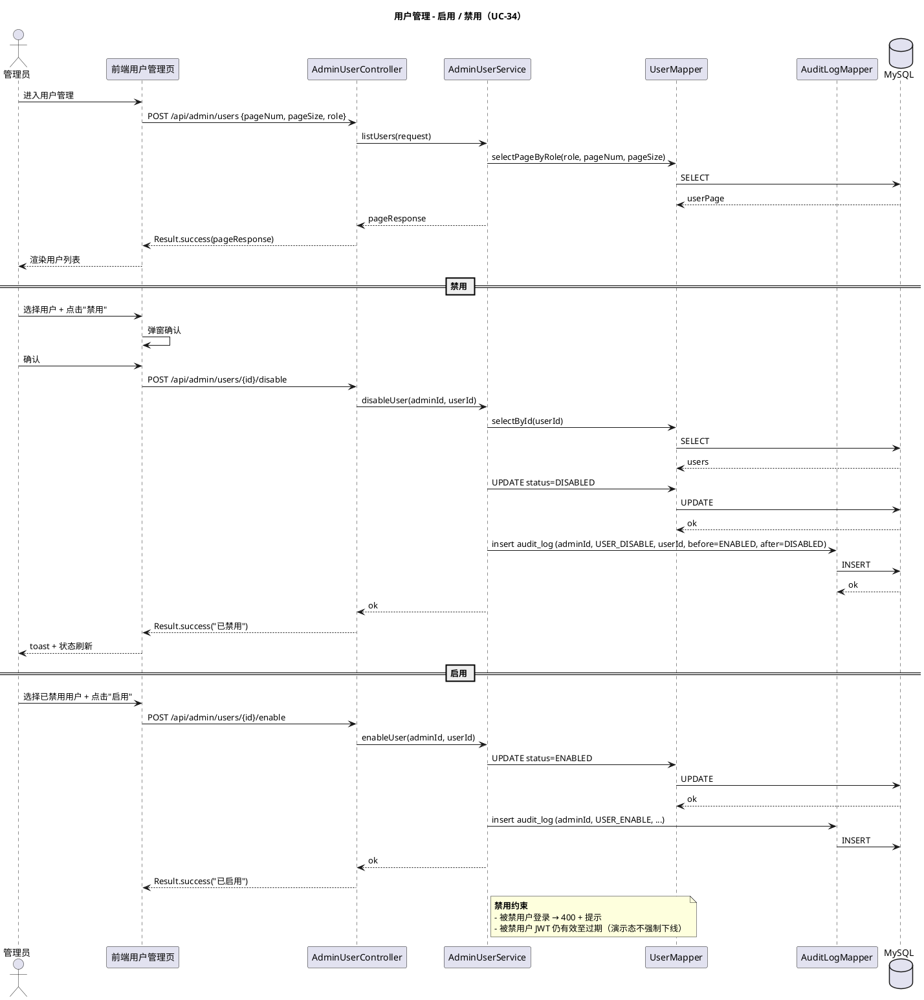
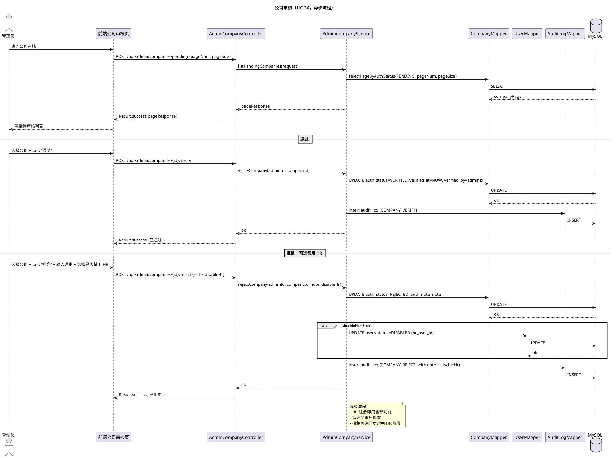
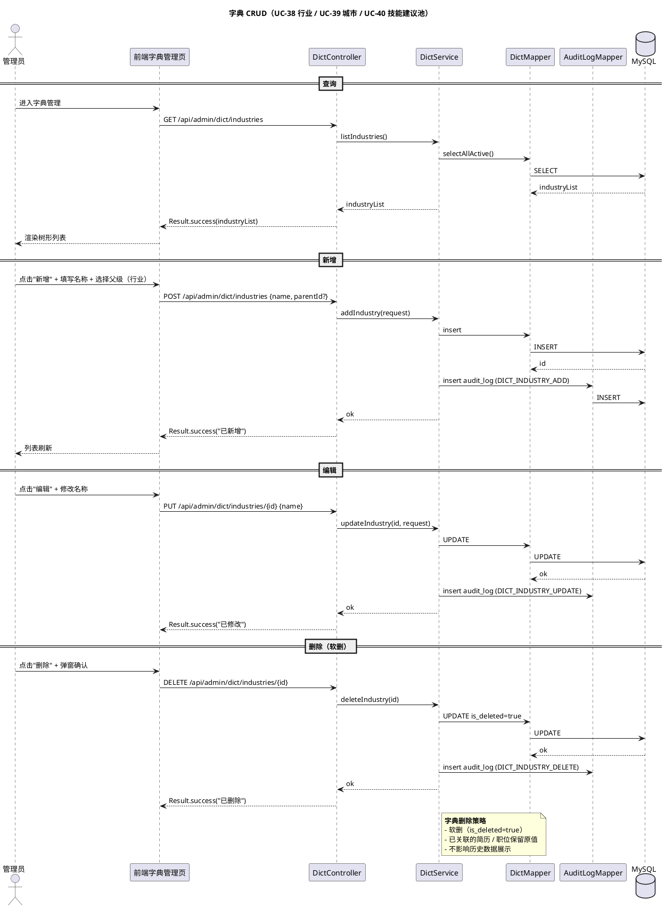

# §7 管理员模块

> WBS 节点：§7 管理员
> 编制依据：`docs/系统设计/WBS/WBS.md v0.1` §7 / `docs/需求分析/功能性需求分析.md v1.1` §4.3
> 编制日期：2026-09-27
> 文档版本：v0.3

> 本文件展示管理员模块的设计。所有 API 路径、DTO 字段、注解命名均为示意，实现可调整。

---

## 修订记录

| 版本 | 日期 | 变更说明 |
|---|---|---|
| v0.1 | 2026-09-27 | 初稿：用户管理 / 职位审核 / 公司审核 / 简历审核 / 字典维护 |
| v0.2 | 2026-10-04 | **UC-37 简历审核取消**：原设计「禁用账号兜底」对候选人不合理，§9 仅保留 3 类审核（用户 / 职位 / 公司）。`audit_log.action_type` 同步去掉 `RESUME_DISABLE` |
| v0.3 | 2026-10-04 | **UC-35 职位审核取消**：用户决定 HR 发布的职位由 HR 自审自管，无需管理员介入。§9 仅保留 2 类审核（用户 / 公司）。`audit_log.action_type` 同步去掉 `JOB_APPROVE` / `JOB_REJECT`。HR 端 4-tab → 3-tab |

---

## 7.0 模块概述

管理员账号由系统内部预置（不开放公开注册），提供 **2 类管理能力** + 1 类字典维护：
1. **用户管理**：启用 / 禁用 / 重置密码 / 角色切换（CANDIDATE ↔ HR）
2. **公司审核**：HR 注册后公司进入 PENDING，事后巡查（异步流程）
3. **字典维护**：行业 / 城市 / 技能建议池

> **UC-37 简历审核取消**：原设计「违规简历 → 禁用候选人账号兜底」对候选人不合理（简历合规问题直接封号过重）。§9 不再包含简历审核模块。`audit_log.action_type` 同步去掉 `RESUME_DISABLE`。
>
> **UC-35 职位审核取消（v0.3）**：管理员对 HR 发布的职位进行审核完全没有必要。HR 创建职位后可直接上线，无需任何审核流程。`audit_log.action_type` 同步去掉 `JOB_APPROVE` / `JOB_REJECT`。
>
> 候选人侧的简历违规风险，由 §2 的「候选人自审 + HR 端在投递详情中查看快照」兜底（HR 拒绝投递即可生效，无需封号）。

依赖：
- §1 用户认证（@RoleAdmin 鉴权）
- §3 职位与公司（HR 自管自审，管理员仅看公司审核）
- §2 简历（HR 在投递详情查看快照，不开放管理员独立审核入口）
- §6 AI（无）

---

## 7.1 数据模型

涉及的核心表（详见 `docs/数据库设计.md`，后续批输出）：

| 表 | 关键字段 |
|---|---|
| `users` | （复用 §1.1，含 role=ADMIN, status=ENABLED/DISABLED） |
| `audit_log` | id, admin_id, action_type（USER_ENABLE/USER_DISABLE/USER_RESET_PASSWORD/USER_ROLE_CHANGE/COMPANY_VERIFY/COMPANY_REJECT/DICT_*）, target_id, target_type, before_value, after_value, note, created_at |
| `dict_industry` | id, name, parent_id（一级/二级）, sort_order, created_at, updated_at, is_deleted |
| `dict_city` | id, name, sort_order, created_at, updated_at, is_deleted |
| `dict_skill_suggestion` | id, name, sort_order, created_at, updated_at, is_deleted |

要点：
- `audit_log` 记录所有管理员操作（用户 / 职位 / 公司 / 简历 / 字典）
- 字典数据 soft delete
- 行业支持一级 + 二级（parent_id 实现树形结构）

---

## 7.2 接口设计（示意）

### 7.2.1 用户管理

| endpoint | 方法 | 鉴权 | 说明 |
|---|---|---|---|
| `/api/admin/users` | POST | @RoleAdmin | 用户列表（分页 + 角色筛选） |
| `/api/admin/users/{id}/enable` | POST | @RoleAdmin | 启用账号 |
| `/api/admin/users/{id}/disable` | POST | @RoleAdmin | 禁用账号 |
| `/api/admin/users/{id}/reset-password` | POST | @RoleAdmin | 重置密码（生成临时密码） |
| `/api/admin/users/{id}/role` | PUT | @RoleAdmin | 修改用户角色（HR ↔ CANDIDATE） |

### ~~7.2.2 职位审核~~（v0.3 取消）

~~HR 发布职位后的合规审核已取消，HR 自审自管。管理员不再介入职位审核流程。~~

### 7.2.2 公司审核

| endpoint | 方法 | 鉴权 | 说明 |
|---|---|---|---|
| `/api/admin/companies/pending` | POST | @RoleAdmin | 待审核公司列表 |
| `/api/admin/companies/{id}/verify` | POST | @RoleAdmin | 通过 |
| `/api/admin/companies/{id}/reject` | POST | @RoleAdmin | 拒绝（带理由 + 可选禁用 HR） |

### 7.2.4 简历审核（v0.2 取消）

~~已取消：原设计「违规简历 → 禁用候选人账号兜底」对候选人不合理（合规问题直接封号过重）。~~

> 简历违规兜底改为：HR 在投递详情查看快照，发现违规可走 `pushStatus(REJECTED)` 流程；候选人简历由 §2 「候选人自审 + 单 ACTIVE 约束」控制。无需独立简历审核页。

### 7.2.5 字典维护

| endpoint | 方法 | 鉴权 | 说明 |
|---|---|---|---|
| `/api/admin/dict/industries` | GET/POST/PUT/DELETE | @RoleAdmin | 行业字典 CRUD |
| `/api/admin/dict/cities` | GET/POST/PUT/DELETE | @RoleAdmin | 城市字典 CRUD |
| `/api/admin/dict/skill-suggestions` | GET/POST/PUT/DELETE | @RoleAdmin | 技能建议池 CRUD |

字段集非穷举。

---

## 7.3 业务逻辑

### 7.3.1 用户管理

- **列表**：分页 + 角色筛选（求职者 / HR）
- **启用 / 禁用**：users.status = ENABLED / DISABLED
- **重置密码**：生成临时密码（6 位随机）→ 写 password_hash → 返回临时密码（管理员转告用户）
- **修改角色**：仅可在 CANDIDATE ↔ HR 之间切换（ADMIN 由系统预置）

### ~~7.3.2 职位审核~~（v0.3 取消）

~~HR 自审自管，无需管理员审核。~~

### 7.3.2 公司审核（异步流程）

- **列表**：auth_status=PENDING 的公司，按注册时间倒序
- **通过**：auth_status=VERIFIED，记录 verified_at / verified_by
- **拒绝**：auth_status=REJECTED + 必填理由 + 可选同步禁用 HR 账号（users.status=DISABLED）

### 7.3.3 ~~简历审核~~（v0.2 取消）

~~全平台简历列表 + 违规禁用账号 — 见 §7.2.4 取消说明。~~

### 7.3.3 字典维护

- **行业**：支持一级 + 二级（parent_id），前端级联下拉
- **城市**：单级，按拼音 / 区域排序
- **技能建议池**：自由输入 + 软删，自动补全用

### 7.3.5 audit_log

- 所有管理员写操作（启用 / 禁用 / 重置密码 / 改角色 / 公司通过 / 公司拒绝 / 字典 CRUD）必写 audit_log
- 字段：操作类型 + 目标 ID + 操作前值 + 操作后值 + 备注 + 时间
- 枚举：`USER_ENABLE` / `USER_DISABLE` / `USER_RESET_PASSWORD` / `USER_ROLE_CHANGE` / `COMPANY_VERIFY` / `COMPANY_REJECT` / `DICT_INDUSTRY_*` / `DICT_CITY_*` / `DICT_SKILL_*`（v0.3：移除 `JOB_APPROVE` / `JOB_REJECT`，UC-35 取消）

---

## 7.4 时序图

### 7.4.1 用户管理（启用 / 禁用，UC-34）

### ~~7.4.2 职位审核（UC-35）~~（v0.3 取消）

~~整段时序图删除，详见 §7.2.2 取消说明。~~

### 7.4.3 公司审核（UC-36，异步流程）

### 7.4.4 ~~简历审核（UC-37）~~（v0.2 取消）

~~整节删除（详见 §7.2.4 取消说明）。~~

### 7.4.4 字典 CRUD（覆盖 UC-38 / UC-39 / UC-40）

---

## 7.5 前端组件

### 7.5.1 页面

- **UserManagement.vue**（用户管理）
  - 表格 + 角色筛选 Tab（求职者 / HR）
  - 操作列：启用 / 禁用 / 重置密码 / 改角色
- ~~**JobAudit.vue**（职位审核）~~（v0.3 取消：HR 自审自管）
- **CompanyAudit.vue**（公司审核）
  - 待审核列表
  - 通过 / 拒绝（带理由 + 可选禁用 HR）
- ~~**ResumeAudit.vue**（简历审核）~~（v0.2 取消）
- **DictManagement.vue**（字典维护）
  - 行业（一级 + 二级树形）
  - 城市（单级）
  - 技能建议池

### 7.5.2 Pinia Stores

- 管理员侧可复用业务 store（`useUserStore` / `useJobStore`）+ 管理员专属 action

### 7.5.3 关键交互

- 所有写操作：二次确认弹窗
- 驳回 / 拒绝：必填理由 → 校验
- 重置密码：弹窗显示临时密码（管理员转告）
- 字典删除：警告弹窗（"已关联数据保留原值，仅隐藏新选择"）

---

## 7.6 错误处理

| 场景 | code | message |
|---|---|---|
| 管理员未登录 | 401 | （前端清 token + 跳登录） |
| 非管理员访问 | 403 | 无权限 |
| 禁用 / 启用不存在用户 | 404 | 用户不存在 |
| 驳回未填理由 | 400 | 请填写理由 |
| 字典名称为空 | 400 / 6xxx | 名称不能为空 |
| 行业父级非法 | 400 / 6xxx | 父级行业无效 |

---

## 7.7 测试要点

### 7.7.1 单元测试

- 用户状态机校验
- 公司审核异步流程（已认证公司不允许直接编辑）
- 字典树形结构校验（parent_id 不能指向自己）
- audit_log 字段必填校验

### 7.7.2 集成测试

- 禁用候选人 → 候选人登录失败
- ~~职位审核通过 → 候选人可见~~（v0.3 取消，HR 自管）
- 公司审核通过 → HR 可直接编辑公司
- 公司审核拒绝 + 禁用 HR → HR 登录失败

### 7.7.3 端到端冒烟

- 管理员：进入用户管理 → 禁用某求职者 → 该求职者尝试登录失败
- 管理员：进入公司审核 → 拒绝某公司 + 禁用 HR → HR 登录失败
- 管理员：进入字典维护 → 新增行业 + 编辑 + 删除
- HR：发布职位 → 直接点"上线" → 候选人立即可见（v0.3 关键流程）
