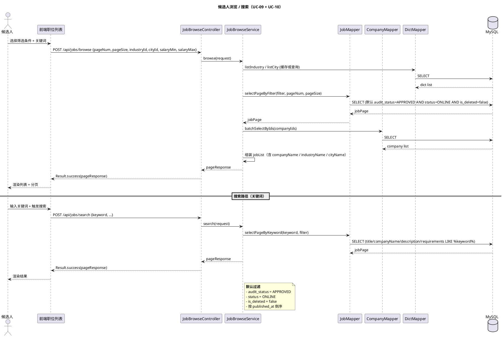
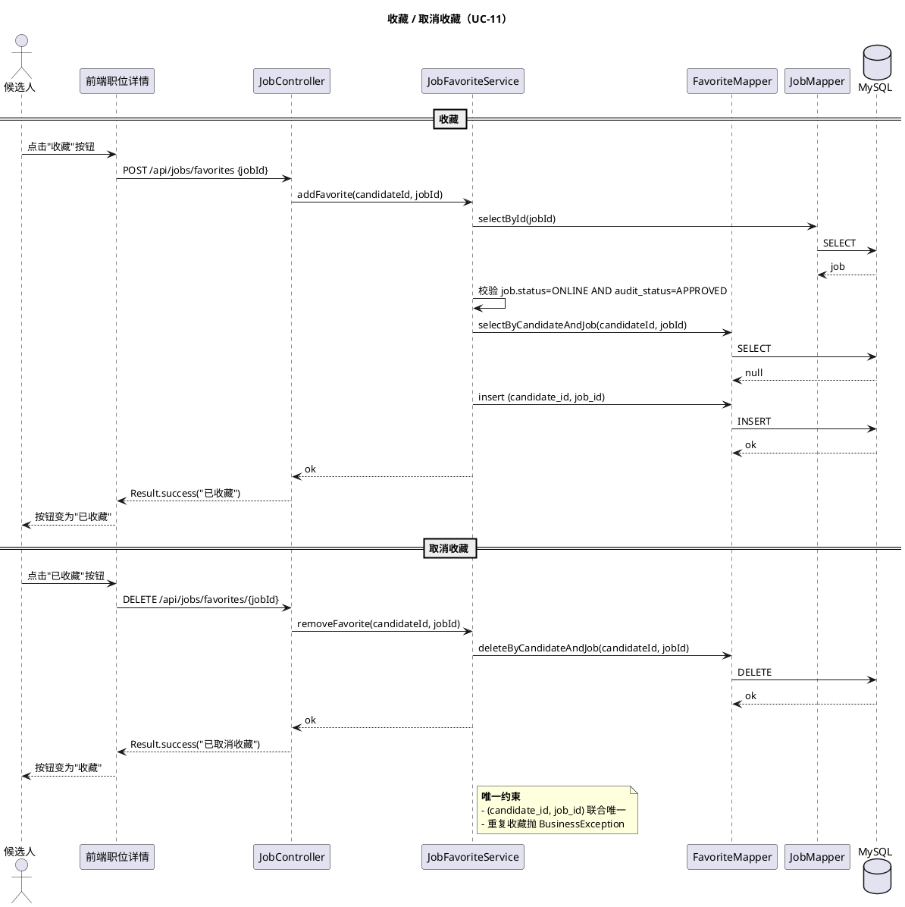
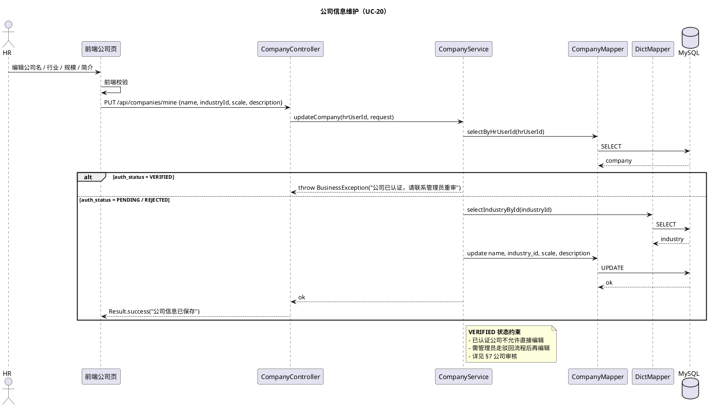
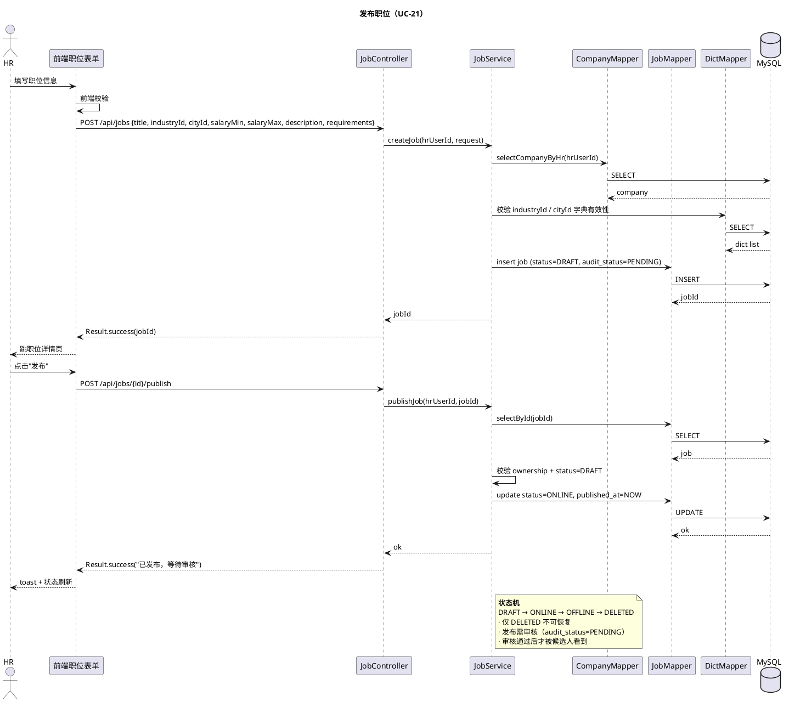
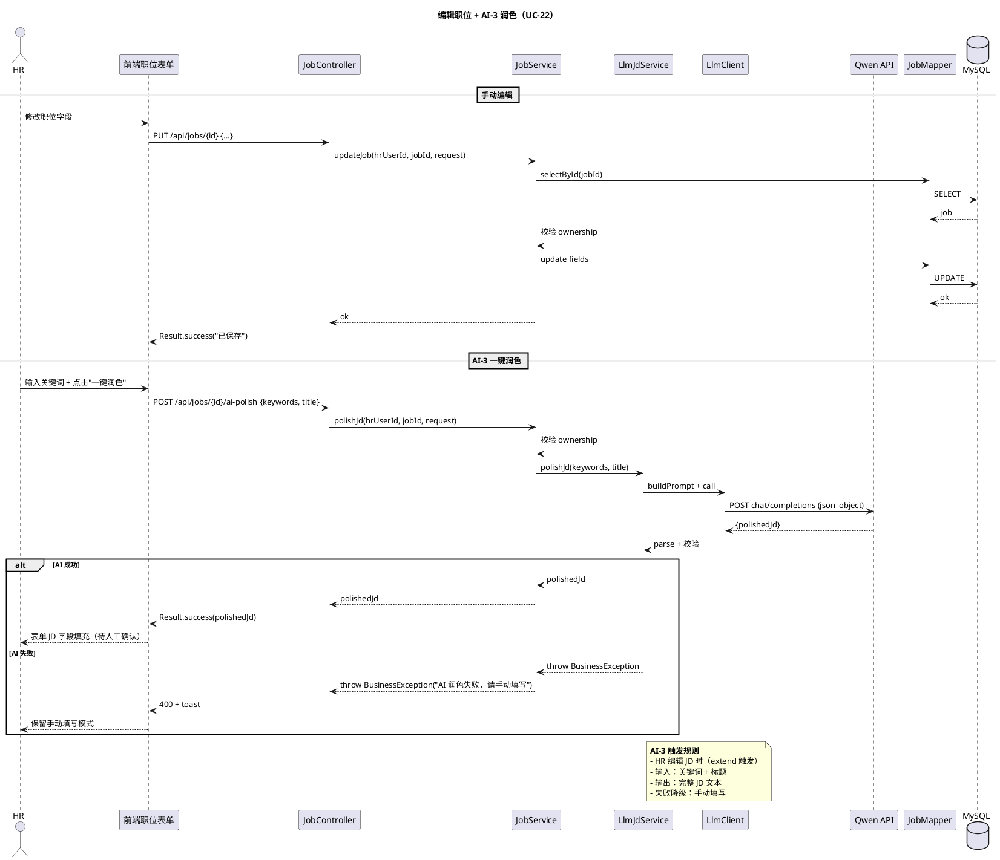
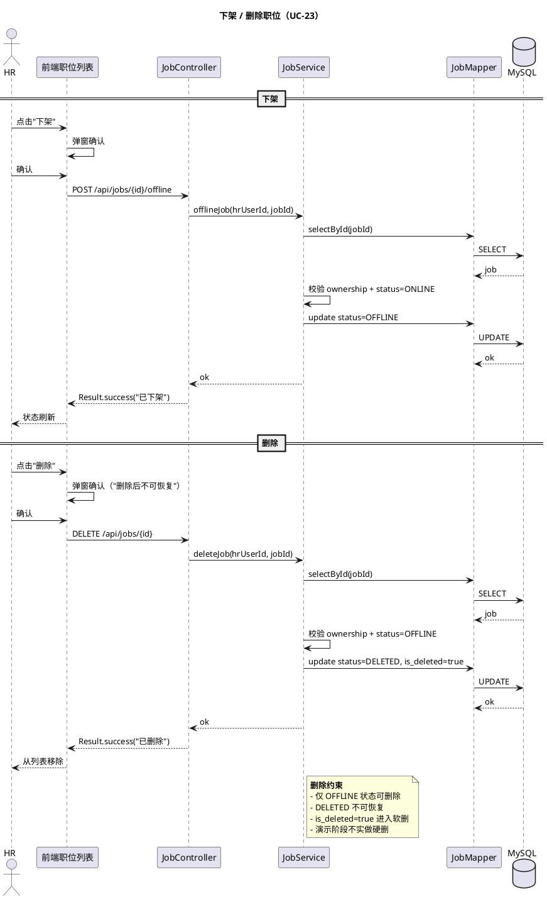
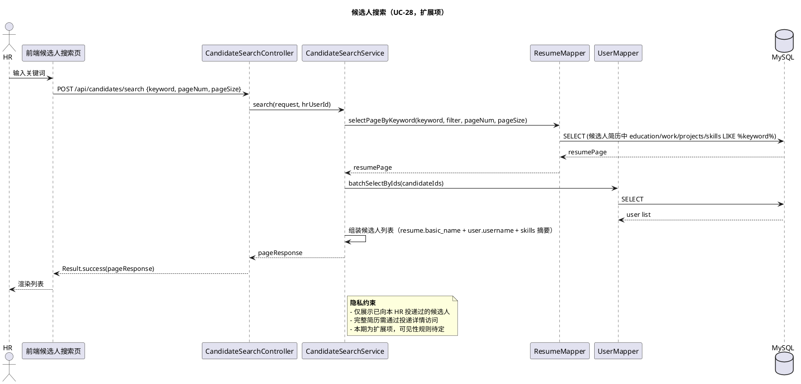

# §3 职位与公司模块

> WBS 节点：§3 职位与公司
> 编制依据：`docs/系统设计/WBS/WBS.md v0.1` §3 / `docs/需求分析/功能性需求分析.md v1.1` §4.2.2 / §4.2.3 / §4.3.2 / §4.3.4
> 编制日期：2026-09-27
> 文档版本：v0.1

> 本文件展示职位与公司模块的设计。所有 API 路径、DTO 字段、注解命名均为示意，实现可调整。

---

## 修订记录

| 版本 | 日期 | 变更说明 |
|---|---|---|
| v0.1 | 2026-09-27 | 初稿：公司维护 / 职位发布 + AI-3 润色 / 浏览搜索 / 收藏 / 候选人搜索 |

---

## 3.0 模块概述

提供 HR 端的职位发布、管理、维护能力，以及候选人端的职位浏览、搜索、收藏能力。

公司审核采用**异步流程**：HR 注册即用全部功能，公司进入 PENDING 状态由管理员事后巡查（详见 §7）。

依赖：
- §1 用户认证（HR 角色 / 候选人角色）
- §6 AI 集成（AI-3 JD 生成 / 润色）
- §8.4 文件上传（公司附件 / 头像，可选）

---

## 3.1 数据模型

涉及的核心表（详见 `docs/数据库设计.md`，后续批输出）：

| 表 | 关键字段 |
|---|---|
| `company` | id, hr_user_id, name, industry_id, scale, description, auth_status（PENDING/VERIFIED/REJECTED）, auth_note, verified_at, verified_by, created_at, updated_at, is_deleted |
| `job` | id, hr_user_id, company_id, title, industry_id, city_id, salary_min, salary_max, description, requirements, status（DRAFT/ONLINE/OFFLINE/DELETED）, audit_status（PENDING/APPROVED/REJECTED）, audit_note, published_at, created_at, updated_at, is_deleted |
| `favorite_job` | id, candidate_id, job_id, created_at；唯一键 (candidate_id, job_id) |
| `dict_industry` | id, name, parent_id（一级 / 二级） |
| `dict_city` | id, name |

要点：
- 行业 / 城市强制下拉字典（管理员维护，§7）
- 技能不做字典（自由输入 + 建议池，见 §6）
- 职位状态与审核状态分开：status 决定是否对候选人可见，audit_status 决定管理员审核结果
- 公司 auth_status 影响 HR 编辑公司信息的能力（VERIFIED 后需重审才能改）

---

## 3.2 接口设计（示意）

### 3.2.1 公司信息

| endpoint | 方法 | 鉴权 | 说明 |
|---|---|---|---|
| `/api/companies/mine` | GET | @RoleHR | HR 查询自己的公司 |
| `/api/companies/mine` | PUT | @RoleHR | HR 编辑自己的公司 |
| `/api/companies/pending` | GET | @RoleAdmin | 管理员查询 PENDING 公司列表 |
| `/api/companies/{id}/verify` | POST | @RoleAdmin | 通过审核 |
| `/api/companies/{id}/reject` | POST | @RoleAdmin | 拒绝审核（带理由） |

### 3.2.2 职位

| endpoint | 方法 | 鉴权 | 说明 |
|---|---|---|---|
| `/api/jobs` | POST | @RoleHR | 发布职位（DRAFT 状态） |
| `/api/jobs/{id}` | GET | 无 | 查看职位详情（候选人） |
| `/api/jobs/{id}` | PUT | @RoleHR | 编辑职位 |
| `/api/jobs/{id}/publish` | POST | @RoleHR | 发布（DRAFT → ONLINE） |
| `/api/jobs/{id}/offline` | POST | @RoleHR | 下架（ONLINE → OFFLINE） |
| `/api/jobs/{id}` | DELETE | @RoleHR | 删除（DELETED 状态） |
| `/api/jobs/browse` | POST | 无 | 候选人浏览（分页 + 筛选） |
| `/api/jobs/search` | POST | 无 | 候选人关键词搜索 |
| `/api/jobs/{id}/ai-polish` | POST | @RoleHR | AI-3 JD 润色 |
| `/api/jobs/favorites` | POST | @RoleCandidate | 收藏 |
| `/api/jobs/favorites/{jobId}` | DELETE | @RoleCandidate | 取消收藏 |
| `/api/jobs/favorites/list` | POST | @RoleCandidate | 我的收藏列表 |
| `/api/jobs/audit/pending` | GET | @RoleAdmin | 待审核职位列表 |
| `/api/jobs/{id}/audit-approve` | POST | @RoleAdmin | 通过审核 |
| `/api/jobs/{id}/audit-reject` | POST | @RoleAdmin | 驳回（带理由） |
| `/api/candidates/search` | POST | @RoleHR | 候选人搜索（简历池关键词） |

字段集非穷举。

---

## 3.3 业务逻辑

### 3.3.1 公司信息维护（HR 视角）

- HR 可编辑公司名 / 行业 / 规模 / 简介
- 行业强制字典下拉（来自 `dict_industry`）
- 公司 auth_status 展示：PENDING / VERIFIED / REJECTED + 理由
- **VERIFIED 状态约束**：不允许直接编辑，需管理员重审后才能改
- 注册时自动创建 company，初始 auth_status=PENDING

### 3.3.2 公司审核（管理员视角，异步）

- 列表：所有 PENDING 公司，按注册时间倒序
- 通过 → auth_status=VERIFIED，记录 verified_at / verified_by
- 拒绝 → auth_status=REJECTED，必填 auth_note，可选同步禁用 HR 账号（user.status=DISABLED）

### 3.3.3 职位发布（HR）

- 必填：title / industry_id / city_id / salary_min-max / description / requirements
- 行业 / 城市强制字典下拉
- 状态机：DRAFT → ONLINE → OFFLINE → DELETED（仅 DELETED 不可恢复）
- 发布 → 进入 ONLINE，audit_status=PENDING，等管理员审核
- 审核通过 → audit_status=APPROVED，候选人可见
- 审核驳回 → audit_status=REJECTED + 理由，HR 可修改后重新提交

### 3.3.4 AI-3 JD 润色（HR 编辑时）

- 触发位置：HR 编辑 JD 时点击"一键润色"按钮
- 调用 §6 `LlmJdService.polishJd(keywords, title)` → 返回完整 JD
- 失败降级：自动切换到手动填写 JD 表单
- 输入：用户填写的关键词 + 职位标题
- 输出：完整 JD 文本（职责 / 要求 / 福利）

### 3.3.5 职位浏览 / 搜索（候选人）

- 分页：每页 20 条
- 筛选维度：industry_id / city_id / salary_min-max
- 搜索关键词：title / company_name / description / requirements，支持技能关键词
- 默认排除 OFFLINE / DELETED / REJECTED 职位
- 默认按发布时间倒序

### 3.3.6 收藏职位（候选人）

- 收藏 / 取消收藏（POST / DELETE）
- 我的收藏列表（POST 分页查询）
- 唯一约束 (candidate_id, job_id)，重复收藏抛错

### 3.3.7 候选人搜索（HR，扩展项）

- 基于简历池的关键词搜索（涉及隐私设置与可见性分级）
- 本期作为可扩展方向保留，具体规则待定
- 当前实现：候选人必须在 HR 可见职位投递过，HR 才能看到其简历

---

## 3.4 时序图

### 3.4.1 候选人浏览 / 搜索（覆盖 UC-09 / UC-10）

### 3.4.2 收藏职位（UC-11）

### 3.4.3 公司信息维护（UC-20）

### 3.4.4 发布职位（UC-21）

### 3.4.5 编辑职位 + AI-3 润色（UC-22）

### 3.4.6 下架 / 删除职位（UC-23）

### 3.4.7 候选人搜索（UC-28，扩展项）

---

## 3.5 前端组件

### 3.5.1 HR 端

- **JobList.vue**（HR 我的职位）
  - 表格 + 状态标签（DRAFT / ONLINE / OFFLINE / DELETED / 审核中）
  - 操作：编辑 / 发布 / 下架 / 删除 / AI 润色
- **JobEdit.vue**（职位编辑）
  - 表单 + 字典下拉（行业 / 城市）
  - 薪资范围双滑块
  - "一键润色"按钮 + AI 生成进度
- **JobPublish.vue**（发布确认）
- **CompanyEdit.vue**（公司编辑，HR 视角）
  - 表单 + 审核状态展示
- **CandidateSearch.vue**（候选人搜索）

### 3.5.2 候选人端

- **JobBrowse.vue**（职位列表）
  - 筛选侧栏（行业 / 城市 / 薪资）
  - 搜索框（关键词）
  - 卡片列表 + 分页
- **JobDetail.vue**（职位详情）
  - 公司信息 + JD 完整内容
  - 收藏 / 投递 / 联系 HR 按钮
- **MyFavorites.vue**（我的收藏）

### 3.5.3 Pinia Stores

- `useJobStore`：jobList / currentJob / filters / fetchJobs / toggleFavorite
- 候选人侧 `useJobBrowseStore`（可选，浏览状态）

### 3.5.4 关键交互

- 收藏按钮：图标切换（空心 ↔ 实心）+ toast
- AI 润色：弹窗加载 → 表单字段填充 → HR 校对 → 保存
- 下架 / 删除：二次确认弹窗
- 候选人投递：跳投递确认页

---

## 3.6 错误处理

| 场景 | code | message |
|---|---|---|
| 行业 / 城市字典不存在 | 400 / 3xxx | 行业 / 城市无效 |
| 编辑非本人公司 / 职位 | 403 | 无权限 |
| VERIFIED 公司不可直接编辑 | 400 / 3xxx | 公司已认证，请联系管理员重审 |
| 重复收藏 | 400 / 3xxx | 已收藏该职位 |
| 删除非 OFFLINE 职位 | 400 / 3xxx | 仅下架后可删除 |
| AI-3 润色失败 | 200 + warning | AI 润色失败，请手动填写 |
| 浏览 / 搜索无结果 | 200 + 空列表 | — |

---

## 3.7 测试要点

### 3.7.1 单元测试

- 职位状态机校验（非法转换抛错）
- VERIFIED 公司编辑约束
- 收藏唯一约束
- 字典下拉数据有效性
- AI-3 润色 mock 测试

### 3.7.2 集成测试

- HR 注册 → 创建公司 PENDING → 发布职位 DRAFT → 提交发布 → 状态 ONLINE + audit PENDING
- 候选人浏览：仅看到 audit=APPROVED AND status=ONLINE AND is_deleted=false
- 候选人收藏：重复收藏抛错
- AI-3 润色：mock 成功 / 失败两种路径
- 公司审核：管理员通过 → HR 可重新编辑

### 3.7.3 端到端冒烟

- 候选人：登录 → 选筛选 → 看到职位列表 → 点详情 → 收藏 → 我的收藏看到
- HR：登录 → 编辑公司（PENDING 状态）→ 发布职位 → 手动填写 JD → 发布 → 等待审核
- HR：编辑职位 → 输入关键词 → 点 AI 润色 → 表单填充 → 校对保存
- HR：下架职位 → 删除（仅 OFFLINE 可删）
