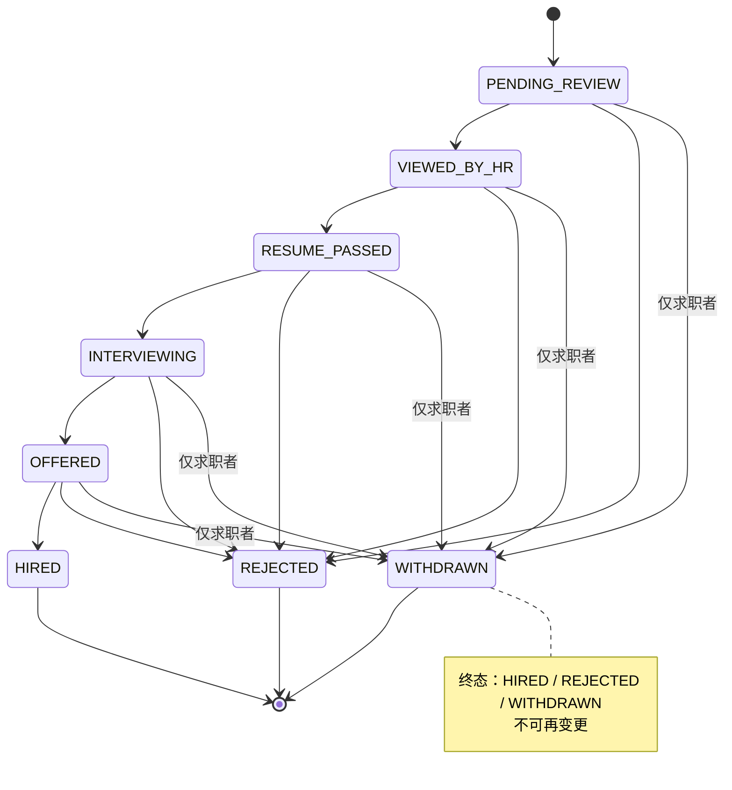

# 上海理工大学光电信息与计算机工程学院

2026—2027(1) 
《计算机项目综合开发创新实践》
阶段性文档

  

项目名称   AI集成的智能招聘系统 
姓    名　　  杨紫雯            
学　  号     2335060507         

## 一、系统需求分析

### 1.1 功能性需求

本系统面向求职者、HR、管理员三类用户，提供以简历与职位为核心的双向撮合服务，并集成大语言模型能力，覆盖简历解析、匹配评分、JD 生成与智能客服等核心场景。三类角色的注册方式与核心权限如下：

| 角色 | 注册方式 | 核心权限 |
|---|---|---|
| 求职者 | 公开注册 | 简历管理、职位搜索与投递、消息、AI 客服 |
| HR | 公开注册（标记 HR 角色） | 发布职位、接收简历、推进投递、消息 |
| 管理员 | 系统内部预置 | 用户审核、公司审核、字典维护（~~职位审核 v0.3 取消：HR 自审自管~~ + ~~简历审核 v0.2 取消~~） |

各功能模块在三角色间的访问权限如下：

| 功能 | 求职者 | HR | 管理员 |
|---|---|---|---|
| 简历管理（自己的） | ✓ | ✕ | ✕ |
| 简历查看（任意） | ✕ | ✓（仅已投递的） | ✓（全部） |
| 职位浏览 | ✓ | ✓ | ✓ |
| 职位发布 | ✕ | ✓ | ✕ |
| 投递简历 | ✓ | ✕ | ✕ |
| 投递查看 / 跟踪 | ✓（自己的） | ✓（收到的全部） | ✓（全部） |
| 投递状态推进 | ✕ | ✓ | ✕ |
| 消息中心 | ✓ | ✓ | ✕ |
| AI 客服 | ✓ | ✓ | ✕ |
| 用户管理 | ✕ | ✕ | ✓ |
| ~~职位审核~~（v0.3 取消） | ✕ | ✕ | ✓ |
| ~~简历审核~~（v0.2 取消） | ✕ | ✕ | ✓ |
| 公司审核 | ✕ | ✕ | ✓ |
| 字典维护 | ✕ | ✕ | ✓ |

#### 1.1.1 求职者端功能

求职者通过公开注册获取账号，注册流程仅需邮箱与密码，密码经 BCrypt 单向哈希后存储。求职者后续可选用密码登录或验证码登录两种方式之一，其中验证码登录受 `app.mail.enabled` 配置开关控制，开发态下验证码输出至后端控制台。

简历管理采用在线结构化简历与附件简历并行的双轨模式。在线简历包含基本信息、教育经历、工作经历、项目经历与技能标签；附件简历支持 PDF 与 Word（.docx）两种格式，单文件不超过 20 MB，上传瞬间由 AI-1 自动抽取结构化字段并回填至在线简历。每位求职者仅维护一份活动简历，以 `is_archived` 标志区分活动（ACTIVE）与归档（ARCHIVED）版本。重新上传流程要求先删除当前 ACTIVE 简历，旧份自动标记为 ARCHIVED，方可建立新的 ACTIVE 简历；归档版本仅 HR 在投递详情中可见，求职者端不展示归档列表。

职位浏览提供每页 20 条的列表与分页能力，支持按行业、城市与薪资范围筛选，关键词搜索覆盖职位名称、公司名称与 JD 内容，支持技能关键词检索。投递时系统取当前 ACTIVE 简历副本随投递记录归档（`resume_snapshot_id`），防止候选人后续修改简历影响历史投递。投递瞬间自动触发 AI-2 简历与 JD 匹配评分，结果以 0–100 分及评分理由形式存入投递记录，仅 HR 可见，候选人端不展示。候选人可在投递详情中发起撤回，撤回后投递进入 WITHDRAWN 终态，系统自动向 HR 发送一条 SYSTEM 角色站内信通知。

个人中心聚合投递记录（含状态时间线）、收藏的职位、账号设置与消息中心入口。账号设置涵盖账号安全（邮箱、密码）、个人资料（用户名、电话、系统默认头像）与求职偏好（期望职位、行业、城市）。系统默认头像基于用户标识实时生成 SVG，不存储额外文件。

#### 1.1.2 HR 端功能

HR 通过公开注册获取账号，注册流程同步填写公司名、行业、规模与简介。注册成功后公司进入待审核状态（`auth_status = PENDING`），但 HR 可即时使用全部功能（包括发布职位），公司审核由管理员事后巡查处理。

职位管理提供发布、编辑、下架与删除能力。HR 发布职位时除手动填写 JD 外，可调用 AI-3 JD 生成或润色功能：输入岗位标题与关键词，系统输出包含职责、要求与福利等板块的完整 JD 文本，HR 在此基础上微调后发布。已下架职位（OFFLINE）支持编辑后重新发布，已删除职位（DELETED）不可恢复。

投递管理按发布的职位分组展示投递列表。每条投递展示候选人基本信息、AI 评分（直接读取 `application.ai_score` 与 `ai_reason`，HR 浏览列表不触发任何 AI 调用）、当前状态以及 WITHDRAWN 标识（默认折叠、灰色卡片、附"已撤回"标签）。投递详情页提供状态时间线、AI 评分理由全文、候选人完整简历快照与附件预览。HR 可推进投递状态（仅允许合法流转）、添加内部备注（仅 HR 自己可见）以及查看候选人投递时所附 ACTIVE 简历的 ARCHIVED 副本。候选人搜索作为扩展项，提供基于简历池的关键词检索能力。

消息中心提供与候选人的即时沟通能力，触发入口包括投递详情页"联系候选人"按钮与候选人撤回投递触发的 SYSTEM 通知。扩展 AI 功能涵盖 AI-5 HR 批量回复（基于简历与 JD 生成个性化回信草稿）与 AI-6 投递信生成（候选人投递时辅助生成求职信）。

#### 1.1.3 管理员端功能

管理员账号由系统内部预置，不开放公开注册。核心职责涵盖用户管理、公司审核与字典维护（~~职位审核 v0.3 取消：HR 自审自管，HR 发布职位后直接上线无需审核~~ + ~~简历审核 v0.2 取消：合规问题直接封号对候选人过重，违规兜底改为 HR 拒绝投递~~）。

用户管理按求职者与 HR 角色分类展示列表，状态操作包括启用、禁用、重置密码，并支持调整用户角色（仅在求职者与 HR 之间切换）。公司审核列表按注册时间排序，操作包括通过（`auth_status = VERIFIED`，记录 `verified_at` 与 `verified_by`）、拒绝（`auth_status = REJECTED`，必填理由）与可选同步停用 HR 账号（`users.status = DISABLED`）。字典维护面向一级 + 二级行业字典、城市字典与技能建议池，技能建议池作为自动补全建议，不强制下拉。

#### 1.1.4 投递状态机

投递记录使用单一 `application.status` 字段记录状态，候选枚举值及可见性如下：

| 枚举值 | 含义 | 候选人可见 | HR 可见 |
|---|---|---|---|
| PENDING_REVIEW | 已投递，待 HR 处理 | 待处理 | ✓ |
| VIEWED_BY_HR | HR 已查看简历 | 处理中（合并显示） | ✓ |
| RESUME_PASSED | 简历通过，进入下一轮 | 简历通过 | ✓ |
| INTERVIEWING | 面试中 | ✓ | ✓ |
| OFFERED | 已发 offer | ✓ | ✓ |
| HIRED | 已入职 | ✓ | ✓ |
| REJECTED | 已拒绝 | ✓ | ✓ |
| WITHDRAWN | 候选人撤回投递 | 已撤回 | 已撤回（默认折叠） |

合法状态转换关系（含 WITHDRAWN）：

HR 可主动推进或终止任意非终态。终态包括 HIRED、REJECTED 与 WITHDRAWN，进入终态后不可再变更。WITHDRAWN 仅由求职者触发，HR 不可主动设置，亦不可从 WITHDRAWN 复活至任何其他状态。候选人侧 UI 隐藏 VIEWED_BY_HR 状态（等同显示为"处理中"），WITHDRAWN 显示为"已撤回"，撤回按钮置灰且不可恢复。HR 全局搜索与投递者列表默认排除 WITHDRAWN，可通过筛选条件显示。

#### 1.1.5 消息中心

消息中心采用二元组唯一会话设计，会话以（`hr_user_id`，`candidate_id`）二元组唯一，跨职位共享同一会话。消息支持可选的职位关联（`message.job_id`），文本与图片 / 文件附件均可承载。

| 触发场景 | 发起方 | 接收方 |
|---|---|---|
| 候选人投递后联系 | 候选人 | HR |
| HR 查看投递时联系 | HR | 候选人 |
| 候选人撤回投递 | 系统 | HR |

后端实时推送采用 SSE 长连接（`SseEmitter`）作为主路径，25 秒心跳避免 nginx 默认超时切断；断线时降级为 3–5 秒轮询，不引入 WebSocket。进入会话时自动将对方消息标记为已读（`read_flag`）。前端布局采用左侧会话列表 + 右侧消息流的标准形式。

#### 1.1.6 AI 功能集成

系统集成 6 个 AI 功能，其中 4 项为必做、2 项为扩展：

| 编号 | 名称 | 触发位置 | 状态 |
|---|---|---|---|
| AI-1 | 简历解析（PDF / Word → 结构化字段） | 求职者上传附件瞬间（仅一次） | 必做 |
| AI-2 | 简历 ↔ JD 匹配评分 | 候选人投递瞬间（仅一次） | 必做 |
| AI-3 | JD 生成 / 润色 | HR 编辑 JD 时一键润色 | 必做 |
| AI-4 | 智能客服 | 全站悬浮聊天窗口 | 必做 |
| AI-5 | HR 批量回复 | HR 投递列表批量操作 | 扩展 |
| AI-6 | 投递信生成 | 候选人投递时附加 | 扩展 |

集成规范：所有调用通过 OpenAI 兼容接口接入，提供方切换仅涉及配置字段修改，不涉及代码改动；业务调用强制 `response_format={"type":"json_object"}`，提示词内提供 JSON Schema；默认超时 30 秒；每次调用记录输入、输出、耗时与 token 数至 `ai_call_log` 表，便于问题追溯与成果展示；评分与分类结果附文字理由，且必须经人工校对方可入库。

**一次性原则**：简历解析仅在上传瞬间触发一次，匹配评分仅在投递瞬间触发一次，HR 与候选人浏览过程均不触发 AI 调用。失败降级策略：简历解析失败时提示用户重新上传或转手动填写；匹配评分失败时写入 `ai_score = NULL`，HR 端显示"待评分"，由 HR 自行查看简历；JD 生成失败时自动切换手动填写 JD 表单；智能客服调用失败时前端显示"客服暂不可用"提示。

### 1.2 非功能性需求

系统在性能、安全、可用性、可维护性与可扩展性五个维度提出明确目标，作为后续技术选型、性能测试、安全测试与运维方案设计的依据。

#### 1.2.1 性能

列表页加载时间控制在 2 秒以内，搜索响应时间控制在 1 秒以内。大模型调用具有秒级延迟（5–30 秒），采用异步处理与前端进度提示，避免阻塞用户操作。

#### 1.2.2 安全

密码经 BCrypt 单向哈希后存储；数据库访问使用 MyBatis-Plus 参数化查询以避免 SQL 注入；前端对用户输入进行转义以避免 XSS。鉴权采用 JwtFilter 解析 JWT 后写入 ThreadLocal，由 AuthInterceptor 结合自定义注解（`@LoginRequired`、`@RoleCandidate`、`@RoleHR`、`@RoleAdmin`）实现角色校验。API Key 等敏感信息通过 `${ENV_VAR:默认值}` 占位符注入 `application-local.yml`，不进入代码仓库。

#### 1.2.3 可用性

前端采用响应式布局，适配 PC 与主流移动端浏览器；表单提交前进行客户端校验，操作结果以统一 Toast 形式反馈；空数据与错误状态提供专门页面。

#### 1.2.4 可维护性

关键业务操作记录至操作日志，管理员操作记录至审计日志（`audit_log`）；AI 调用记录其输入、输出、耗时与 token 数，便于问题追溯与成果展示；全局异常统一处理；配置外部化，关键路径通过 `${ENV_VAR:默认值}` 占位符管理。数据生命周期采用软删（`is_deleted` 字段）+ 列表默认过滤 + 视图层"显示已结束"开关；ARCHIVED 简历与 WITHDRAWN / REJECTED 投递保留期不少于 6 个月。

#### 1.2.5 可扩展性

大模型提供方可通过配置文件切换；文件存储先落地本地磁盘，预留对象存储（OSS）接口；模块间保持松耦合，便于后续替换与升级。

## 二、技术路线

### 2.1 前端开发技术

前端采用 Vue 3 与 Vite 构建，开发语言使用纯 JavaScript，不引入 TypeScript 以降低学习门槛。UI 组件库选用 Element Plus，提供表格、表单、对话框、上传等基础组件，覆盖主要交互需求。状态管理使用 Pinia，路由使用 Vue Router 4，HTTP 请求使用 Axios，配合后端 JWT 方案管理登录态与权限。

### 2.2 后端开发技术

后端基于 Spring Boot 3.5.14，依赖管理使用 Maven 3.9.8，运行于 Java 17 之上。持久层选用 MyBatis-Plus 3.5.7，配合 `spring-boot3-starter` 在 MyBatis 基础上提供代码生成与通用方法，减少样板代码。鉴权采用轻量引入的 Spring Security Crypto 配合 jjwt 0.12.x 实现 JWT Token 无状态认证；验证码登录与邮件通知通过 `spring-boot-starter-mail` 实现，发送方式由 `app.mail.enabled` 配置开关控制。所有第三方服务地址、密钥、模型名等通过 `application.yml` 外部化，便于在不同环境之间切换。

### 2.3 数据库实现技术

数据库使用 MySQL 8.0.46，字符集统一采用 `utf8mb4`，排序规则为 `utf8mb4_0900_ai_ci`，存储引擎使用 InnoDB 以支持外键约束。数据库表共计 19 张，按业务域划分如下：

| 业务域 | 表数 | 表名 |
|---|---|---|
| 账号与认证 | 2 | `users`、`email_code` |
| 简历 | 3 | `candidate_profile`、`resume`、`resume_attachment` |
| 职位与公司 | 2 | `company`、`job` |
| 投递 | 3 | `application`、`application_status_history`、`application_note` |
| 收藏 | 1 | `favorite_job` |
| 消息 | 3 | `conversation`、`message`、`message_attachment` |
| 字典 | 3 | `dict_industry`、`dict_city`、`dict_skill_suggestion` |
| AI 与审计 | 2 | `ai_call_log`、`audit_log` |

所有业务表包含统一的审计字段（创建时间、更新时间、软删标记），投递记录的状态变更通过独立的状态历史表记录，AI 调用通过独立的日志表记录。简历基本信息以 JSON 字段存储教育经历、工作经历与项目经历，不建子表；技能以自由输入为主，配合可选建议池，不强制下拉。

## 三、系统特色

### 3.1 AI 驱动的核心能力

简历解析：求职者上传 PDF 或 Word 简历后，系统通过大模型自动抽取姓名、联系方式、教育经历、工作经历、项目经历与技能等结构化字段，回填至在线简历，降低手动填写成本。

匹配评分：候选人提交投递时，系统基于简历与 JD 的语义相似度给出 0–100 分的匹配评分并附简要说明，HR 可结合评分与候选人详情推进面试流程，减轻筛选负担。

JD 生成：HR 仅需提供岗位标题与关键词，系统即可生成包含职责、要求、福利等板块的 JD 初版，HR 在此基础上修改落地，避免从零开始撰写。

智能客服：求职者在前端发起咨询后，AI 智能客服基于预先编写的使用手册与系统说明书回答常见问题；未命中时引导用户转人工或提交反馈，提升系统自助服务能力。

### 3.2 工程亮点

演示模式开关：所有依赖外部服务的 AI 调用与邮件发送均支持配置开关控制，开发态下 AI 调用与验证码均输出至控制台，便于答辩演示与本地调试。

异步审核：HR 注册后公司进入待审核状态，但 HR 仍可即时使用全部功能，审核由管理员事后巡查处理，平衡用户体验与合规审核。

简历快照：投递瞬间自动拷贝当前 ACTIVE 简历标识作为快照引用，防止候选人后续修改简历影响历史投递评分与 HR 视图。

状态机单一字段：投递状态以单一字段记录，通过视图层过滤（候选人侧隐藏 VIEWED_BY_HR）实现差异化展示，简化后端逻辑与数据迁移成本。

## 四、拟采用的 AI 工具

### 4.1 系统集成 LLM API（产品内 AI）

系统采用大语言模型 API 作为智能化能力底座，统一通过 OpenAI 兼容接口接入。默认选用阿里云通义千问 `qwen-plus`，因其在国内访问稳定、中文表达自然、接口规范便于切换。作为备选，亦可配置 MiniMax 等同类型提供方，切换仅需修改 API 地址、密钥与模型名三项配置，不涉及代码改动。鉴权方式采用 Bearer Token，请求格式遵循 OpenAI Chat Completions 规范，便于在多种提供方之间复用客户端代码。系统承担 AI-1 至 AI-6 共六项功能的调用调度，每次调用记录输入、输出、耗时与 token 数至 `ai_call_log` 表，并实施 30 秒超时控制与降级策略。

### 4.2 开发辅助 AI 工具（开发过程使用）

本项目在需求分析、文档撰写、系统设计与代码开发阶段引入 AI 工具作为效率辅助，核心使用 opencode CLI、Codex 桌面端与 WorkBuddy 助手三类工具，背后均采用 MiniMax-M3 大模型。AI 工具主要承担草稿生成、方案对比、时序图绘制、数据库 schema 设计与测试用例编写等重复性工作，所有需求决策、设计取舍与字段命名修正均由开发者主控，AI 输出经逐条审阅后方纳入正式文档或代码。

工具使用遵循 `AGENTS.md` 协作规范：日志统一写入 `docs/dev-logs/YYYY-MM-DD.md`，单日文件仅追加不可覆盖，文末追加编辑者署名；AI 不进行未经审批的 git 提交；禁止在项目根或子目录创建工具专属目录存放日志。该机制保证开发过程可追溯、协作边界清晰，AI 作为效率工具而非决策主体。

---

## 修订记录

| 版本 | 日期 | 变更说明 |
|---|---|---|
| v0.1 | 2026-09-22 | 初稿，基于当时需求分析撰写 |
| v0.2 | 2026-09-28 | 补充 docx 模板内容 |
| v1.0 | 2026-09-28 | 按 v1.1 需求分析与数据库设计修订：投递状态由 7 个扩充为 8 个（含 WITHDRAWN 终态）；简历管理由多版本改为单一 ACTIVE + 历史归档；鉴权由 Spring Security 完整方案改为 JwtFilter + 自定义注解；数据库表数由 18 调整为 19；字符集排序规则由 `utf8mb4_unicode_ci` 调整为 `utf8mb4_0900_ai_ci`；拟采用的 AI 工具拆分为产品内 API 与开发辅助 AI 两小节 |
| v1.1 | 2026-09-28 | 添加层级号：1.1.x / 1.2.x 嵌套编号，标题层级相应调整为 H1（抬头）/ H2（一、二、三、四）/ H3（1.1、1.2 等）/ H4（1.1.1、1.1.2 等） |