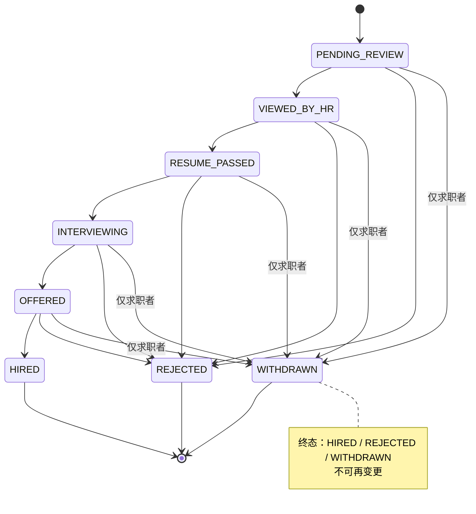

# 功能性需求分析

> 项目名称：AI 集成的智能招聘系统
> 文档版本：v1.1
> 编制日期：2026-09-26
> 课程：计算机项目综合开发创新实践

---

## 修订记录

| 版本 | 日期 | 变更说明 |
|---|---|---|
| v0.1 | 2026-09-22 | 初稿：确定角色 / 功能 / 状态机 / AI 清单 / 数据实体 |
| v0.2 | 2026-09-23 | 字典策略调整：技能改为自由输入 + 可选建议池；行业 / 城市仍为强制字典 |
| v0.3 | 2026-09-23 | 权限矩阵修正：拆分简历管理与简历查看、投递查看与状态推进；管理员只审核不生产职位 |
| v0.4 | 2026-09-23 | 消息中心独立为求职者端与 HR 端的顶层模块 |
| v0.5 | 2026-09-23 | 消息会话唯一性从三元组（HR、候选人、职位）改为二元组（HR、候选人），职位标识下放到消息级别 |
| v0.6 | 2026-09-23 | 实体清单扩充：新增简历附件、投递状态历史、HR 备注、职位收藏、消息附件、审计日志等表 |
| v0.7 | 2026-09-24 | 关键技术决策定稿（JWT / 文件存储 / 简历格式 / 邮件 / AI 降级策略）；明确简历基本信息必填字段 |
| v0.8 | 2026-09-24 | 增加验证码登录（备选）方式；实体清单新增邮箱验证码表 |
| v0.9 | 2026-09-24 | HR 公司审核改为异步流程：注册即用全部功能，管理员事后巡查 |
| v1.0 | 2026-09-24 | 按标准需求分析文档结构整理，统一表述口径，剥离过程性说明 |
| v1.1 | 2026-09-26 | 简历评分改为投递瞬间触发，HR 浏览列表不再触发 AI；简历版本改为单一 ACTIVE + 历史归档；新增 WITHDRAWN 终态（候选人撤回投递）；账号设置细化为账号安全 / 个人资料 / 求职偏好或我的公司；头像改为系统默认生成（不上传）；去除隐私设置；验证码登录去除用户切换开关 |


---

## 1. 引言

### 1.1 编写目的

本文档描述"AI 集成的智能招聘系统"的功能需求，明确系统的业务边界、用户角色与各角色的核心业务流程，定义功能模块、交互流程、状态机、AI 集成方案及数据实体概要，作为后续概要设计、数据库设计与功能测试的依据。

预期读者：课程指导教师、项目评审人员、开发人员。

### 1.2 项目背景

随着互联网招聘行业的发展，传统招聘流程存在以下痛点：

- 求职者手动填写大量简历字段，完成率低；
- HR 在大量简历中筛选候选人效率低下；
- 职位描述（JD）撰写质量参差不齐；
- 候选人投递后缺乏有效反馈通道；
- 用户在使用网站时遇到问题缺乏即时帮助。

本项目通过集成大语言模型（LLM）API 解决上述痛点，构建一个 AI 增强的智能招聘 Web 系统。

### 1.3 术语定义

| 术语 | 说明 |
| --- | --- |
| LLM | 大语言模型（Large Language Model），本项目通过 OpenAI 兼容接口调用 |
| JD | 职位描述（Job Description） |
| 简历双轨 | 在线结构化简历与附件简历（PDF / Word）并行的管理模式 |
| 投递 | 求职者向某一职位提交简历的行为 |
| 状态机 | 投递记录在各处理阶段之间的状态流转规则 |

---

## 2. 项目概述

### 2.1 项目目标

构建一个三角色（求职者 / HR / 管理员）的 Web 招聘系统，在传统增删改查功能基础上集成 4 个核心 AI 功能（简历解析、匹配评分、JD 生成、智能客服），形成可演示、可答辩的完整应用。

### 2.2 项目范围

**包含：**

- 三角色 Web 招聘系统（求职者 / HR / 管理员）；
- 简历双轨管理（在线表单 + 附件上传）；
- 投递状态管理（求职者 / HR 共享数据，可见范围按角色区分）；
- 站内消息中心（前端交互形态参考主流即时通讯软件）；
- 4 个必做 AI 集成功能；
- 字典维护（行业 / 城市为强制字典；职业技能为自由输入，配可选建议池）。

**不包含：**

- 面试日程管理（通过消息中心或线下沟通解决）；
- HR 企业资质认证（简化为角色标识与公司信息审核）；
- 防骚扰机制（投递上限 / 黑名单 / 举报）；
- 简历隐私分级（默认所有 HR 可见已投递的简历）；
- 数据看板 / 漏斗可视化；
- 系统公告；
- 移动端 App（响应式布局即可）；
- 邮件 / 短信通知。


---

## 3. 用户角色与权限

### 3.1 角色总览

| 角色 | 注册方式 | 核心权限 |
|---|---|---|
| 求职者 | 公开注册 | 简历管理、职位搜索与投递、消息、AI 客服 |
| HR | 公开注册（标记 HR 角色） | 发布职位、接收简历、推进投递、消息 |
| 管理员 | 系统内部预置 | 用户审核、职位审核、简历审核、公司审核、字典维护 |

### 3.2 权限矩阵

| 功能 | 求职者 | HR | 管理员 |
|---|---|---|---|
| 简历管理（自己的） | ✓ | ✕ | ✕ |
| 简历查看（任意） | ✕ | ✓（仅已投递的） | ✓（全部） |
| 职位浏览 | ✓ | ✓ | ✓ |
| 职位发布 | ✕ | ✓ | ✕ |
| 投递简历 | ✓ | ✕ | ✕ |
| 投递查看 / 跟踪 | ✓（自己的） | ✓（收到的全部投递） | ✓（全部） |
| 投递状态推进 | ✕ | ✓ | ✕ |
| 消息中心 | ✓ | ✓ | ✕ |
| AI 客服 | ✓ | ✓ | ✕ |
| 用户管理 | ✕ | ✕ | ✓ |
| 职位审核 | ✕ | ✕ | ✓ |
| 简历审核 | ✕ | ✕ | ✓ |
| 公司审核 | ✕ | ✕ | ✓ |
| 字典维护 | ✕ | ✕ | ✓ |


---

## 4. 功能需求

### 4.1 求职者端

#### 4.1.1 注册 / 登录

- **注册**：邮箱 + 密码（密码采用 BCrypt 哈希存储），注册时选择角色（求职者 / HR）；
- **登录方式**（两种，任选其一）：
  - 密码登录：邮箱 + 密码；
  - 验证码登录：邮箱 + 验证码（默认发送到后端控制台，可通过配置改为发送真实邮箱）。

#### 4.1.2 简历管理

每位求职者只维护**一份活动简历（ACTIVE）**，AI 解析仅在上传瞬间触发一次。

- **首次上传流程**：进入简历管理 → 若无 ACTIVE 简历 → 提示上传附件（PDF / Word，≤20MB） → 系统调用 AI 解析返回 JSON → 自动创建 ACTIVE 简历并写入 JSON 内容 → 用户在表单上编辑校对 → 保存入库；
- **后续编辑**：仅可修改表单内容（与修改个人信息一致），不允许再上传或替换附件；保存不再触发 AI；
- **重新上传流程**：必须先删除当前 ACTIVE 简历 → 旧份自动标记为 ARCHIVED → 进入"无 ACTIVE"状态 → 再次走上传 → AI 解析 → 自动建表 → 编辑 → 保存；
- **AI 解析触发点**：仅在上传瞬间一次；编辑保存、归档切换、查看均不触发 AI；
- **基本信息**：姓名 / 电话 / 邮箱均为必填；
- **简历内容字段**：教育经历、工作经历、项目经历（JSON 存储）、技能（自由输入）、自我介绍；
- **归档可见性**：ARCHIVED 历史版本仅 HR 在投递详情中可见，求职者端不展示归档列表。
#### 4.1.3 职位浏览

- 职位列表 + 分页（每页 20 条）；
- 筛选维度：行业、城市、薪资范围；
- 关键词搜索：职位名称 / 公司名称 / JD 内容，支持技能关键词。

#### 4.1.4 投递

- 流程：浏览 JD → 点击"投递" → 系统自动取当前 ACTIVE 简历副本 → 提交；
- **AI 评分触发**：提交瞬间自动触发"简历 ↔ JD 匹配评分"（详见 7.1 AI-2），结果（分数 + 理由）写入 `application` 表，**仅 HR 可见，候选人端不展示**；
- 扩展项：可附自定义求职信（对应扩展功能 AI-6 投递信生成）；
- 投递后立即看到初始状态"已投递，待 HR 处理"；
- **撤回投递**：提交后任意时刻，候选人可点击"撤回投递"（位置见 4.1.5），投递状态进入 WITHDRAWN 终态（详见 5）；撤回后系统自动给 HR 发送一条站内信通知。
#### 4.1.5 我的（个人中心）

- **我的投递**：投递记录列表（含状态时间线）；每条投递右侧操作区提供"撤回"按钮（点击后弹窗确认，确认后投递进入 WITHDRAWN，按钮置灰，且不可恢复）；
- 收藏的职位；
- **账号设置**：
  - **账号安全**：邮箱、密码（用于登录）；
  - **个人资料**：用户名、电话、系统默认头像（注册时自动生成圆形头像，含姓名首字母与背景色，前端按 user_id 实时渲染）；
  - **求职偏好**：期望职位、期望行业、期望城市（自由输入 / 选择，用于推荐与匹配）。

#### 4.1.6 消息中心

- 会话列表（与各 HR 的对话）；
- 消息收发；
- 系统通知；
- AI 客服入口（详见 4.1.7）。

#### 4.1.7 AI 客服

- 全站悬浮聊天窗口；
- 基于系统使用手册的关键词检索 + LLM 生成回答；
- 流式输出。

### 4.2 HR 端

#### 4.2.1 注册 / 登录

- **注册**：邮箱 + 密码（BCrypt 哈希存储），登录方式与求职者共用（密码登录 / 验证码登录）；
- **HR 注册时需同步填写公司信息**（公司名 / 行业 / 规模 / 简介）；
- 公司提交后进入待审核状态（`company.auth_status = PENDING`），**HR 立即可用全部功能**（包括发布职位）；管理员事后审核，详见 4.3.4。

> **关于公司审核**：HR 注册流程不阻塞，注册即可发布职位。管理员事后巡查，发现公司信息不实可执行：
> ① 将公司标记为拒绝状态（`company.auth_status = REJECTED`），并填写理由（`company.auth_note`）；
> ② 可选：同步停用该 HR 账号（`users.status = DISABLED`）。
> HR 查看拒绝理由后需重新注册。

#### 4.2.2 职位管理

- **AI JD 生成**：输入关键词 → LLM 生成 JD → 人工微调 → 发布（详见 AI-3）；
- 手动填写 / 修改 JD（兜底方案）；
- 列表管理：编辑、下架（隐藏而非删除，可编辑后重新发布）、删除、刷新。

#### 4.2.3 投递管理

- 投递列表（按发布的职位分组），每条投递显示：
  - 候选人基本信息（姓名 / 当前状态）；
  - **AI 匹配评分**：直接读取投递时已存储的 `application.ai_score`（0–100）与 `ai_reason`（一句话评分理由）；HR 浏览列表**不触发任何 AI 调用**；
  - WITHDRAWN 项默认折叠、灰色显示，右上角加"已撤回"标签；
- 投递详情页：
  - 顶部状态时间线，最后一行展示撤回时间与触发方（如"WITHDRAWN @ 时间 by 候选人"）；
  - "AI 评分"区块：分数 + 评分理由全文；
  - HR 可查看候选人完整简历（取自投递时所附 ACTIVE 简历的 ARCHIVED 副本）与附件预览；
- 状态推进：见第 5 章；WITHDRAWN 终态下 HR 不再推进，亦不可强制复活；
- 全局搜索默认排除 WITHDRAWN，可通过筛选条件显示。
#### 4.2.4 候选人搜索（扩展项）

基于简历池的关键词搜索。涉及求职者隐私设置、可见性分级等问题，本期不实现，作为可扩展方向保留。

#### 4.2.5 我的（个人中心）

- 我发布的职位；
- **账号设置**：
  - **账号安全**：邮箱、密码（用于登录）；
  - **HR 个人信息**：用户名、电话、系统默认头像（与求职者共用同一头像生成规则）；
  - **我的公司**：链接到公司管理界面（与 4.3.4 公司审核共用同一份数据；HR 视角可编辑公司名 / 行业 / 规模 / 简介，查看审核状态；管理员视角多出"审核"动作）。

#### 4.2.6 消息中心

- 会话列表；
- 消息收发；
- 系统通知；
- 额外触发入口：投递详情页右上角"联系候选人"。

#### 4.2.7 可扩展项

- **AI-5 HR 批量回复**：基于候选人简历 + JD 生成个性化回信。

### 4.3 管理员端
> 管理员为非注册账号，初始写入数据库

#### 4.3.1 用户管理

- 用户列表（按求职者 / HR 角色分类）；
- 状态操作：启用、禁用、重置密码（非必须）；
- HR 角色标记。

#### 4.3.2 职位审核

- 职位列表（按发布时间倒序）；
- 审核操作：通过、驳回（需填写理由）。

#### 4.3.3 简历审核

- 管理员可查看平台内全部简历；
- 对存在违规内容的简历，通过用户管理功能（禁用账号）处理，简历内容本身不作编辑。

#### 4.3.4 公司审核

- 列表：处于待审核状态（`company.auth_status = PENDING`）的公司，由 HR 注册时自动产生；
- 列表项：公司名、行业、规模、HR 邮箱、注册时间；
- 审核操作：
  - **通过** → `auth_status = VERIFIED`，记录 `verified_at` / `verified_by`；
  - **拒绝** → `auth_status = REJECTED`，必填理由（`auth_note`），可选同步停用 HR 账号（`users.status = DISABLED`）；
- 异步流程：HR 注册后无需等待审核，可立即使用全部功能（包括发布职位），管理员事后巡查处理；
- 与职位审核（4.3.2）互补：职位审核处理职位内容合规，公司审核处理公司身份合规。

#### 4.3.5 字典维护

- 行业（一级 + 二级）；
- 城市；
- 技能（不强制下拉，仅提供建议池）。


---

## 5. 投递状态机

### 5.1 状态枚举

| 枚举值 | 含义 | 候选人可见 | HR 可见 |
|---|---|---|---|
| PENDING_REVIEW | 已投递，待 HR 处理 | ✓（显示为"待处理"） | ✓ |
| VIEWED_BY_HR | HR 已查看简历 | ✕（合并到"处理中"） | ✓ |
| RESUME_PASSED | 简历通过，进入下一轮 | ✓（显示为"简历通过"） | ✓ |
| INTERVIEWING | 面试中 | ✓ | ✓ |
| OFFERED | 已发 offer | ✓ | ✓ |
| HIRED | 已入职 | ✓ | ✓ |
| REJECTED | 已拒绝 | ✓ | ✓ |
| WITHDRAWN | 候选人撤回投递 | ✓（显示为"已撤回"） | ✓（默认折叠显示） |

### 5.2 状态流转

合法状态转换如下：

```
PENDING_REVIEW → VIEWED_BY_HR
PENDING_REVIEW → REJECTED
VIEWED_BY_HR   → RESUME_PASSED
VIEWED_BY_HR   → REJECTED
RESUME_PASSED  → INTERVIEWING
RESUME_PASSED  → REJECTED
INTERVIEWING   → OFFERED
INTERVIEWING   → REJECTED
OFFERED        → HIRED
OFFERED        → REJECTED

任意非终态 → WITHDRAWN（仅求职者触发）
```

合法状态转换（Mermaid 流转图）：



- HR 可主动推进或终止任意非终态状态；
- 终态：HIRED、REJECTED、**WITHDRAWN**；进入任一终态后不可再变更；
- **WITHDRAWN 触发规则**：仅求职者可触发 WITHDRAWN；HR 不可主动将投递设为 WITHDRAWN，亦不可从 WITHDRAWN 复活到任何其他状态；
- 候选人撤回投递不影响该投递历史 AI 评分、附件、简历快照的留存（HR 仍可查看）。

### 5.3 显示逻辑

- 数据库：投递记录使用单一 `application.status` 字段；
- 候选人侧 UI：隐藏 `VIEWED_BY_HR` 状态，等同显示为"处理中"；WITHDRAWN 显示为"已撤回"，且操作区撤回按钮置灰、不可恢复；
- HR 侧 UI：展示完整状态流；WITHDRAWN 默认折叠 + 灰色卡片 + "已撤回"标签；状态时间线最后一行展示"WITHDRAWN @ 时间 by 候选人"；
- HR 全局搜索 / 投递者列表默认排除 WITHDRAWN，可通过筛选条件显示。
## 6. 消息中心

### 6.1 数据模型

- **会话（conversation）**：(id, hr_id, candidate_id, created_at, updated_at)；
- **消息（message）**：(id, conversation_id, sender_id, sender_role, job_id, content, created_at, read_flag)。

### 6.2 触发场景

- 候选人投递后，在投递详情页点击"联系 HR"；
- HR 查看投递时，在投递详情页点击"联系候选人"；
- **候选人撤回投递** → 系统自动给 HR 发送一条简短通知消息（内容示例："候选人 X 已撤回对职位 Y 的投递"）；
- 同一（HR， 候选人）二元组仅对应唯一会话；`job_id` 放在消息级别（一条消息可关联某个职位）。
### 6.3 界面与交互

- 前端布局参考主流即时通讯软件：左侧会话列表 + 右侧消息流；
- 会话列表显示"在聊"职位摘要（基于该会话最近的消息）；进入会话后，消息按关联职位打标签或分组；
- 后端采用 SSE 或轮询（每 3–5 秒），不引入 WebSocket；
- 进入会话时自动将对方消息标记为已读。


---

## 7. AI 功能需求

### 7.1 必做功能

| 编号 | 功能 | 触发位置 | 预期输出 |
|---|---|---|---|
| AI-1 | 简历解析（PDF / Word → 结构化字段） | 求职者上传附件瞬间（仅首次上传触发，编辑保存不触发） | JSON：姓名 / 教育 / 工作 / 技能 |
| AI-2 | 简历 ↔ JD 匹配评分 | 候选人投递瞬间（HR 浏览列表不再触发） | 0–100 分 + 匹配理由；HR 直接读取已存储字段 |
| AI-3 | JD 生成 / 润色 | HR 编辑 JD 时（"一键润色"选项按钮） | 完整 JD 文本 |
| AI-4 | 智能客服机器人 | 全站悬浮窗口 | 基于使用手册的回答 |
> **AI-1 简历解析流程**：PDF/Word → 纯文本（见 §9.1 / `docs/技术约束.md §11` / `docs/系统设计/WBS/WBS.md 2.2`）→ LLM → JSON。Python 软依赖负责第一步（文本抽取），LLM 负责第二步（AI-1 的核心）。

### 7.2 扩展功能

| 编号 | 功能 | 触发位置 | 状态 |
|---|---|---|---|
| AI-5 | HR 批量回复（基于简历 + JD） | HR 投递列表批量操作 | 扩展 |
| AI-6 | 投递信生成 | 候选人投递时 | 扩展 |

### 7.3 已裁剪功能

- 面试题生成（不做）；
- 简历评分雷达图（不做）。

### 7.4 AI 集成通用规范

1. **API Key 管理**：通过本地配置文件（`application-local.yml`）+ 环境变量注入，不进入代码仓库；
2. **提供方切换**：修改 `llm.api-url` / `api-key` / `model` 三个配置字段即可在通义千问 / MiniMax 之间切换；
3. **结构化输出**：业务调用强制 `response_format={"type":"json_object"}`，提示词中给出 JSON Schema；
4. **超时控制**：默认 30 秒（`llm.timeout-seconds`）；
5. **降级策略**：未配置 API Key 或调用失败时返回明确错误而非崩溃，业务流程仍可继续；
6. **缓存**：相同提示词 + 参数在本地缓存 1 小时（暂不引入 Redis）；
7. **日志**：每次调用记录输入、输出、耗时、token 数，存入 `ai_call_log` 表；
8. **可解释**：所有 AI 输出（含 AI-2 评分）均附带文字理由，便于人工复核；
9. **可纠错**：AI-1 简历解析、AI-3 JD 生成、AI-5 批量回复、AI-6 投递信生成的输出经人工校对后方可入库；AI-2 评分自动入库（HR 通过查看评分与简历推进状态，不修改分数本身）；
10. **一次性原则**：简历解析仅在上传瞬间触发一次，匹配评分仅在投递瞬间触发一次，二者均不在 HR / 候选人浏览时触发；评分失败 → 写入 `ai_score = NULL` 并显示"待评分"，不做排队重试。


---

## 8. 数据实体概要

> 本清单为概要设计，具体字段与索引在数据库设计文档中细化。

### 8.1 设计原则

- 教育经历、工作经历、项目经历不建子表，以 JSON 字段存储简历主体；
- 技能不建子表（自由输入，不做索引）；
- 提示词模板存放于代码中，不建表；
- 不建通用文件表，各业务使用专门的附件表。

### 8.2 实体清单

共 19 张表，按业务域划分如下。

#### 账号与认证

| 表名 | 说明 |
|---|---|
| users | 用户账号（含角色、状态、密码哈希、`username` 姓名、`phone` 电话；头像由 user_id 实时生成 SVG，无需 DB 字段） |
| email_code | 邮箱验证码（email / code / codeType / used / expireTime），用于验证码登录 |

#### 简历相关

| 表名 | 说明 |
|---|---|
| candidate_profile | 求职者扩展资料（与 users 一对一），含求职偏好（期望职位 / 行业 / 城市） |
| resume | 简历主体（在线字段 + AI 解析后的 JSON），含 `is_archived`（false=活动 ACTIVE；true=归档 ARCHIVED）；每位求职者仅一份 `is_archived = false` |
| resume_attachment | 简历附件元数据（文件名、存储路径、大小、上传时间、MIME） |

#### 职位与公司

| 表名 | 说明 |
|---|---|
| company | HR 所属公司 |
| job | 职位 / JD（关联行业、城市、HR） |

#### 投递相关

| 表名 | 说明 |
|---|---|
| application | 投递记录（候选人 + 职位 + 状态 + AI 评分），含 `ai_score`（0–100，NULL 表示"待评分"）和 `ai_reason`（评分理由） |
| application_status_history | 投递状态变更历史（from_status / to_status / changed_by / changed_at），驱动"状态时间线"展示 |
| application_note | HR 内部备注（仅 HR 自己可见，支持候选人 / 投递两个维度） |

#### 收藏

| 表名 | 说明 |
|---|---|
| favorite_job | 求职者收藏职位（candidate_id + job_id 联合唯一） |

#### 消息相关

| 表名 | 说明 |
|---|---|
| conversation | 消息会话（HR + 候选人二元组唯一） |
| message | 消息（含可选的职位关联） |
| message_attachment | 消息附件（图片 / 文件，HR 与求职者通用） |

#### 字典

| 表名 | 说明 |
|---|---|
| dict_industry | 行业字典（强制下拉） |
| dict_city | 城市字典（强制下拉） |
| dict_skill_suggestion | 技能建议池（可选，用于自动补全） |

#### AI 与审计

| 表名 | 说明 |
|---|---|
| ai_call_log | AI 调用日志（输入、输出、耗时、token 数） |
| audit_log | 管理员操作日志（用户 / 职位 / 简历审核等敏感动作） |

### 8.3 实体关系（简版）

- users 1:1 candidate_profile（求职者）；
- users 1:N job（HR 发布职位）；
- users 1:N company（HR 关联公司）；
- candidate_profile 1:N resume（其中仅一份 `is_archived = false` 为活动简历，其余为归档）；
- resume N:M job（通过 application 关联）；
- job 1:N application；
- users N:M users（通过 conversation + message 关联）。


---

## 9. 关键技术决策（功能视角）

> 本节仅收录与功能行为、业务流程相关的关键技术决策；与质量属性相关的决策（认证、文件存储、邮件）见《非功能性需求分析》。

### 9.1 简历解析格式：PDF + Word（.docx）

- 覆盖 95% 的真实简历格式；
- 图片格式需要 OCR 引擎（额外增加依赖），暂不支持；.doc 老格式较为少见，不支持。

### 9.2 AI 降级策略

采用"即时提示 + 手动兜底"的组合方案：

- **简历解析失败** → 弹出错误提示，用户重新上传或转手动填写；
- **匹配评分失败** → 写入 `ai_score = NULL`，HR 端显示"待评分"，由 HR 自行查看简历；
- **JD 生成失败** → 自动切换到手动填写 JD 表单；
- 不做排队重试机制（避免用户长时间等待）。

### 9.3 验证码登录：作为密码登录的备选

- 登录页同时提供密码登录与验证码登录两种入口，由用户自行选择；不提供切换开关；
- 后端通过配置 `app.mail.enabled` 控制验证码发送方式：
  - **false（默认，演示模式）**：验证码打印到后端控制台，前端响应中提示"控制台查看"；
  - **true（生产模式）**：通过 Spring Mail 发送真实邮件；
- 注册仍以密码方式完成；
- 依赖：spring-boot-starter-mail、email_code 表。

### 9.4 公司审核：异步流程

- HR 注册即用全部功能，公司审核异步进行；
- 流程：HR 注册 → 公司进入待审核状态（`company.auth_status = PENDING`）→ HR 立即可用全部功能（包括发布职位）→ 管理员事后巡查处理（详见 4.3.4）；
- 不做公司邮箱域名校验、营业执照上传、第三方企业信息 API 对接（简化处理）；
- 公司表相关字段：`auth_status` / `auth_note` / `verified_at` / `verified_by`。

### 9.5 头像生成策略

- 注册成功后系统自动为每位用户生成默认头像；用户**不**上传、不修改头像；
- 生成规则：按 user_id 哈希取色（确定背景色）+ 取姓名首字母 / 默认占位符（确定前景字符），渲染为 SVG；
- 存储：纯前端 / 后端按 user_id 实时计算，不写 DB，不依赖对象存储；同一用户头像稳定不变；
- 用途：消息列表、投递者列表、候选人详情、HR 个人信息等所有需要展示用户身份的位置；
- 实施成本：单一前端组件 + 后端可选缓存层（首次访问生成后存到 `/uploads/avatar/{userId}.svg`，后续直接读文件）。
